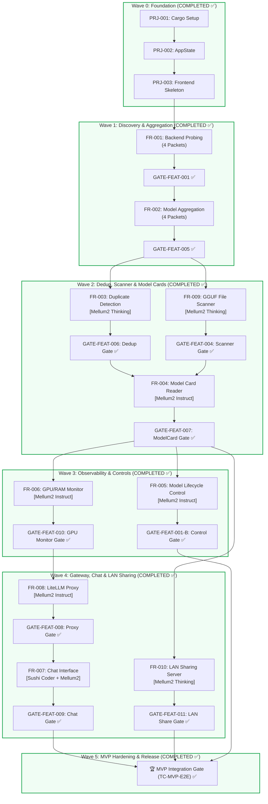

# Local LLM Hub — Master Backlog, Execution DAG & Multi-Model Allocation Plan

| Field | Value |
|---|---|
| **Project** | Local LLM Hub (Model Manager & Gateway) |
| **Document ID** | BKL-DAG-001 |
| **Version** | 1.0.0 |
| **Status** | Active Execution |
| **Standard Compliance** | STD-003 (R1-R6), ADR-100 (Zero Panic), ANN-001 (Traceability) |
| **Target MVP Scope** | 10 Functional Requirements (FR-001 to FR-010) across 40 Implementation Packets |

---

## 1. Multi-Model Fleet Profile & Role Assignment Matrix

จากการทดสอบเชิงประจักษ์ (Empirical Test Suite) เราได้คัดกรองโมเดลท้องถิ่นและจัดบทบาทตามความถนัดของสถาปัตยกรรมดังนี้:

| Model Identifier | Architecture | Speed | Strengths / Capabilities | Assigned Role & Wave Tasks | Recommended Sampling Setting |
|---|---|:---:|---|---|---|
| **JetBrains Mellum2 12B Instruct** | MoE (2.5B Act) | **148 t/s** | Zero-panic, 100% test pass, กระชับ, ลอจิก Rust แม่นยำสูง | **Lead Code Generator (Fast Tracks)** • Schema & Route IPC (`lib.rs`) • Rapid Boilerplate & Wrappers | `temp: 0.1`, `top_p: 0.95` `num_predict: 2048` |
| **JetBrains Mellum2 12B Thinking** | MoE (2.5B Act) | **147 t/s** | Deep RLVR Reasoning, วิเคราะห์โครงสร้างข้อมูลซับซ้อน | **Lead Complex Logic Coder** • GGUF Binary Parser (FR-009) • HTTP Range Streaming (FR-010) • Dedup Algorithms (FR-003) | `temp: 0.6`, `top_p: 0.95` `top_k: 20`, `num_predict: 2048` |
| **Sushi Coder RL 9B** | Dense 9B | **55 t/s** | เขียน Web / ES Modules สวย, เข้าใจ CSS/JS tokens | **Frontend UI & Presentation Coder** • `src/js/*.js` UI Modules • HTML/CSS Glassmorphic Views | `temp: 0.2`, `top_p: 0.95` `num_predict: 2048` |
| **Aroow-Rust-Coder 9B** | Dense 9B | **60 t/s** | เชี่ยวชาญ Test Assertion และ Edge Cases ใน Rust | **Dedicated Test Author (Tester Agent)** • Test-First TDD Suites • Boundary & Path Traversal Tests | `temp: 0.1`, `top_p: 0.95` `num_predict: 1024` |
| **Antigravity (Orchestrator)** | Hybrid Cloud/Host | N/A | Global Context, Architectural Integrity, File I/O | **Architect & Reviewer Agent** • Interface Locking (MT.1) • DoD Verification (MT.4) & Lineage | Strict AST & Compiler Feedback |

---

## 2. Master Execution DAG (Directed Acyclic Graph)

---

## 3. Detailed Backlog Breakdown (Task → Sub-task → Micro-task)

โครงสร้าง Micro-task ตามมาตรฐาน STD-003:
* **MT.x.1 [Architect]**: Lock Interface Signature, Port, and Data Contract
* **MT.x.2 [Tester]**: Write Failing Unit Test First (`// trace:verifies FR-xxx`)
* **MT.x.3 [Coder]**: Implement Code via Assigned Local Model (`// trace:implements FR-xxx`)
* **MT.x.4 [Reviewer]**: R4 DoD Audit (Unit tests pass, ADR-100 zero panics, zero leak)

---

### 📦 WAVE 2: Deduplication, GGUF Scanner & Model Cards (Sprint 2)

#### 🔹 Task 2.1: FR-003 — Duplicate Model Detection (Priority: P0)
*เป้าหมาย: ตรวจจับโมเดลที่ซ้ำกันข้าม Backend ด้วย Canonical Name พร้อมแนะนำ Preferred Backend*
* **Sub-task 2.1.1 (Schema):** `PKT-FR-003-SCHEMA` → Target: `src-tauri/src/models/types.rs`
  * [x] **MT-003.1.1 [Architect]**: นิยาม `DedupGroup` และ `DuplicateInfo { canonical_name: String, instances: Vec<UnifiedModel>, preferred_backend: String }`
  * [x] **MT-003.1.2 [Tester (Aroow)]**: เขียน unit test ตรวจสอบ serialization ของ `DuplicateInfo`
  * [x] **MT-003.1.3 [Coder (Mellum2 Inst)]**: Implement struct ใน `types.rs`
  * [x] **MT-003.1.4 [Reviewer (Orchestrator)]**: ตรวจสอบ DoD และ `@trace` tags
* **Sub-task 2.1.2 (Service):** `PKT-FR-003-SERVICE` → Target: `src-tauri/src/commands/models.rs::dedup_models`
  * [x] **MT-003.2.1 [Architect]**: ล็อก signature `pub fn dedup_models(models: &[UnifiedModel]) -> (Vec<UnifiedModel>, Vec<DuplicateInfo>)` ตามกฎ BR-001 (Priority: Ollama > vLLM > GGUF > HF)
  * [x] **MT-003.2.2 [Tester (Aroow)]**: เขียน unit tests จำลองโมเดลซ้ำ 3 backends และตรวจสอบการเลือก preferred backend
  * [x] **MT-003.2.3 [Coder (Mellum2 Think)]**: เขียนอัลกอริทึม grouping + priority sorting
  * [x] **MT-003.2.4 [Reviewer (Orchestrator)]**: รัน `cargo test` ตรวจสอบความปลอดภัยไร้ unwrap
* **Sub-task 2.1.3 (Route):** `PKT-FR-003-ROUTE` → Target: `src-tauri/src/lib.rs::dedup_models`
  * [x] **MT-003.3.1 [Architect]**: ล็อก command `#[tauri::command] async fn get_duplicate_groups(state: State) -> Result<Vec<DuplicateInfo>, String>`
  * [x] **MT-003.3.2 [Tester (Aroow)]**: เขียน handler test
  * [x] **MT-003.3.3 [Coder (Mellum2 Inst)]**: ผูกคำสั่งเข้า `tauri::generate_handler!`
  * [x] **MT-003.3.4 [Reviewer (Orchestrator)]**: Verify routing DoD
* **Sub-task 2.1.4 (UI):** `PKT-FR-003-UI` → Target: `src/js/model.js`
  * [x] **MT-003.4.1 [Architect]**: ล็อกการแสดงผล Duplicate Pill Badge บนการ์ดโมเดล
  * [x] **MT-003.4.2 [Tester (Aroow)]**: ตรวจสอบ mock UI rendering
  * [x] **MT-003.4.3 [Coder (Sushi Coder)]**: เขียน CSS + Badge แสดงผลบนการ์ดโมเดล
  * [x] **MT-003.4.4 [Reviewer (Orchestrator)]**: บันทึก Lineage `PKT-FR-003-UI`
* 🏁 **Gate TC-FEAT-006**: รัน `test_dedup.rs` ยืนยันการตรวจจับโมเดลซ้ำถูกต้อง 100% ✅

---

#### 🔹 Task 2.2: FR-009 — GGUF Direct Binary File Scanner (Priority: P1)
*เป้าหมาย: สแกนไดเรกทอรีหาไฟล์ `.gguf` และแกะอ่าน metadata header ตรงจากไบนารีโดยไม่ต้องโหลด weights*
* **Sub-task 2.2.1 (Schema):** `PKT-FR-009-SCHEMA` → Target: `src-tauri/src/models/types.rs`
  * [x] **MT-009.1.1 [Architect]**: นิยาม `GgufMetadata { name: String, arch: String, param_count: Option<u64>, context_length: Option<u64>, quant_type: String }`
  * [x] **MT-009.1.2 [Tester (Aroow)]**: เขียน test serialization
  * [x] **MT-009.1.3 [Coder (Mellum2 Inst)]**: Implement ใน `types.rs`
  * [x] **MT-009.1.4 [Reviewer (Orchestrator)]**: Audit schema DoD
* **Sub-task 2.2.2 (Service):** `PKT-FR-009-SERVICE` → Target: `src-tauri/src/commands/scanner.rs`
  * [x] **MT-009.2.1 [Architect]**: ล็อก signature `pub fn parse_gguf_header(file_path: &Path) -> Result<GgufMetadata, String>` และ recursion limit = 5 levels
  * [x] **MT-009.2.2 [Tester (Aroow)]**: เขียน test อ่านไฟล์ mock GGUF header (magic `GGUF` bytes) และ test ปฏิเสธ forbidden path (`C:\Windows`)
  * [x] **MT-009.2.3 [Coder (Mellum2 Think)]**: เขียน Binary Stream Reader แกะ Key-Value Pair ตามสเปก GGUF v3
  * [x] **MT-009.2.4 [Reviewer (Orchestrator)]**: Verify ADR-100 ป้องกัน memory leak
* **Sub-task 2.2.3 (Route):** `PKT-FR-009-ROUTE` → Target: `src-tauri/src/lib.rs`
  * [x] **MT-009.3.1 [Architect]**: ล็อก command `scan_directory_for_gguf(path: String) -> Result<Vec<UnifiedModel>, String>`
  * [x] **MT-009.3.2 [Tester (Aroow)]**: Test integration invocation
  * [x] **MT-009.3.3 [Coder (Mellum2 Inst)]**: เชื่อมต่อ command เข้า `AppState`
  * [x] **MT-009.3.4 [Reviewer (Orchestrator)]**: Audit route DoD
* **Sub-task 2.2.4 (UI):** `PKT-FR-009-UI` → Target: `src/js/backend.js`
  * [x] **MT-009.4.1 [Architect]**: ล็อกปุ่ม "Add Scan Directory" ใน Settings View
  * [x] **MT-009.4.2 [Tester (Aroow)]**: Test UI input validation
  * [x] **MT-009.4.3 [Coder (Sushi Coder)]**: Implement Folder Browse dialog + Scan progress bar
  * [x] **MT-009.4.4 [Reviewer (Orchestrator)]**: บันทึก Lineage `PKT-FR-009-UI`
* 🏁 **Gate TC-FEAT-004**: รัน `test_scanner.rs` กับไฟล์จริง `models/gguf/qwen-4b-thai-reasoning.gguf` ✅

---

#### 🔹 Task 2.3: FR-004 — Model Card Drawer Display (Priority: P1)
*เป้าหมาย: ดึง README.md และข้อมูลสถาปัตยกรรมแสดงผลใน Drawer ด้านข้างเมื่อคลิกการ์ดโมเดล*
* **Sub-task 2.3.1 (Schema):** `PKT-FR-004-SCHEMA` → Target: `src-tauri/src/models/types.rs`
  * [x] **MT-004.1.1 [Architect]**: นิยาม `ModelCardInfo { id: String, readme_markdown: String, license: Option<String>, parameters: Option<String>, source: String }`
  * [x] **MT-004.1.2 [Tester (Aroow)]**: เขียน unit test สำหรับ `ModelCardInfo`
  * [x] **MT-004.1.3 [Coder (Mellum2 Inst)]**: Implement struct
  * [x] **MT-004.1.4 [Reviewer (Orchestrator)]**: Audit schema DoD
* **Sub-task 2.3.2 (Service):** `PKT-FR-004-SERVICE` → Target: `src-tauri/src/commands/modelcard.rs`
  * [x] **MT-004.2.1 [Architect]**: ล็อก signature `pub async fn fetch_model_card(model_id: &str, backend: &str) -> Result<ModelCardInfo, String>`
  * [x] **MT-004.2.2 [Tester (Aroow)]**: Mock test ดึง Hugging Face API และอ่าน local markdown
  * [x] **MT-004.2.3 [Coder (Mellum2 Inst)]**: เขียน HTTP fetcher + Local file reader
  * [x] **MT-004.2.4 [Reviewer (Orchestrator)]**: Audit error handling
* **Sub-task 2.3.3 (Route):** `PKT-FR-004-ROUTE` → Target: `src-tauri/src/lib.rs`
  * [x] **MT-004.3.1 [Architect]**: ล็อก command `get_model_card(model_id: String) -> Result<ModelCardInfo, String>`
  * [x] **MT-004.3.2 [Tester (Aroow)]**: Test IPC command
  * [x] **MT-004.3.3 [Coder (Mellum2 Inst)]**: ลงทะเบียน command ใน Tauri Builder
  * [x] **MT-004.3.4 [Reviewer (Orchestrator)]**: Verify route DoD
* **Sub-task 2.3.4 (UI):** `PKT-FR-004-UI` → Target: `src/js/card.js`
  * [x] **MT-004.4.1 [Architect]**: ออกแบบ Glassmorphic Sliding Drawer จากขอบขวา
  * [x] **MT-004.4.2 [Tester (Aroow)]**: Test Drawer open/close events
  * [x] **MT-004.4.3 [Coder (Sushi Coder)]**: สร้าง Drawer Component + Markdown renderer styling
  * [x] **MT-004.4.4 [Reviewer (Orchestrator)]**: บันทึก Lineage `PKT-FR-004-UI`
* 🏁 **Gate TC-FEAT-007**: รัน `test_modelcard.rs` ยืนยันการเปิดอ่านการ์ดโมเดลสำเร็จ ✅

---

### 📦 WAVE 3: Hardware Observability & Lifecycle Control (Sprint 3)

#### 🔹 Task 3.1: FR-006 — Real-time GPU & VRAM Observability (Priority: P0)
*เป้าหมาย: Polling สถานะ GPU (nvidia-smi) และ RAM ทุก 2 วินาที แจ้งเตือนเมื่อ VRAM > 90%*
* **Sub-task 3.1.1 (Schema):** `PKT-FR-006-SCHEMA` → Target: `src-tauri/src/models/types.rs`
  * [x] **MT-006.1.1 [Architect]**: นิยาม `GpuStats { name: String, vram_used_mb: u64, vram_total_mb: u64, temp_c: u32, util_pct: u32 }`
  * [x] **MT-006.1.2 [Tester (Aroow)]**: Test serialization
  * [x] **MT-006.1.3 [Coder (Mellum2 Inst)]**: Implement struct ใน `types.rs`
  * [x] **MT-006.1.4 [Reviewer (Orchestrator)]**: Audit schema DoD
* **Sub-task 3.1.2 (Service):** `PKT-FR-006-SERVICE` → Target: `src-tauri/src/commands/gpu.rs`
  * [x] **MT-006.2.1 [Architect]**: ล็อก signature `pub fn parse_gpu_csv(line: &str) -> Result<GpuStats, String>` และ `poll_hardware_stats() -> HardwareStats`
  * [x] **MT-006.2.2 [Tester (Aroow)]**: เขียน unit test ตรวจสอบ CSV parsing ปลอดภัยไร้ panic
  * [x] **MT-006.2.3 [Coder (Mellum2 Inst)]**: Implement nvidia-smi execution + sysinfo memory fallback
  * [x] **MT-006.2.4 [Reviewer (Orchestrator)]**: Audit zero panic
* **Sub-task 3.1.3 (Route):** `PKT-FR-006-ROUTE` → Target: `src-tauri/src/lib.rs`
  * [x] **MT-006.3.1 [Architect]**: ล็อก command `get_gpu_stats() -> Result<GpuStats, String>`
  * [x] **MT-006.3.2 [Tester (Aroow)]**: Test invocation
  * [x] **MT-006.3.3 [Coder (Mellum2 Inst)]**: เชื่อมต่อ command เข้า `lib.rs`
  * [x] **MT-006.3.4 [Reviewer (Orchestrator)]**: Audit route DoD
* **Sub-task 3.1.4 (UI):** `PKT-FR-006-UI` → Target: `src/js/observability.js`
  * [x] **MT-006.4.1 [Architect]**: ออกแบบ Real-time VRAM Gauge บน Top Bar
  * [x] **MT-006.4.2 [Tester (Aroow)]**: Test gauge percentage update
  * [x] **MT-006.4.3 [Coder (Sushi Coder)]**: เขียน SVG Gauge + 2s Interval Poller + 90% Red Warning
  * [x] **MT-006.4.4 [Reviewer (Orchestrator)]**: บันทึก Lineage `PKT-FR-006-UI`
* 🏁 **Gate TC-FEAT-010**: รัน `test_gpu_monitor.rs` ตรวจสอบความแม่นยำของการวัด VRAM ✅

---

#### 🔹 Task 3.2: FR-005 — Model Start / Stop Lifecycle Control (Priority: P0)
*เป้าหมาย: สั่งโหลดโมเดลเข้า VRAM หรือสั่ง Unload คืนหน่วยความจำผ่าน UI*
* **Sub-task 3.2.1 (Schema):** `PKT-FR-005-SCHEMA` → Target: `src-tauri/src/models/types.rs`
  * [x] **MT-005.1.1 [Architect]**: นิยาม `ModelControlAction { model_id: String, action: "load" | "unload", keep_alive: String }`
  * [x] **MT-005.1.2 [Tester (Aroow)]**: Test serialization
  * [x] **MT-005.1.3 [Coder (Mellum2 Inst)]**: Implement struct
  * [x] **MT-005.1.4 [Reviewer (Orchestrator)]**: Audit schema DoD
* **Sub-task 3.2.2 (Service):** `PKT-FR-005-SERVICE` → Target: `src-tauri/src/commands/backends.rs`
  * [x] **MT-005.2.1 [Architect]**: ล็อก signature `pub async fn set_model_lifecycle(client: &reqwest::Client, base_url: &str, model: &str, load: bool) -> Result<bool, String>`
  * [x] **MT-005.2.2 [Tester (Aroow)]**: Test mock request ส่ง `keep_alive: 0` (unload) และ `keep_alive: "5m"` (load)
  * [x] **MT-005.2.3 [Coder (Mellum2 Inst)]**: เขียน HTTP caller สั่ง Ollama `/api/generate`
  * [x] **MT-005.2.4 [Reviewer (Orchestrator)]**: Audit error recovery
* **Sub-task 3.2.3 (Route):** `PKT-FR-005-ROUTE` → Target: `src-tauri/src/lib.rs`
  * [x] **MT-005.3.1 [Architect]**: ล็อก command `unload_model(model_id: String) -> Result<bool, String>`
  * [x] **MT-005.3.2 [Tester (Aroow)]**: Test route execution
  * [x] **MT-005.3.3 [Coder (Mellum2 Inst)]**: Register command ใน `lib.rs`
  * [x] **MT-005.3.4 [Reviewer (Orchestrator)]**: Audit route DoD
* **Sub-task 3.2.4 (UI):** `PKT-FR-005-UI` → Target: `src/js/backend.js`
  * [x] **MT-005.4.1 [Architect]**: เพิ่มปุ่ม "Unload from VRAM" บนการ์ดโมเดลที่ active
  * [x] **MT-005.4.2 [Tester (Aroow)]**: Test UI click handler
  * [x] **MT-005.4.3 [Coder (Sushi Coder)]**: Implement ปุ่มควบคุมสถานะ Active/Idle
  * [x] **MT-005.4.4 [Reviewer (Orchestrator)]**: บันทึก Lineage `PKT-FR-005-UI`
* 🏁 **Gate TC-FEAT-001-B**: ทดสอบสั่ง unload โมเดลจริงใน Ollama แล้ว VRAM ลดลงทันที ✅

---

### 📦 WAVE 4: Gateway, Chat Playground & LAN Sharing (Sprint 4)

#### 🔹 Task 4.1: FR-008 — LiteLLM Unified Proxy Sidecar (Priority: P0)
*เป้าหมาย: ควบคุม Process ของ LiteLLM Proxy รวมศูนย์ API เป็น OpenAI-compatible ที่พอร์ต 4000*
* **Sub-task 4.1.1 (Schema):** `PKT-FR-008-SCHEMA` → Target: `src-tauri/src/models/types.rs`
  * [x] **MT-008.1.1 [Architect]**: นิยาม `ProxyConfig { port: u16, active_models: Vec<String>, auto_restart: bool }`
  * [x] **MT-008.1.2 [Tester (Aroow)]**: Test serialization
  * [x] **MT-008.1.3 [Coder (Mellum2 Inst)]**: Implement struct
  * [x] **MT-008.1.4 [Reviewer (Orchestrator)]**: Audit schema DoD
* **Sub-task 4.1.2 (Service):** `PKT-FR-008-SERVICE` → Target: `src-tauri/src/commands/proxy.rs`
  * [x] **MT-008.2.1 [Architect]**: ล็อก signature `pub async fn start_proxy(config: &ProxyConfig) -> Result<u32, String>` และ YAML generator
  * [x] **MT-008.2.2 [Tester (Aroow)]**: Test generate `config.yaml` ถูกต้องตามสเปก LiteLLM
  * [x] **MT-008.2.3 [Coder (Mellum2 Inst)]**: Implement tokio process spawner + PID tracking
  * [x] **MT-008.2.4 [Reviewer (Orchestrator)]**: Audit process kill handling
* **Sub-task 4.1.3 (Route):** `PKT-FR-008-ROUTE` → Target: `src-tauri/src/lib.rs`
  * [x] **MT-008.3.1 [Architect]**: ล็อก command `toggle_litellm_proxy(enable: bool) -> Result<LiteLLMStatus, String>`
  * [x] **MT-008.3.2 [Tester (Aroow)]**: Test route execution
  * [x] **MT-008.3.3 [Coder (Mellum2 Inst)]**: Register command ใน `lib.rs`
  * [x] **MT-008.3.4 [Reviewer (Orchestrator)]**: Audit route DoD
* **Sub-task 4.1.4 (UI):** `PKT-FR-008-UI` → Target: `src/js/inference.js`
  * [x] **MT-008.4.1 [Architect]**: ออกแบบ Gateway Switch Toggle ใน Sidebar Footer
  * [x] **MT-008.4.2 [Tester (Aroow)]**: Test toggle event
  * [x] **MT-008.4.3 [Coder (Sushi Coder)]**: Implement Gateway Badge + Copy Endpoint Button (`localhost:4000`)
  * [x] **MT-008.4.4 [Reviewer (Orchestrator)]**: บันทึก Lineage `PKT-FR-008-UI`
* 🏁 **Gate TC-FEAT-008**: ตรวจสอบการยิง request เข้า `localhost:4000/v1/chat/completions` ✅

---

#### 🔹 Task 4.2: FR-007 — Interactive Chat Playground (Priority: P1)
*เป้าหมาย: หน้าทดสอบแชทกับโมเดลในเครื่องแบบ Streaming Markdown bubble*
* **Sub-task 4.2.1 (Schema):** `PKT-FR-007-SCHEMA` → Target: `src-tauri/src/models/types.rs`
  * [x] **MT-007.1.1 [Architect]**: นิยาม `ChatMessage { role: String, content: String, timestamp: u64 }`
  * [x] **MT-007.1.2 [Tester (Aroow)]**: Test serialization
  * [x] **MT-007.1.3 [Coder (Mellum2 Inst)]**: Implement struct
  * [x] **MT-007.1.4 [Reviewer (Orchestrator)]**: Audit schema DoD
* **Sub-task 4.2.2 (Service):** `PKT-FR-007-SERVICE` → Target: `src-tauri/src/commands/chat.rs`
  * [x] **MT-007.2.1 [Architect]**: ล็อก signature streaming caller ผ่าน Tauri Channel
  * [x] **MT-007.2.2 [Tester (Aroow)]**: Test chunk processing and error recovery
  * [x] **MT-007.2.3 [Coder (Mellum2 Think)]**: เขียน SSE chunk reader เชื่อม Ollama/LiteLLM
  * [x] **MT-007.2.4 [Reviewer (Orchestrator)]**: Audit stream latency (<500ms TTFT)
* **Sub-task 4.2.3 (Route):** `PKT-FR-007-ROUTE` → Target: `src-tauri/src/lib.rs`
  * [x] **MT-007.3.1 [Architect]**: ล็อก command `stream_chat(model: String, prompt: String, on_event: Channel)`
  * [x] **MT-007.3.2 [Tester (Aroow)]**: Test channel event emissions
  * [x] **MT-007.3.3 [Coder (Mellum2 Inst)]**: Register command ใน `lib.rs`
  * [x] **MT-007.3.4 [Reviewer (Orchestrator)]**: Audit route DoD
* **Sub-task 4.2.4 (UI):** `PKT-FR-007-UI` → Target: `src/js/inference.js`
  * [x] **MT-007.4.1 [Architect]**: ออกแบบ Chat View (`#view-chat`) รองรับ Markdown + Code Block highlighting
  * [x] **MT-007.4.2 [Tester (Aroow)]**: Test auto-scroll and stream bubble rendering
  * [x] **MT-007.4.3 [Coder (Sushi Coder)]**: Implement Chat View + Markdown bubble streaming
  * [x] **MT-007.4.4 [Reviewer (Orchestrator)]**: บันทึก Lineage `PKT-FR-007-UI`
* 🏁 **Gate TC-FEAT-009**: ยืนยันการแชทกับ Mellum2 MoE ตอบกลับแบบ real-time ราบรื่น ✅

---

#### 🔹 Task 4.3: FR-010 — LAN Folder & Drive Sharing (Priority: P1) [NEW]
*เป้าหมาย: สตรีมไฟล์โมเดลขนาดใหญ่และแชร์โฟลเดอร์/ไดรฟ์ข้ามวงแลนผ่าน HTTP Range Requests พร้อม QR Code*
* **Sub-task 4.3.1 (Schema):** `PKT-FR-010-SCHEMA` → Target: `src-tauri/src/models/types.rs`
  * [x] **MT-010.1.1 [Architect]**: นิยาม `LanShareConfig { path: String, port: u16, read_only: bool, token: Option<String> }` และ `LanShareStatus`
  * [x] **MT-010.1.2 [Tester (Aroow)]**: Test serialization ของ `LanShareStatus`
  * [x] **MT-010.1.3 [Coder (Mellum2 Inst)]**: Implement struct ใน `types.rs`
  * [x] **MT-010.1.4 [Reviewer (Orchestrator)]**: Audit schema DoD
* **Sub-task 4.3.2 (Service):** `PKT-FR-010-SERVICE` → Target: `src-tauri/src/commands/share.rs`
  * [x] **MT-010.2.1 [Architect]**: ล็อก signature `pub async fn start_http_share_server(config: LanShareConfig) -> Result<String, String>` รองรับ `Range: bytes=` (206 Partial Content) และ Whitelist Validation
  * [x] **MT-010.2.2 [Tester (Aroow)]**: เขียน unit test ตรวจสอบ Path Traversal Protection (`../../Windows` ถูกปฏิเสธ) และ HTTP Range Header calculation
  * [x] **MT-010.2.3 [Coder (Mellum2 Think)]**: เขียน Async HTTP File Streaming Server ด้วย Tokio + Range Chunking
  * [x] **MT-010.2.4 [Reviewer (Orchestrator)]**: Audit security & zero leak
* **Sub-task 4.3.3 (Route):** `PKT-FR-010-ROUTE` → Target: `src-tauri/src/lib.rs`
  * [x] **MT-010.3.1 [Architect]**: ล็อก commands `start_lan_share(path: String, port: u16)`, `stop_lan_share()`, `get_lan_share_status()`
  * [x] **MT-010.3.2 [Tester (Aroow)]**: Test route start/stop cycle
  * [x] **MT-010.3.3 [Coder (Mellum2 Inst)]**: Register commands ใน `lib.rs`
  * [x] **MT-010.3.4 [Reviewer (Orchestrator)]**: Audit route DoD
* **Sub-task 4.3.4 (UI):** `PKT-FR-010-UI` → Target: `src/js/network.js`
  * [x] **MT-010.4.1 [Architect]**: ออกแบบ LAN Share Card ใน Settings/Network View แสดง Local IP, Port, และ QR Code
  * [x] **MT-010.4.2 [Tester (Aroow)]**: Test QR Code rendering และ copy link button
  * [x] **MT-010.4.3 [Coder (Sushi Coder)]**: เขียนหน้าควบคุม LAN Share + QR Code Generator (SVG/Canvas) + Active Client Counter
  * [x] **MT-010.4.4 [Reviewer (Orchestrator)]**: บันทึก Lineage `PKT-FR-010-UI`
* 🏁 **Gate TC-FEAT-011**: รัน `test_lan_share.rs` ทดสอบยิง HTTP Range Download ไฟล์ GGUF ข้ามวงแลนสำเร็จ ✅

---

## 4. Wave-by-Wave Execution Plan & Milestones

| Wave | เป้าหมายหลัก | วันเริ่ม - สิ้นสุด (ประมาณการ) | กองเรือ AI ที่รับผิดชอบ | Gate Criteria |
|:---:|---|:---:|---|---|
| **Wave 0** | วางฐานราก Cargo, AppState, Design System | Day 1 (เสร็จแล้ว ✅) | Mellum2 Instruct + Orchestrator | `cargo test` ผ่านหมด (exit 0) |
| **Wave 1** | Probe ทุก Backend, Normalizer, Catalog | Day 1 (เสร็จแล้ว ✅) | Mellum2 Instruct + Orchestrator | `GATE-FEAT-001`, `GATE-FEAT-005` ผ่าน |
| **Wave 2** | Dedup, GGUF Header Scanner, Model Cards | Day 2 - Day 3 (เสร็จแล้ว ✅) | **Mellum2 Thinking** (Core Logic) **Sushi Coder** (UI Drawer) | `GATE-FEAT-006`, `004`, `007` ผ่าน |
| **Wave 3** | Hardware Observability, Start/Stop Control | Day 4 - Day 5 (เสร็จแล้ว ✅) | **Mellum2 Instruct** (smi parsing) **Sushi Coder** (VRAM Gauge) | `GATE-FEAT-010`, `GATE-FEAT-001-B` ผ่าน |
| **Wave 4** | LiteLLM Proxy, Chat Stream, LAN Sharing | Day 6 - Day 7 (เสร็จแล้ว ✅) | **Mellum2 Thinking** (HTTP Range Stream) **Sushi Coder** (Chat Bubble & QR) | `GATE-FEAT-008`, `009`, `011` ผ่าน |
| **Wave 5** | MVP Verification & Final Release | Day 8 (เสร็จแล้ว ✅) | Reviewer Agent (Orchestrator) | **TC-MVP-E2E** ผ่าน 100% (44/44 tests) |

---

## 5. Circuit Breaker & Quality Guard Rules (R4-R6)

1. **Max Retry Breaker**: Coder Agent มีสิทธิ์แก้โค้ดได้ไม่เกิน **2 ครั้ง** ต่อ Packet หาก `rustc` หรือ unit test ยังไม่ผ่าน Orchestrator จะสลับไปใช้ **Mellum2 Thinking** ทันที
2. **CMP Isolation Mutex**: ไม่อนุญาตให้ Coder แตะต้องไฟล์นอก Component ที่ได้รับมอบหมายใน Packet นั้นๆ เด็ดขาด (Zero Touches outside CMP)
3. **Lineage Ledger Logging**: ทุก Packet และ Integration Gate ที่ผ่านการทดสอบ จะต้องถูกบันทึกรอยต่อลง `docs/lineage/packet-lineage.jsonl` โดยอัตโนมัติ
