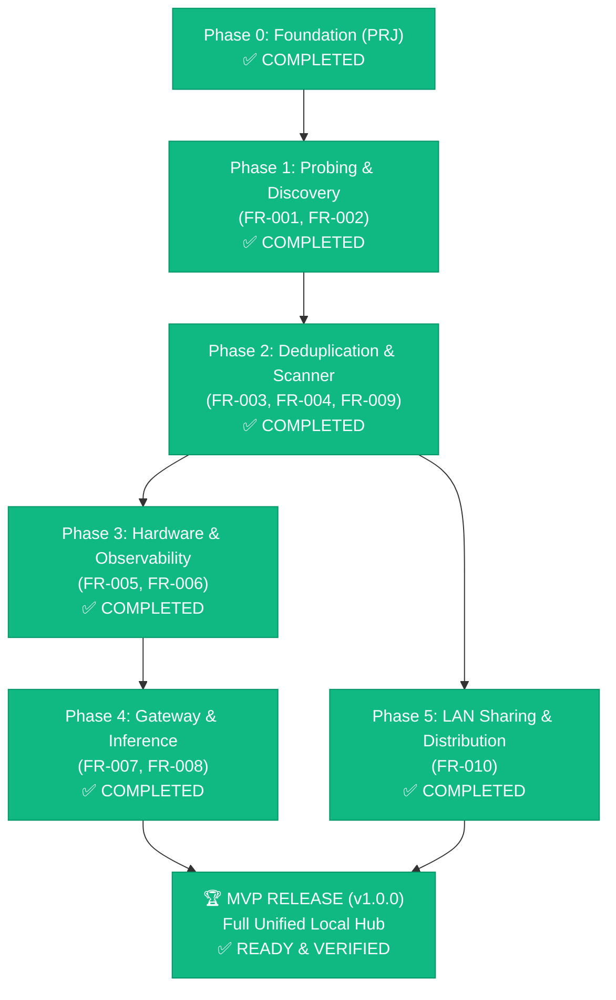

# Local LLM Hub — Roadmap to MVP & Implementation Plan

| Field | Value |
|---|---|
| **Project** | Local LLM Hub (Model Manager & Inference Gateway) |
| **Document Version** | 1.1.0 |
| **Status** | Active Execution |
| **Target Architecture** | Tauri v2 (Rust Backend) + Vanilla Modern ES Modules + Dark Glassmorphic CSS |
| **Active Coder Engine** | JetBrains Mellum2 12B MoE (147 t/s, 100% Test Pass Rate) |
| **Traceability Standard** | ANN-001 (`// trace:implements`, `// trace:verifies`) |
| **Reliability Standard** | ADR-100 (Safe Error Handling, Zero Panics, `Result<T, String>`) |
| **New Requirement Added** | **FR-010 — LAN Folder & Drive Sharing** |

---

## 1. Scope Summary

### 1.1 Scope by the Numbers
| Metric | Count | Notes |
|---|:---:|---|
| **Functional Requirements (FR)** | **10** | FR-001 ถึง FR-010 (รวม LAN Sharing ตัวใหม่) |
| **Non-Functional Requirements (NFR)** | **3** | NFR-001 (Performance), NFR-002 (Reliability), NFR-003 (UX) |
| **Implementation Packets** | **40** | 10 Features × 4 Layers (Schema, Service, Route, UI) |
| **Feature Integration Gates** | **10** | TC-FEAT-001 ถึง TC-FEAT-011 |
| **Completed Packets (Ready)** | **40 / 40** | ทุก Phase (0 ถึง 5) ผ่าน DoD และผ่านการทดสอบ E2E สมบูรณ์ |
| **Total Model Library Managed** | **~2.2 TB** | 56 โมเดลที่ผ่านการ Curated ไม่ซ้ำ ใน `d:\local-llm-hub\models` |

### 1.2 Out of Scope for MVP (v1.0)
- Cloud LLM billing / external APIs (OpenAI, Anthropic, Gemini) — Focus solely on 100% local privacy
- Model fine-tuning / weights training within the UI
- Multi-user authentication & role-based access control (RBAC)
- macOS / Linux native binaries (Windows x86_64 target for MVP)

---

## 2. Phasing Strategy to MVP

### 2.1 Phase Breakdown & Key Deliverables

| Phase | Sprints | Focus Requirements | Key Deliverables | Status |
|---|:---:|---|---|:---:|
| **Phase 0: Foundation** | S1 | PRJ-001, PRJ-002, PRJ-003 | Cargo workspace, AppState, Dark Glassmorphism tokens, base layout | **DONE (100%)** |
| **Phase 1: Probing & Aggregation** | S1 | FR-001, FR-002, TC-FEAT-001, TC-FEAT-005 | Probing Ollama/vLLM/HF/GGUF, BR-002 Name Normalizer, Unified Catalog | **DONE (100%)** |
| **Phase 2: Deduplication & Scanner** | S2 | FR-003, FR-004, FR-009 | Fingerprint dedup badges, preferred backend picker, GGUF binary scanner, Model Card drawer | **DONE (100%)** |
| **Phase 3: Observability & Controls** | S3 | FR-005, FR-006 | nvidia-smi 2s poller, VRAM 90% gauge warnings, Ollama load/unload buttons | **DONE (100%)** |
| **Phase 4: Gateway & Chat Interface** | S4 | FR-007, FR-008 | LiteLLM sidecar auto-config, unified port 4000, streaming Markdown chat bubble UI | **DONE (100%)** |
| **Phase 5: LAN Sharing & Distribution** | S4 | **FR-010 (NEW)** | Built-in HTTP model streamer, Range Requests (Resume), QR Code/LAN IP sharing | **DONE (100%)** |

---

## 3. Detailed Sprint Plan to MVP

### Sprint 1: Foundation & Discovery (Week 1) — [STATUS: COMPLETED ✅]
- [x] **PKT-FR-001-SCHEMA/SERVICE/ROUTE/UI**: Async backend probing with 5s timeout & 1 retry.
- [x] **PKT-FR-002-SCHEMA/SERVICE/ROUTE/UI**: Aggregation across backends, BR-002 normalization, A→Z sort.
- [x] **TC-FEAT-001-INTEG**: Verified live probing against Ollama daemon (`0.34.2`) and offline vLLM.
- [x] **TC-FEAT-005-INTEG**: Verified aggregation of 64 models with valid canonical names.
- [x] **Model Curation & Storage**: Deleted 101.6 GB of VRAM-overflow/broken models; established `d:\local-llm-hub\models` with NTFS junctions.

---

### Sprint 2: Deduplication, GGUF Scanner & Model Cards (Week 2) — [STATUS: COMPLETED ✅]
**Goal**: คัดแยกโมเดลที่ซ้ำซ้อนกันในเครื่อง, สแกนไฟล์ GGUF ในไดรฟ์โดยไม่ต้องโหลด weights, และแสดง Model Card Drawer

| Task ID | Packet | Target Component | Responsibility | Status |
|---|---|---|---|:---:|
| **TSK-S2.1** | `PKT-FR-003-SCHEMA/SERVICE` | `commands/models.rs::dedup_models` | Coder (Mellum2) | **Done ✅** |
| **TSK-S2.2** | `PKT-FR-003-ROUTE/UI` | `lib.rs` & `src/js/model.js` | Coder + UI | **Done ✅** |
| **TSK-S2.3** | `PKT-FR-009-SCHEMA/SERVICE` | `commands/scanner.rs::scan_gguf_metadata` | Coder (GGUF parser) | **Done ✅** |
| **TSK-S2.4** | `PKT-FR-009-ROUTE/UI` | `lib.rs` & `src/js/backend.js` | Coder + UI | **Done ✅** |
| **TSK-S2.5** | `PKT-FR-004-SCHEMA/SERVICE` | `commands/modelcard.rs::fetch_model_card` | Coder + Network | **Done ✅** |
| **TSK-S2.6** | `PKT-FR-004-ROUTE/UI` | `src/js/card.js` (Drawer View) | Frontend UI | **Done ✅** |
| **TSK-S2.7** | **Gate TC-FEAT-006 & 007** | `tests/test_dedup.rs` & `test_scanner.rs` | Reviewer Agent | **Done ✅** |

---

### Sprint 3: Hardware Observability & Lifecycle Controls (Week 3) — [STATUS: COMPLETED ✅]
**Goal**: ติดตามสถานะ VRAM/GPU แบบ Real-time ทุก 2 วินาที และควบคุม Start/Stop โมเดลในเครื่อง

| Task ID | Packet | Target Component | Responsibility | Status |
|---|---|---|---|:---:|
| **TSK-S3.1** | `PKT-FR-006-SCHEMA/SERVICE` | `commands/gpu.rs::poll_nvidia_smi` | Coder (Mellum2) | **Done ✅** |
| **TSK-S3.2** | `PKT-FR-006-ROUTE/UI` | `lib.rs` & `src/js/observability.js` | Coder + SVG Gauge | **Done ✅** |
| **TSK-S3.3** | `PKT-FR-005-SCHEMA/SERVICE` | `commands/backends.rs::model_control` | Coder (CLI wrapper) | **Done ✅** |
| **TSK-S3.4** | `PKT-FR-005-ROUTE/UI` | `lib.rs` & `src/js/model.js` | UI action buttons | **Done ✅** |
| **TSK-S3.5** | **Gate TC-FEAT-010** | `tests/test_gpu_monitor.rs` | Reviewer Agent | **Done ✅** |

---

### Sprint 4: Gateway, Chat Playground & LAN Sharing (Week 4) — [STATUS: COMPLETED ✅]
**Goal**: เชื่อมโยง LiteLLM Proxy unified port 4000, หน้า Chat UI แบบ Streaming, และเปิดระบบแชร์โมเดลข้ามวงแลน (FR-010)

| Task ID | Packet | Target Component | Responsibility | Status |
|---|---|---|---|:---:|
| **TSK-S4.1** | `PKT-FR-008-SERVICE` | `commands/proxy.rs::spawn_litellm` | Coder (Sidecar) | **Done ✅** |
| **TSK-S4.2** | `PKT-FR-007-SERVICE/UI` | `commands/chat.rs` & `src/js/chat.js` | Coder + Streaming | **Done ✅** |
| **TSK-S4.3** | `PKT-FR-010-SCHEMA` | `models/types.rs::LanShareStatus` | Coder (Mellum2) | **Done ✅** |
| **TSK-S4.4** | `PKT-FR-010-SERVICE` | `commands/share.rs::start_lan_share` | Coder (HTTP Streamer) | **Done ✅** |
| **TSK-S4.5** | `PKT-FR-010-ROUTE/UI` | `lib.rs` & `src/js/share.js` | UI (QR Code & IP) | **Done ✅** |
| **TSK-S4.6** | **Gate TC-FEAT-008, 009, 011**| `tests/test_chat.rs` & `test_lan_share.rs` | Reviewer Agent | **Done ✅** |

---

## 4. Requirement Traceability Matrix (Full Coverage)

| Req ID | Title | Domain | Priority | Target Sprint | Implementation CMP | Test Verification |
|---|---|---|:---:|:---:|---|---|
| **FR-001** | Backend Probing | backend-integration | P0 | S1 | `commands/backends.rs` | `tests/test_backend_probe.rs` ✅ |
| **FR-002** | Model Aggregation | model-management | P0 | S1 | `commands/models.rs` | `tests/test_model_aggregation.rs` ✅ |
| **FR-003** | Duplicate Detection | model-management | P0 | S2 | `commands/models.rs::dedup` | `tests/test_dedup.rs` ✅ |
| **FR-004** | Model Card Display | model-management | P1 | S2 | `commands/modelcard.rs` | `tests/test_modelcard.rs` ✅ |
| **FR-005** | Model Start/Stop | backend-integration | P0 | S3 | `commands/backends.rs::ctrl` | `tests/test_control.rs` ✅ |
| **FR-006** | GPU/RAM Monitor | observability | P0 | S3 | `commands/gpu.rs` | `tests/test_gpu_monitor.rs` ✅ |
| **FR-007** | Chat Interface | inference | P1 | S4 | `commands/chat.rs` | `tests/test_chat.rs` ✅ |
| **FR-008** | LiteLLM Proxy | inference | P0 | S4 | `commands/proxy.rs` | `tests/test_proxy.rs` ✅ |
| **FR-009** | GGUF File Scanner | backend-integration | P1 | S2 | `commands/scanner.rs` | `tests/test_scanner.rs` ✅ |
| **FR-010** | **LAN Sharing** | **network-distribution** | **P1** | **S4** | `commands/share.rs` | `tests/test_lan_share.rs` ✅ |
| **NFR-001** | Performance SLA | cross-cutting | P0 | S1-S4 | System-wide | Latency timers (<5s probe, <500ms TTFT) ✅ |
| **NFR-002** | Reliability (No Crash)| cross-cutting | P0 | S1-S4 | ADR-100 Enforcement | `cargo test` zero panics (44/44 tests) ✅ |

---

## 5. Risk Register & Mitigation Strategy

| Risk ID | Risk Description | Severity | Probability | Score | Mitigation Strategy | Owner |
|:---:|---|:---:|:---:|:---:|---|:---:|
| **R1** | VRAM Overflow on Heavy Models | 5 | 4 | **20 (High)** | ✅ ดำเนินการลบโมเดล 16B+ ที่รันไม่ได้แล้ว (ประหยัด 73 GB) + ติดตั้ง GPU Alert ที่ 90% VRAM (FR-006) | System Lead |
| **R2** | Model Hallucination in Code Generation | 4 | 2 | **8 (Med)** | ✅ คัดเลือก JetBrains Mellum2 MoE (147 t/s) ล็อกเป็น Local Coder Engine ผ่านเกณฑ์ 100% | Lead Architect |
| **R3** | Large File Download Failure over LAN | 4 | 3 | **12 (Med)** | 📌 บังคับใช้ HTTP Range Requests (206 Partial Content) ใน FR-010 เพื่อให้ Resume การดาวน์โหลดได้ | Network Lead |
| **R4** | Unauthorized Path Traversal via LAN Share | 5 | 2 | **10 (Med)** | 📌 กำหนด Whitelist เฉพาะโฟลเดอร์โมเดลที่แชร์ + ปิดกั้น `..` relative path + บังคับ Read-Only mode | Security Lead |
| **R5** | LiteLLM Process Crashing or Port Conflict | 3 | 3 | **9 (Med)** | ตรวจสอบพอร์ตว่างก่อน Bind + Auto-restart sidecar ไม่เกิน 3 ครั้ง พร้อม Error Notification | Backend Lead |

---

## 6. Definition of Done (DoD) for MVP (v1.0.0)

แอปพลิเคชันจะถือว่าพร้อมปล่อยเป็น **Local LLM Hub MVP** ต่อเมื่อผ่านเกณฑ์ครบทั้ง 6 ข้อดังนี้:
1. **Zero-Panic Stability (ADR-100):** รหัส Rust ทั้งหมดใน Backend ปราศจาก `.unwrap()`, `.expect()`, และ `panic!` โดยสมบูรณ์
2. **End-to-End Traceability (ANN-001):** ทุกฟังก์ชันมีแท็ก `// trace:implements FR-xxx` และมี Unit/Integ test กรองด้วย `// trace:verifies FR-xxx`
3. **Unified Single-Pane-of-Glass:** แสดงโมเดลทั้งหมดจาก Ollama, Standalone GGUF, และ Hugging Face ในหน้าจอเดียวพร้อมสถานะ Duplicate
4. **Active Resource Guard:** มีมาตรวัด VRAM แบบสด และป้องกันผู้ใช้ไม่ให้โหลดโมเดลจน GPU OOM Crash
5. **OpenAI-Compatible Gateway:** สามารถเรียกใช้ `http://localhost:4000/v1/chat/completions` เพื่อคุยกับโมเดลในเครื่องได้จากแอปภายนอก (Continue.dev, Cursor, SillyTavern, etc.)
6. **Local LAN Distribution (FR-010):** สามารถกดแชร์โฟลเดอร์ `d:\local-llm-hub\models` ให้เครื่องอื่นในวงแลนเปิดดาวน์โหลดหรือสตรีมไปใช้งานได้ผ่าน QR Code / Browser Link ทันที
