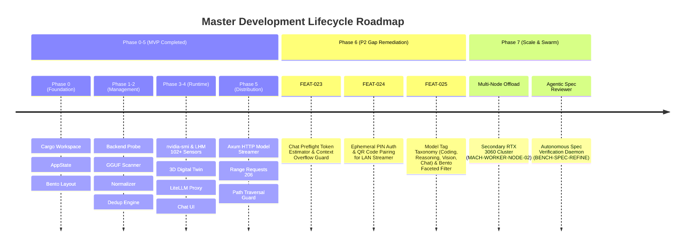

# Local LLM Hub — Master Development Roadmap (v2.0)

| Field | Value |
|---|---|
| **Document ID** | `ROADMAP-001` |
| **System** | Local LLM Hub (Model Manager & Inference Gateway) |
| **Version** | 2.0.0 (Post-MVP & Phase 6/7 Expansion) |
| **Status** | Active Execution |
| **Target Architecture** | Tauri v2 + Rust Core + Vanilla Modern ES Modules Bento UI |
| **Baseline Hardware** | Intel Core i7-8700K (12T), NVIDIA RTX 3060 12GB CUDA, 32GB RAM |
| **Traceability Standards** | [STD-001](standards/STD-001-documentation-architecture.md), [ANN-001](annotations/ANN-001-annotation-language.md), [ADR-009](adr/ADR-009-feature-gap-remediation-and-p2-roadmap.md) |
| **Associated Gap Analysis** | [GAP-001](GAP-ANALYSIS.md) |

---

## 1. Executive Summary & Project Milestones

Local LLM Hub ได้ผ่านการพัฒนาและทดสอบครบถ้วนในระดับ MVP Production-Ready (Phase 0 ถึง Phase 5) ด้วยผลการทดสอบ Backend Unit & Integration Tests **63 / 63 ผ่าน 100%** และผ่านการทดสอบ Benchmark [BENCH-SPEC-REFINE-001](benchmarks/BENCH-SPEC-REFINE-001.md)

Roadmap ฉบับนี้กำหนดทิศทางการพัฒนาต่อเนื่องตามผลการประเมิน [GAP-001](GAP-ANALYSIS.md) เพื่อยกระดับความปลอดภัย, UX Safety, และความสามารถในการขยายตัวสู่เครือข่าย Multi-Node:

---

## 2. Phasing Breakdown & Delivery Matrix

### 2.1 ✅ Completed Phases (Phase 0 – 5: Core MVP)

| Phase | Core Requirements | Deliverables & Implementation | Automated Tests | Status |
|---|---|---|:---:|:---:|
| **Phase 0: Foundation** | PRJ-001 – PRJ-003 | Tauri v2 boilerplate, Rust AppState, Serde DTOs, Bento CSS | 11 Tests | 🟢 **DONE** |
| **Phase 1: Backend Probing** | [FR-001](requirements/FR-001-backend-probe.md), [FR-002](requirements/FR-002-model-aggregation.md) | Ollama/vLLM HTTP probers, `aggregate_models`, `tokio::join!` | 10 Tests | 🟢 **DONE** |
| **Phase 2: Model Management** | [FR-003](requirements/FR-003-deduplication.md), [FR-004](requirements/FR-004-model-card.md), [FR-009](requirements/FR-009-gguf-scanner.md) | GGUF binary magic parser, BR-001/002 dedup, Model card drawer | 12 Tests | 🟢 **DONE** |
| **Phase 3: Hardware Observability** | [FR-005](requirements/FR-005-model-control.md), [FR-006](requirements/FR-006-gpu-monitor.md), [FR-016](requirements/FR-016-3d-hardware-digital-twin.md) | `nvidia-smi` async poller, LHM sidecar (102 channels), Three.js 3D Twin | 15 Tests | 🟢 **DONE** |
| **Phase 4: Inference Gateway** | [FR-007](requirements/FR-007-chat-interface.md), [FR-008](requirements/FR-008-litellm-proxy.md), [FR-013](requirements/FR-013-prompt-presets.md) | LiteLLM auto-config, unified port 4000, streaming markdown chat, presets | 9 Tests | 🟢 **DONE** |
| **Phase 5: LAN Model Distribution** | [FR-010](requirements/FR-010-lan-sharing.md), [FR-015](requirements/FR-015-storage-symlink-offloader.md), [FR-017](requirements/FR-017-huggingface-cache-offload.md) | Axum HTTP server (port 8080), HTTP 206 partial content, NTFS junctions | 6 Tests | 🟢 **DONE** |

---

### 2.2 🚀 Active / Planned Phase 6: P2 Feature Gap Remediation & UX Safety

เป้าหมายของ Phase 6 คือการปิดช่องว่างที่ระบุใน [GAP-001](GAP-ANALYSIS.md) ตามข้อตกลงสถาปัตยกรรม [ADR-009](adr/ADR-009-feature-gap-remediation-and-p2-roadmap.md):

| Feature Code | Feature Name | Domain | Priority | Key Target Deliverables | Target Gate |
|---|---|---|:---:|---|:---:|
| [`FEAT-023`](domains/inference-gateway/features/FEAT-023-chat-preflight-token-counter.md) | Chat Preflight Token Estimator | Inference Gateway | **P2.1** | Live Token Meter มุมกล่องข้อความ, แจ้งเตือน Context Overflow เมื่อเกิน 90% | `TC-FEAT-023` |
| [`FEAT-024`](domains/network-distribution/features/FEAT-024-lan-ephemeral-pin-auth.md) | Ephemeral PIN Auth & QR Pairing | Network Distribution | **P2.2** | Dynamic 4-digit PIN บน Axum Middleware, QR Code Quick Link, Brute-force protection | `TC-FEAT-024` |
| [`FEAT-025`](domains/model-management/features/FEAT-025-model-tag-taxonomy-filter.md) | Model Tag Taxonomy Filter | Model Management | **P2.3** | Bento Grid Tag Pills (`Coding`, `Reasoning`, `Vision`, `Chat`), Dynamic model counter | `TC-FEAT-025` |
| `GAP-OBS-01` | Thermal Threshold Audio/Visual Warning | Observability | **P2.4** | Visual Toast Banner เมื่อ GPU Hotspot เกิน 88°C หรือ VRAM เกิน 95% | `TC-FEAT-010-WARN` |

---

### 2.3 🔮 Future Horizon Phase 7: Distributed Cluster & Agentic Swarm

| Initiative ID | Title | Scope | Hardware Context | Architecture Standard |
|---|---|---|---|---|
| `DIST-SWARM-001` | Multi-Node Secondary Worker Offload | เชื่อมต่อ worker node ตัวที่สอง (`MACH-WORKER-NODE-02`) กระจายโหลด batch inference ข้ามวงแลน | Secondary PC (Dual RTX 3060 24GB) | ADR-003, Axum gRPC/REST |
| `AGENT-REVIEW-001` | Autonomous Technical Spec Auditor | นำร่องโมเดล `Mellum2 12B Thinking` (แชมป์ BENCH-SPEC-REFINE-001) มารันเป็น Local CI daemon ตรวจสอบ spec อัตโนมัติทุก git commit | Local RTX 3060 12GB CUDA | BENCH-SPEC-REFINE-001 |

---

## 3. Engineering Quality & Verification Gates

ทุก Feature ที่เข้าสู่ระบบต้องผ่านเกณฑ์ Definition of Done (DoD):
1. **Zero Panic Policy (ADR-100)**: ห้ามมี `panic!` หรือ `unwrap()` บน production paths ใน Rust เด็ดขาด
2. **Strict Typings & IPC Contracts**: ใช้ Serde DTOs ที่ผ่านการประกาศใน [`src-tauri/src/models/types.rs`](file:///d:/local-llm-hub/src-tauri/src/models/types.rs)
3. **Automated Verification**: มี Unit Tests หรือ Integration Tests ที่รันผ่าน `cargo test` ได้ 100% Green
4. **Document Traceability**: มีการเชื่อมโยง Requirement ID และ Feature ID เข้ากับ [docs/.doc-graph.json](file:///d:/local-llm-hub/docs/.doc-graph.json)
