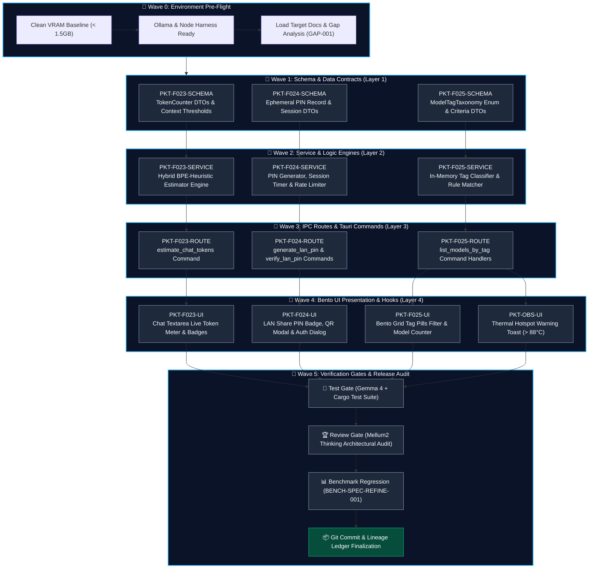

# 🌊 Execution DAG: Wave-Based Implementation Plan
## การจัดลำดับการพัฒนาแบบ Wave ด้วย Local Multi-Agent Workflow บน RTX 3060 (12GB)

| ข้อมูลเอกสาร | รายละเอียด |
|---|---|
| **Document ID** | `EXEC-DAG-WAVE-001` |
| **System** | Local LLM Hub — Phase 6 (P2 Roadmap Implementation) |
| **Version** | `1.0.0` |
| **Status** | `Approved / Execution-Ready` |
| **Target Hardware** | NVIDIA GeForce RTX 3060 (12GB GDDR6 CUDA) |
| **Workflow Standard** | [`SPEC-WORKFLOW-001`](MULTI_AGENT_WORKFLOW_SPEC.md), [`STD-003`](../standards/STD-003-implementation-unit-and-packet.md), [`ADR-009`](../adr/ADR-009-feature-gap-remediation-and-p2-roadmap.md) |
| **Associated Gap Specs** | [`GAP-001`](../GAP-ANALYSIS.md), [`FEAT-023`](../domains/inference-gateway/features/FEAT-023-chat-preflight-token-counter.md), [`FEAT-024`](../domains/network-distribution/features/FEAT-024-lan-ephemeral-pin-auth.md), [`FEAT-025`](../domains/model-management/features/FEAT-025-model-tag-taxonomy-filter.md) |

---

## 1. บทนำและสถาปัตยกรรม Wave Execution

การพัฒนาฟีเจอร์ระดับระบบบนฮาร์ดแวร์จำกัด (Single GPU 12GB VRAM) ต้องอาศัยการแบ่งรอบการพัฒนาเป็น **ลำดับคลื่น (Waves)** ที่มี Dependency แบบ **Directed Acyclic Graph (DAG)** เพื่อรับประกัน:
1. **Interface Stability (R2)**: Layer ด้านล่าง (Schema/Contracts) ต้องเสร็จสมบูรณ์และผ่านการล็อกสเปก ก่อนที่ Layer ด้านบน (Service, Route, UI) จะเริ่มพัฒนา
2. **Zero VRAM Contention**: การรัน Local AI Model แต่ละบทบาท (Explorer, Worker, Verifier, Tester, Reviewer) จะต้องรันแบบ **Sequential Single-Model Execution** พร้อมสั่ง `ollama stop` ปลดปล่อย VRAM ทุกครั้งก่อนสลับโมเดล
3. **Atomic Rollback & Lineage (R6)**: หาก Wave ใดไม่ผ่าน Gate ระบบจะไม่อนุญาตให้ไหลไป Wave ถัดไป

---

## 2. High-Level Wave Execution DAG



---

## 3. Local Multi-Agent Pipeline ต่อ Packet (Intra-Packet Workflow)

ในแต่ละ Packet ภายใน Wave จะถูกประมวลผลผ่าน **Local Multi-Agent Fleet** บน RTX 3060 12GB ตามลำดับดังนี้:

```
┌────────────────────────────────────────────────────────────────────────────────────────┐
│ 1. 🧭 Explorer Agent (Mellum2 12B Instruct @ 1,875 Prompt t/s)                         │
│    - สแกน codebase, ดึง Rust structs / TS definitions ที่เกี่ยวข้อง                    │
│    - สร้าง Target File Checklist & Context Boundary                                   │
└───────────────────────────────────────────┬────────────────────────────────────────────┘
                                            │ produces
                                            ▼
┌────────────────────────────────────────────────────────────────────────────────────────┐
│ 2. 📋 Spec Contract Gate (Verification of Scope)                                       │
│    - ล็อก Acceptance Criteria (AC), File Paths, และ System Constraints                  │
└───────────────────────────────────────────┬────────────────────────────────────────────┘
                                            │ authorizes
                                            ▼
┌────────────────────────────────────────────────────────────────────────────────────────┐
│ 3. 🛠️ Worker Agent (Mellum2 12B Instruct @ 127.8 t/s)                                  │
│    - เขียนโค้ดตามสัญญา AC พร้อมใส่ // trace:implements FEAT-xxx                        │
│    - ส่งออก Unified Diff Patch                                                         │
└───────────────────────────────────────────┬────────────────────────────────────────────┘
                                            │ submits to
                                            ▼
┌────────────────────────────────────────────────────────────────────────────────────────┐
│ 4. 🛡️ Verify Gate (Sushi Coder RL @ temp: 0.0 - Deterministic 100%)                    │
│    - ตรวจสอบโค้ดเทียบกับ AC, Null-Safety, Bounds Checking, Zero-Panic                   │
│    - [Pass] -> ส่งต่อไป Test Gate | [Fail] -> ส่งกลับ Worker แก้ไข (สูงสุด 2 รอบ)       │
└───────────────────────────────────────────┬────────────────────────────────────────────┘
                                            │ passed
                                            ▼
┌────────────────────────────────────────────────────────────────────────────────────────┐
│ 5. 🧪 Test Gate (Gemma 4 12B IT + Cargo Test CLI)                                      │
│    - คอมไพล์และรัน Unit Test / Integration Test ในเครื่อง                              │
└───────────────────────────────────────────┬────────────────────────────────────────────┘
                                            │ all green
                                            ▼
┌────────────────────────────────────────────────────────────────────────────────────────┐
│ 6. 🏆 Review Gate (Mellum2 12B Thinking @ 116.3 t/s)                                   │
│    - Deep CoT Concurrency Audit, Architectural Invariants Check                        │
│    - อนุมัติ Commit Draft และบันทึกลง lineage ledger                                   │
└────────────────────────────────────────────────────────────────────────────────────────┘
```

---

## 4. รายละเอียดและแผนการดำเนินการในแต่ละ Wave

### 🌊 Wave 0: Environment Pre-Flight
- **วัตถุประสงค์**: ล้าง VRAM และเตรียมสภาพแวดล้อมทดสอบ
- **ภารกิจ**:
  1. สั่ง `ollama stop` ปลดปล่อยโมเดลทั้งหมดให้อยู่ในสถานะ Clean VRAM (< 1.5GB)
  2. ยืนยันว่า Node.js ESM harness และ Ollama v0.35.0 พร้อมทำงาน
  3. ตรวจสอบสถานะ git working tree clean

---

### 🌊 Wave 1: Schema & Data Contracts (Layer 1)
- **วัตถุประสงค์**: นิยามโครงสร้างข้อมูลและ Serialized DTOs ทั้งหมดใน Rust Core
- **Packets**:
  1. **`PKT-F023-SCHEMA`**: นิยาม `TokenEstimateRequest`, `TokenEstimateResult`, `ContextThresholdLevel` ใน `src-tauri/src/models/types.rs`
  2. **`PKT-F024-SCHEMA`**: นิยาม `LanSharePinSession`, `LanPinVerificationResult` ใน `src-tauri/src/models/types.rs`
  3. **`PKT-F025-SCHEMA`**: นิยาม `ModelCategoryTag` enum (`Coding`, `Reasoning`, `Chat`, `Vision`, `Edge`) และเพิ่ม field `tags: Vec<String>` ใน `UnifiedModel`
- **Agent Assigned**:
  - Worker: `MODEL-MELLUM2-INST` (MoE 2.5B Active)
  - Verify Gate: `MODEL-SUSHI-CODER` (RL Zero-Variance)
  - Test Gate: `cargo test --lib` (Serde serialization unit tests)

---

### 🌊 Wave 2: Service & Logic Engines (Layer 2)
- **วัตถุประสงค์**: พัฒนากลไกการคำนวณและตรรกะทางธุรกิจใน Rust Backend
- **Packets**:
  1. **`PKT-F023-SERVICE`**: ฟังก์ชันคำนวณ BPE Heuristic ใน Rust และ JavaScript (`src/js/chat.js`)
  2. **`PKT-F024-SERVICE`**: อัปเกรด `src-tauri/src/commands/share.rs` เพิ่ม Axum In-Memory Session Store, PIN Generator (สุ่มเลข 4 หลัก), Timer หมดอายุ 30 นาที, และ Brute-force rate limiter
  3. **`PKT-F025-SERVICE`**: ฟังก์ชัน `classify_model_tags(model: &UnifiedModel)` อนุมานหมวดหมู่จากชื่อและ metadata ใน `src-tauri/src/commands/models.rs`
- **Agent Assigned**:
  - Explorer & Worker: `MODEL-MELLUM2-INST`
  - Verify Gate: `MODEL-SUSHI-CODER`
  - Test Gate: `cargo test --test test_lan_share` + `test_model_aggregation`

---

### 🌊 Wave 3: IPC Routes & Tauri Commands (Layer 3)
- **วัตถุประสงค์**: Expose คำสั่ง IPC สู่ Frontend อย่างปลอดภัยตามกฎ ADR-100 (Zero-Panic)
- **Packets**:
  1. **`PKT-F023-ROUTE`**: Command `estimate_chat_tokens` ใน `src-tauri/src/commands/chat.rs`
  2. **`PKT-F024-ROUTE`**: Commands `generate_lan_pin`, `verify_lan_pin` ใน `src-tauri/src/commands/share.rs`
  3. **`PKT-F025-ROUTE`**: Command `get_models_with_taxonomy` ใน `src-tauri/src/commands/models.rs`
  4. ลงทะเบียนคำสั่งใหม่ใน `generate_handler![]` ใน `src-tauri/src/lib.rs`
- **Agent Assigned**:
  - Worker: `MODEL-MELLUM2-INST`
  - Verify Gate: `MODEL-SUSHI-CODER`
  - Review Gate: `MODEL-MELLUM2-THINK`

---

### 🌊 Wave 4: Bento UI Presentation & Hooks (Layer 4)
- **วัตถุประสงค์**: พัฒนาส่วนต่อประสานผู้ใช้แบบ Responsive, Real-time และทันสมัย
- **Packets**:
  1. **`PKT-F023-UI`**: Live Token Meter มุมกล่องข้อความ Chat พร้อมไฟสถานะ 🟢/🟡/🔴 ใน `src/js/chat.js`
  2. **`PKT-F024-UI`**: ปุ่มสลับ "Require PIN", ป้าย PIN 4 หลัก, Modal แสดง QR Code, และหน้า Auth Dialog บน Web Portal ใน `src/index.html`
  3. **`PKT-F025-UI`**: Tag Filter Pills bar ด้านบนหน้ารายการโมเดลใน `src/js/model.js` พร้อมตัวนับโมเดลแบบ Dynamic
  4. **`PKT-OBS-UI`**: Toast แจ้งเตือนเมื่อ GPU Hotspot สูงเกิน 88°C ใน `src/js/sensors.js`
- **Agent Assigned**:
  - Worker: `MODEL-MELLUM2-INST`
  - Verify Gate: `MODEL-SUSHI-CODER`

---

### 🌊 Wave 5: Verification Gates & Release Audit
- **วัตถุประสงค์**: ตรวจสอบคุณภาพขั้นสุดท้ายก่อนปิดรอบการพัฒนา
- **ขั้นตอนการตรวจสอบ**:
  1. **Full Test Suite Execution**: รัน `cargo test --tests` และ `cargo test --lib` ทั้งหมด (ต้องผ่าน 100% Green)
  2. **Architectural Concurrency Audit**: ใช้ `MODEL-MELLUM2-THINK` ตรวจสอบ race condition และ memory leaks
  3. **Benchmark Regression**: ยืนยันว่าการทำงานของระบบไม่ทำให้ Throughput ของโมเดลตกลง
  4. **Git Commit & Lineage**: บันทึก hash ลง `packet-lineage.jsonl` และ commit เข้าสู่ `main`

---

## 5. กฎเหล็กด้าน Hardware & VRAM Management บน RTX 3060 12GB

| ข้อกำหนด | กฎเกณฑ์ที่ต้องปฏิบัติตาม |
|---|---|
| **Max Concurrent Models** | **1 โมเดลเท่านั้น** ใน VRAM ณ เวลาใดเวลาหนึ่ง |
| **Model Context Window** | จำกัด `num_ctx: 8192` เพื่อคุม KV Cache ไม่ให้เกิน 1.5GB VRAM |
| **Model Switching Protocol** | เรียก `ollama stop "<current_model>"` แบบ Synchronous ก่อนโหลดโมเดลถัดไป |
| **Circuit Breaker** | หาก Worker แก้ไขโค้ดไม่ผ่าน Verify Gate เกิน 2 ครั้ง ให้ Escalate ไปที่ `Mellum2 Thinking` ทันที |
| **Zero Panic Policy** | ทุกฟังก์ชันใน Rust ต้อง return `Result<T, String>` ห้ามใช้ `.unwrap()` หรือ `panic!` |
