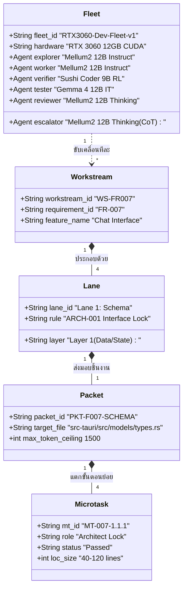

# 📐 Multi-Agent Taxonomy: Fleet, Workstream, Lane & Microtask
## เอกสารนิยามมาตรฐานศัพท์และวิธีนับหน่วยการผลิตซอฟต์แวร์ด้วย Local AI Fleet บน RTX 3060 (12GB)

| ข้อมูลเอกสาร | รายละเอียด |
|---|---|
| **Document ID** | `SPEC-TAXONOMY-001` |
| **Title** | Multi-Agent Taxonomy: Fleet, Workstream, Lane, Packet & Microtask Quantification |
| **Version** | `1.0.0` |
| **Status** | `Approved / Normative Standard` |
| **Standard & Governance** | [`SPEC-WORKFLOW-001`](MULTI_AGENT_WORKFLOW_SPEC.md), [`STD-003`](../standards/STD-003-implementation-unit-and-packet.md), [`EXEC-DAG-WAVE-001`](EXECUTION_DAG_WAVES.md) |
| **Target Hardware** | NVIDIA GeForce RTX 3060 12GB GDDR6 (CUDA 12.x) |

---

## 1. บทนำและกรอบแนวคิดหลัก (Conceptual Overview)

ในการพัฒนาระบบซอฟต์แวร์ด้วย **Local Multi-Agent Fleet** จำเป็นต้องมีนิยามศัพท์ที่เป็นเอกภาพและสามารถวัดปริมาณงาน (**Quantification**) ได้อย่างแม่นยำ เพื่อป้องกันความสับสนระหว่าง:
- **ใครเป็นคนทำ?** $\rightarrow$ **Fleet** (ทีมโมเดล AI)
- **ทำฟีเจอร์อะไร?** $\rightarrow$ **Workstream** (สายธารการผลิตระดับ Feature/FR)
- **ทำที่ชั้นสถาปัตยกรรมไหน?** $\rightarrow$ **Lane** (ทางวิ่งระดับชั้นข้อมูล Schema/Service/Route/UI)
- **ส่งมอบชิ้นงานขนาดเท่าใด?** $\rightarrow$ **Packet** (หน่วยงานระดับเลเยอร์)
- **ลงมือทำคำสั่งย่อยระดับใด?** $\rightarrow$ **Microtask** (หน่วยงานระดับฟังก์ชันหรือ Unit Test)

```
┌────────────────────────────────────────────────────────────────────────────────────────┐
│ 🛸 FLEET (ทีมเครื่องบินรบ AI): 1 Fleet ต่อ 1 Hardware Node (มี 5 + 1 Agents)           │
└───────────────────────────────────────────┬────────────────────────────────────────────┘
                                            │ ขับเคลื่อน
                                            ▼
┌────────────────────────────────────────────────────────────────────────────────────────┐
│ 🚀 WORKSTREAM (สายการผลิตคุณลักษณะ): 1 Workstream = 1 FR (ความต้องการ 1 ข้อ)           │
└───────────────────────────────────────────┬────────────────────────────────────────────┘
                                            │ แตกเป็น 4 ทางวิ่งตามชั้นสถาปัตยกรรม
                                            ▼
┌────────────────────────────────────────────────────────────────────────────────────────┐
│ 🏊‍♂️ LANE (ทางวิ่งสถาปัตยกรรม): เสมอ 4 Lanes ต่อ 1 Workstream                            │
│   ├── Lane 1: Schema Lane    (Layer 1: Structs / DTOs / Types)                         │
│   ├── Lane 2: Service Lane   (Layer 2: Core Logic / Algorithms)                        │
│   ├── Lane 3: Route Lane     (Layer 3: Tauri IPC Commands)                             │
│   └── Lane 4: UI Lane        (Layer 4: Bento Glassmorphic DOM / JS)                    │
└───────────────────────────────────────────┬────────────────────────────────────────────┘
                                            │ ส่งมอบชิ้นงาน
                                            ▼
┌────────────────────────────────────────────────────────────────────────────────────────┐
│ 📦 PACKET (ชิ้นงานประจำเลน): 1 Packet = 1 FR × 1 Lane (รวม 4 Packets ต่อ Workstream)   │
└───────────────────────────────────────────┬────────────────────────────────────────────┘
                                            │ ย่อยการทำงาน TDD
                                            ▼
┌────────────────────────────────────────────────────────────────────────────────────────┐
│ 🔬 MICROTASKS (งานอะตอมิกย่อยสุด): 4 Microtasks ต่อ 1 Packet (16-18 MTs ต่อ 1 FR)      │
│   ├── MT.1 [Architect Lock]  → ล็อกสเปก interface และ signature                        │
│   ├── MT.2 [Tester TDD Red]  → เขียน Unit Test ดักล่วงหน้า                              │
│   ├── MT.3 [Coder Green]     → เขียนโค้ดจริงให้เทสต์ผ่าน                               │
│   └── MT.4 [Verifier DoD]    → ตรวจ Memory Safety, Zero-Panic, AC Match                 │
└────────────────────────────────────────────────────────────────────────────────────────┘
```

---

## 2. นิยามและวิธีนับรายหน่วย (Detailed Quantification Rules)

---

### 🛸 2.1 Fleet (ฝูงบิน AI) คืออะไร และนับอย่างไร?

#### 📌 นิยาม:
**Fleet** คือ **กลุ่มโมเดล AI ท้องถิ่น (Local LLMs) ที่ถูกคัดเลือกและจัดตั้งขึ้นมาเป็นทีม** บนโหนดฮาร์ดแวร์หนึ่งๆ โดยแต่ละโมเดลจะได้รับมอบหมายบทบาทเฉพาะทาง (Specialized Roles) ตามผลการทดสอบ Benchmark เพื่อประสานงานกันจนงานเสร็จสมบูรณ์

#### 🔢 วิธีนับ (Quantification):
- **1 Fleet** = **1 ทีมโมเดลประจำเครื่องฮาร์ดแวร์ 1 เครื่อง**
- ในสภาพแวดล้อมปัจจุบันบน `MACH-LOCAL-RTX3060-I7` เรามี **1 Fleet** ชื่อว่า **`RTX3060-Dev-Fleet-v1`**
- ภายใน 1 Fleet ประกอบด้วย **5 บทบาทหลัก + 1 ทางรอดฉุกเฉิน (5+1 Agents)**:
  1. `🧭 Explorer Agent`: **Mellum2 12B Instruct** (ความเร็วอ่าน 1,875 t/s, สำรวจ Codebase)
  2. `🛠️ Worker Agent`: **Mellum2 12B Instruct** (ความเร็วตอบ 128 t/s, ผลิตโค้ด)
  3. `🛡️ Verify Gate Agent`: **Sushi Coder 9B RL** (รัน `temp: 0.0`, ตรวจ AC แบบ 100% Deterministic)
  4. `🧪 Test Gate Agent`: **Gemma 4 12B IT** (คอมไพล์โค้ดและรัน Cargo Tests)
  5. `🏆 Review Gate Agent`: **Mellum2 12B Thinking** (ความเร็วคิด 116 t/s, Deep CoT Audit)
  - `🧠 (+1) Reasoning Escalator`: **Mellum2 12B Thinking** (ตื่นมาช่วยแก้เมื่อ Worker ติดหล่มเกิน 2 รอบ)

> **ตัวอย่างการนับ Fleet:**  
> • ปัจจุบันมีคอมเครื่องเดียวรัน $\rightarrow$ **1 Fleet**  
> • หากอนาคตเชื่อมต่อเครื่องที่สอง (`MACH-WORKER-NODE-02` Dual RTX 3060) $\rightarrow$ จะเพิ่มเป็น **2 Fleets**

---

### 🚀 2.2 Workstream (สายการผลิตคุณลักษณะ) คืออะไร และนับอย่างไร?

#### 📌 นิยาม:
**Workstream** คือ **ท่อส่งงานหรือกระบวนการผลิตตั้งแต่ต้นน้ำยันปลายน้ำ (End-to-End Pipeline)** ที่รับผิดชอบในการเปลี่ยนข้อกำหนดความต้องการระบบ 1 ข้อ ให้กลายเป็นฟีเจอร์จริงใน Production ที่ผ่านการทดสอบครบถ้วน

#### 🔢 วิธีนับ (Quantification):
- **1 Workstream** = **1 Functional Requirement (1 FR)**
- หากมี Requirement 17 ข้อ จะมีทั้งหมด **17 Workstreams**
- **สัญลักษณ์และรหัสเรียก:** `WS-<REQ_ID>`
  - ตัวอย่าง:
    - `WS-FR001`: Workstream การค้นหาและตรวจสอบสถานะ Backend (`FR-001`)
    - `WS-FR007`: Workstream ระบบห้องสนทนาและ Streaming Chat (`FR-007`)
    - `WS-FR010`: Workstream ระบบสตรีมมิ่งแชร์ไฟล์โมเดลในวงแลน (`FR-010`)
    - `WS-FR023`: Workstream ระบบคำนวณและแจ้งเตือน Token ก่อนกดส่ง (`FEAT-023`)

---

### 🏊‍♂️ 2.3 Lane (ทางวิ่งสถาปัตยกรรม) คืออะไร และนับอย่างไร?

#### 📌 นิยาม:
**Lane (Architectural Swimlane)** คือ **เส้นทางวิ่งย่อยภายใน 1 Workstream ที่ถูกแบ่งตามชั้นของสถาปัตยกรรม (Architectural Layers)** เพื่อให้เกิดการล็อกขอบเขต (Interface Lock) ตามกฎ **ARCH-001** โดยไม่อนุญาตให้โค้ดชั้นบนเขียนข้ามหรือเริ่มทำก่อนที่โค้ดชั้นล่างจะผ่านการทดสอบ

#### 🔢 วิธีนับ (Quantification):
- **1 Workstream จะมี 4 Lanes เสมอ (ตายตัว)**:

$$\mathbf{1\text{ Workstream}} = \mathbf{4\text{ Lanes}}$$

| ลำดับเลน | ชื่อเลน (Lane Name) | เลเยอร์สถาปัตยกรรม | สิ่งที่เกิดขึ้นในเลนนี้ |
|:---:|---|---|---|
| **Lane 1** | **`Schema Lane`** | Layer 1: Schema / State | นิยาม Structs, Serialized DTOs, Enums, Mutex State |
| **Lane 2** | **`Service Lane`** | Layer 2: Service Logic | เขียน Core Logic, Business Rules, Algorithm การคำนวณ |
| **Lane 3** | **`Route Lane`** | Layer 3: Contract / Route | สร้าง Tauri IPC Command Handlers, Input Validation, Zero-Panic Result |
| **Lane 4** | **`UI Lane`** | Layer 4: Presentation | ออกแบบ Bento DOM, Glassmorphic CSS, Event Listeners |

> **กฎเหล็กการวิ่งใน Lane:**  
> บนการ์ด RTX 3060 12GB เลนทั้ง 4 จะวิ่งแบบ **ตามลำดับ (Sequential Flow)**:  
> $\text{Lane 1 (Schema)} \longrightarrow \text{Lane 2 (Service)} \longrightarrow \text{Lane 3 (Route)} \longrightarrow \text{Lane 4 (UI)}$

---

### 📦 2.4 Packet (ชิ้นงานประจำเลน) คืออะไร และนับอย่างไร?

#### 📌 นิยาม:
**Packet** คือ **หน่วยของชิ้นงานที่เป็นรูปธรรม (Deliverable Package)** ที่ส่งมอบในแต่ละเลนของ Workstream โดยเกิดจากผลคูณของ Requirement กับ Layer ตามมาตรฐาน **STD-003**:

$$\mathbf{\text{Packet}} = \mathbf{\text{FR}} \times \mathbf{\text{Layer (Lane)}}$$

#### 🔢 วิธีนับ (Quantification):
- **1 Workstream (1 FR)** จะมี **4 Packets เสมอ**:
  - `PKT-<FR>-SCHEMA`
  - `PKT-<FR>-SERVICE`
  - `PKT-<FR>-ROUTE`
  - `PKT-<FR>-UI`
- ตัวอย่าง: สำหรับ `FR-010` (LAN Sharing) จะมี 4 Packets คือ:
  1. `PKT-FR010-SCHEMA`: นิยาม `LanShareConfig`, `LanShareStatus`
  2. `PKT-FR010-SERVICE`: สร้าง Axum HTTP Server, Range Header Parser
  3. `PKT-FR010-ROUTE`: สร้าง `start_lan_share()`, `stop_lan_share()` commands
  4. `PKT-FR010-UI`: สร้าง UI card `view-share` และปุ่มเปิด/ปิดแชร์

---

### 🔬 2.5 Microtask (MT) คืออะไร และนับอย่างไร?

#### 📌 นิยาม:
**Microtask (MT)** คือ **หน่วยงานที่เล็กที่สุดในระดับอะตอมิก (Atomic Task)** ที่ Agent แต่ละตัวหยิบขึ้นมาทำในแต่ละขั้นตอนของ TDD Loop โดยมีขนาดโค้ดเพียง **40 – 120 บรรทัด** (< 800 tokens) เพื่อไม่ให้โมเดลเกิดอาการหลอน

#### 🔢 วิธีนับ (Quantification):
- **1 Packet** จะแตกเป็น **4 Microtasks** ตามบทบาท:
  1. `MT.1 [Architect Lock]`: ล็อกสเปก signature / interface (โดย Explorer)
  2. `MT.2 [Tester TDD Red]`: เขียน Unit Test ดักเงื่อนไขล่วงหน้า (โดย Test Agent)
  3. `MT.3 [Coder Green]`: เขียนโค้ด実装ให้เทสต์ผ่าน (โดย Worker)
  4. `MT.4 [Verifier DoD]`: ตรวจสอบ AC, Zero-Panic, Memory Safety (โดย Verify Gate)
- บวกกับ **2 Integration Microtasks** เมื่อทำครบทั้ง 4 เลน:
  - `MT.5 [Integration Test]`: รัน Cargo Integration Test เชื่อม 4 เลน
  - `MT.6 [Lineage Append]`: บันทึก Hash ประวัติลง Ledger

#### 🧮 สรุปสูตรการคำนวณรวม:
$$\mathbf{1\text{ Workstream (1 FR)}} = \mathbf{4\text{ Packets}} = (4 \times 4) + 2 = \mathbf{18\text{ Microtasks!}}$$

---

## 3. สรุปตารางเปรียบเทียบและการนับ (Master Quantification Matrix)

| ระดับหน่วย | ชื่อเรียก | นิยามเชิงวิศวกรรม | เกณฑ์การนับ | ขนาดและขอบเขต | ตัวอย่างในระบบนี้ |
|---|---|---|:---:|:---:|---|
| **Fleet** | ฝูงบิน AI | ทีมโมเดล Local LLM ประจำฮาร์ดแวร์โหนด | นับตามเครื่อง Server/GPU | **5 + 1 Agents** ต่อโหนด | `RTX3060-Dev-Fleet-v1` |
| **Workstream** | สายการผลิต | Pipeline พัฒนาฟีเจอร์ระดับ Requirement | **1 Workstream = 1 FR** | 1 ฟีเจอร์ใหญ่ของระบบ | `WS-FR007` (Chat System) |
| **Lane** | ทางวิ่งข้อมูล | เลเยอร์สถาปัตยกรรมภายใน 1 Workstream | **4 Lanes ต่อ Workstream** | 1 เลเยอร์สถาปัตยกรรม | `Schema Lane`, `UI Lane` |
| **Packet** | ก้อนชิ้นงาน | ชิ้นงานส่งมอบประจำเลน ($FR \times Layer$) | **4 Packets ต่อ Workstream** | 1 – 2 ไฟล์โค้ด | `PKT-F007-SCHEMA` |
| **Microtask** | งานอะตอมิก | ขั้นตอนย่อยของ TDD Loop ที่ Agent แต่ละตัวลงมือทำ | **16 – 18 MTs ต่อ 1 FR** | **40 – 120 บรรทัด** | `MT-007-1.1.1` (Struct Lock) |

---

## 4. แผนภาพแสดงความสัมพันธ์เชิงพื้นที่ (Architectural Topology)



เอกสารฉบับนี้ใช้เป็น **มาตรฐานอ้างอิงสูงสุด (Normative Ground Truth)** สำหรับการวางแผน, การสื่อสารในทีม, และการป้อน Prompt ให้กับ Local Multi-Agent Fleet ในทุกรอบการพัฒนา
