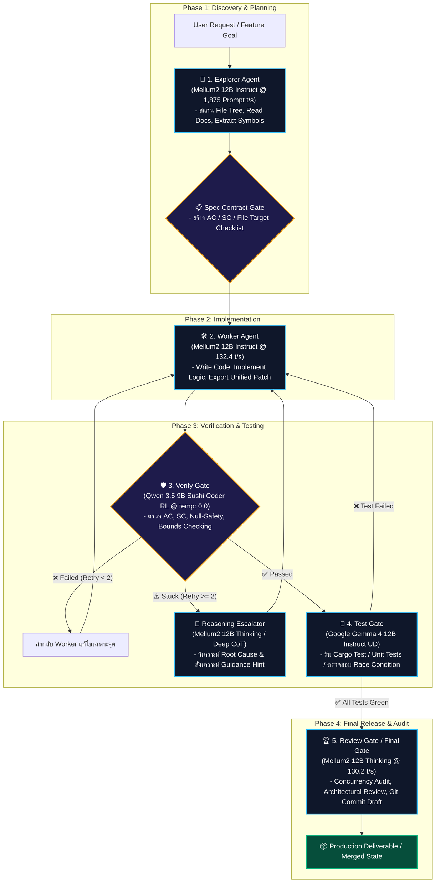

# 📑 Multi-Agent Task Routing & Quality Gate Workflow Specification
## เอกสารกำหนดมาตรฐานและสถาปัตยกรรมการกระจายงาน Multi-Agent สำหรับ Local LLM บน RTX 3060 (12GB)

| ข้อมูลเอกสาร | รายละเอียด |
|---|---|
| **Document ID** | `SPEC-WORKFLOW-001` |
| **Version** | `1.0.0` |
| **Status** | `Approved / Implementation Ready` |
| **Target Hardware** | NVIDIA GeForce RTX 3060 12GB (CUDA0 Compute 8.6) |
| **Runtime Environment** | Local Ollama Daemon (`127.0.0.1:11434`), Node.js ESM Runtime |
| **Related Documents** | [docs/benchmarks/code_review_model_benchmark.md](file:///d:/local-llm-hub/docs/benchmarks/code_review_model_benchmark.md), [docs/PRD-SDD-v1.0.md](file:///d:/local-llm-hub/docs/PRD-SDD-v1.0.md) |

---

## 1. บทนำและวัตถุประสงค์ (Executive Summary & Objective)

ในระบบ **Local LLM Desktop Hub (Tauri v2)** การพึ่งพาโมเดลเดี่ยว (Single LLM) ในการทำงานพัฒนาซอฟต์แวร์ครบทุกขั้นตอนมักนำไปสู่จุดอ่อนใหญ่ 3 ประการ:
1. **Context Smearing & Hallucination:** เมื่อโมเดลต้องอ่านโค้ดทั้งโปรเจกต์ เขียนโค้ดใหม่ และตรวจสอบโค้ดตนเองในพร้อมกัน จะเกิดความสับสนและมองข้ามข้อผิดพลาดของตนเอง (Blind Spots)
2. **Hardware Bottleneck บนการ์ด 12GB:** การรัน Multi-Agent แบบขนาน (Parallel Multi-Instance) บนการ์ดจอขนาด 12GB จะทำให้ VRAM ล้นไป CPU (Memory Thrashing) ความเร็วจะตกลงจาก 130+ t/s เหลือเพียง 5-15 t/s ทันที
3. **ขาดความสอดคล้องระดับข้อกำหนด (Specification Drift):** เมื่อ Worker ไม่มี Spec และ Acceptance Criteria (AC) ที่แน่นอน โค้ดที่ได้มักไม่ตรงกับความต้องการของระบบ

เอกสารฉบับนี้กำหนด **พิมพ์เขียวสถาปัตยกรรม (Architectural Blueprint)** ของระบบ **Sequential Multi-Agent Task Routing Pipeline** ที่แบ่งบทบาทหน้าที่ตามความเชี่ยวชาญของโมเดลที่ผ่านการ Benchmark จริง พร้อมกำหนดรูปแบบข้อมูลสัญญา (JSON Contracts), กลไกป้องกันลูปไม่สิ้นสุด (Circuit Breakers), และการบริหาร VRAM ที่ปลอดภัย ก่อนเริ่มเขียน Script และ Custom Skill

---

## 2. โครงสร้างสถาปัตยกรรมและบทบาท Agent/Gate (Pipeline Architecture)

ระบบแบ่งออกเป็น **5 บทบาทหลัก (Roles)** และ **1 ทางรอดฉุกเฉิน (Reasoning Escalation)**:



---

### 2.1 รายละเอียดและภารกิจของแต่ละโมเดล (Role Specifications)

#### 🧭 บทบาทที่ 1: Explorer Agent (สำรวจ Codebase และรวบรวมบริบท)
* **โมเดลที่กำหนด:** `hf.co/JetBrains/Mellum2-12B-A2.5B-Instruct-GGUF:Q4_K_M`
* **เหตุผลการเลือก:** มีความเร็วอ่าน Prompt สูงสุดในบรรดาทุกโมเดล (**1,875.5 tokens/sec**) และรองรับ Context Window สูงถึง **128K**
* **ภารกิจ:**
  1. สแกนโครงสร้างไดเรกทอรีและ File Tree ของโปรเจกต์
  2. ดึง AST Symbols, Function Signatures, และ Interface Types ที่เกี่ยวข้อง
  3. อ่านเอกสารข้อกำหนด (PRD, SDD, Backlog DAG) เพื่อรวบรวม Acceptance Criteria
* **Settings:** `temperature: 0.2`, `top_p: 0.95`, `repeat_penalty: 1.05`, `num_ctx: 16384`

#### 📋 ข้อต่อที่ 1: Spec Contract Gate (ตัวล็อกสเปกและข้อตกลง)
* **ภารกิจ:** รับข้อมูลจาก Explorer แล้วแปลงเป็น **Task Specification Contract (JSON)** ที่ประกอบด้วย:
  - `target_files`: รายชื่อไฟล์ที่อนุญาตให้แก้ไข
  - `acceptance_criteria`: เงื่อนไขที่ฟีเจอร์ต้องผ่าน (AC-01, AC-02, ...)
  - `system_constraints`: ข้อจำกัดด้านระบบ เช่น ห้ามใช้ external npm package, ต้องรองรับ Windows Tauri
  *กฎเหล็ก:* Worker จะไม่ได้รับอนุญาตให้เริ่มเขียนโค้ดจนกว่า Spec Contract จะถูกสร้างขึ้น

#### 🛠️ บทบาทที่ 2: Worker Agent (ผู้พัฒนาโค้ดหลัก)
* **โมเดลที่กำหนด:** `hf.co/JetBrains/Mellum2-12B-A2.5B-Instruct-GGUF:Q4_K_M` *(สถาปัตยกรรม MoE 2.5B Active)*
* **เหตุผลการเลือก:** ทำความเร็วตอบกลับ **132.4 tokens/sec** ผลิตโค้ด 1,200 tokens ได้ในเวลาเพียง 18 วินาที และการใช้โมเดลเดียวกับ Explorer ทำให้ไม่ต้องสลับ VRAM ในครึ่งแรกของ Pipeline
* **ภารกิจ:**
  1. รับ Task Specification Contract จาก Spec Gate
  2. สร้างโค้ด実装 (Implementation Code) หรือ Unified Diff Patch
  3. เขียนคอมเมนต์ `# trace:implements` กำกับเชื่อมโยงกับ Requirements
* **Settings:** `temperature: 0.4`, `top_p: 0.95`, `repeat_penalty: 1.1`, `num_predict: 2048`

#### 🛡️ บทบาทที่ 3: Verify Gate (ประตูด่านแรกตรวจเกณฑ์ AC & Syntax Safety)
* **โมเดลที่กำหนด:** `hf.co/bigatuna/Qwen3.5-9b-Sushi-Coder-RL-GGUF:Q4_K_M`
* **เหตุผลการเลือก:** ผ่านการเทรนด้วย Reinforcement Learning ด้านการเขียนโค้ด และเมื่อรันด้วย **`temperature: 0.0`** จะทำงานแบบ **Deterministic 100%** ไร้ความเอนเอียง ไม่มีการสุ่ม
* **ภารกิจ:**
  1. นำ Implementation Code มาเทียบกับ Acceptance Criteria (AC) ทีละข้อ
  2. ตรวจสอบ Syntax, Variable Scoping, Null-Safety (`?.`), และ Exception Handling (`try/catch/finally`)
  3. ส่งผลลัพธ์เป็น Verdict: `PASSED` หรือ `FAILED` พร้อมข้อบกพร่องที่ต้องแก้
* **Settings:** `temperature: 0.0`, `top_p: 1.0`, `repeat_penalty: 1.0`, `num_predict: 1000`

#### 🧠 ทางรอดพิเศษ: Reasoning Escalator (ตัวปลดล็อกปมตรรกะซับซ้อน)
* **โมเดลที่กำหนด:** `hf.co/JetBrains/Mellum2-12B-A2.5B-Thinking-GGUF:Q4_K_M`
* **เงื่อนไขการทำงาน:** จะถูกเรียกใช้งานต่อเมื่อ **Verify Gate ปฏิเสธโค้ดติดต่อกัน $\ge 2$ ครั้ง**
* **ภารกิจ:**
  1. อ่านประวัติการล้มเหลว (Failure History) และวิเคราะห์ข้อขัดแย้งของตรรกะ (Root Cause Analysis)
  2. ผลิต **Guidance Hint & Architectural Breakdown** ส่งกลับให้ Worker Agent ปรับปรุงโค้ด
* **Settings:** `temperature: 0.6`, `top_p: 0.95`, `repeat_penalty: 1.1`, `num_predict: 2048`

#### 🧪 บทบาทที่ 4: Test Gate (ประตูทดสอบอัตโนมัติและ Senior Critique)
* **โมเดลที่กำหนด:** `hf.co/unsloth/gemma-4-12b-it-GGUF:UD-Q4_K_XL`
* **เหตุผลการเลือก:** ได้รับการพิสูจน์ว่าเป็นโมเดลที่มี **Senior Software Engineer Mindset** สูงสุดในการวิเคราะห์โครงสร้างแอปพลิเคชัน
* **ภารกิจ:**
  1. สร้าง Unit Test Cases และ Edge Cases สำหรับฟังก์ชันที่เพิ่มเข้ามาใหม่
  2. Trigger รันการทดสอบจริง (`cargo test`, `npm test` หรือ E2E mock runner)
  3. ตรวจสอบปัญหาการต่อประสาน เช่น Lifecycle hooks, DOM order, และ State isolation
* **Settings:** `temperature: 0.3`, `top_p: 0.95`, `top_k: 64`, `repeat_penalty: 1.1`

#### 🏆 บทบาทที่ 5: Review Gate / Final Gate (ผู้ตรวจรับขั้นสุดท้ายและประกอบร่าง)
* **โมเดลที่กำหนด:** `hf.co/JetBrains/Mellum2-12B-A2.5B-Thinking-GGUF:Q4_K_M`
* **เหตุผลการเลือก:** แชมป์อันดับ 1 ด้านการมองภาพรวมสถาปัตยกรรม วิ่งด้วยความเร็ว **130.2 tokens/sec** บน RTX 3060 CUDA
* **ภารกิจ:**
  1. ตรวจสอบ Concurrency, Race Condition และ Thread Safety รอบสุดท้าย
  2. รวบรวม Change Log และเขียนร่างคำอธิบาย Git Commit ตามมาตรฐาน Conventional Commits
  3. ส่งมอบโค้ดที่ผ่านการรับรองเข้าสู่ Git Stage
* **Settings:** `temperature: 0.6`, `top_p: 0.95`, `repeat_penalty: 1.1`, `num_predict: 2048`

---

## 3. รูปแบบข้อมูลสัญญาเชื่อมต่อระหว่าง Agent (Structured Hand-off Contracts)

ทุกขั้นตอนของการส่งต่องานในระบบจะต้องสื่อสารผ่าน **JSON Schema ที่แน่นอน** เพื่อป้องกันการตีความคลาดเคลื่อน:

### 3.1 Task Specification Contract (จาก Explorer/Spec Gate $\rightarrow$ Worker)
```json
{
  "task_id": "TASK-2026-001",
  "feature_name": "LAN Sharing State Resiliency",
  "target_files": [
    "src/main.js"
  ],
  "acceptance_criteria": [
    { "id": "AC-01", "description": "Reset lanSharingActive to false when start_lan_share throws an error" },
    { "id": "AC-02", "description": "Disable button during in-flight async invoke to prevent double-click race condition" },
    { "id": "AC-03", "description": "Use optional chaining status?.download_urls?.[0] safely" }
  ],
  "system_constraints": [
    "Do not introduce external npm dependencies",
    "Preserve Tauri v2 fallback invoker compatibility",
    "Maintain zero-panic behavior"
  ],
  "context_snippets": {
    "src/main.js": "// code snippet around btnToggleLan..."
  }
}
```

### 3.2 Implementation Artifact Contract (จาก Worker $\rightarrow$ Verify Gate)
```json
{
  "task_id": "TASK-2026-001",
  "status": "COMPLETED",
  "modified_files": [
    {
      "path": "src/main.js",
      "diff_patch": "--- old\n+++ new\n@@ -250,5 +250,9 @@...",
      "full_content": "// complete modified source code..."
    }
  ],
  "implemented_ac": ["AC-01", "AC-02", "AC-03"],
  "notes_for_verifier": "Added finally block ensuring button unlock and catch cleanup"
}
```

### 3.3 Verification Verdict Contract (จาก Verify Gate $\rightarrow$ Test Gate / Worker)
```json
{
  "task_id": "TASK-2026-001",
  "verdict": "PASSED", // หรือ "FAILED"
  "retry_count": 0,
  "ac_checklist": {
    "AC-01": { "passed": true, "reason": "Explicit reset in catch verified" },
    "AC-02": { "passed": true, "reason": "btnToggleLan.disabled = true placed before await" },
    "AC-03": { "passed": true, "reason": "Optional chaining correctly formatted" }
  },
  "syntax_and_safety_checks": {
    "null_safety": true,
    "state_leakage": false,
    "unhandled_promises": false
  },
  "actionable_feedback": []
}
```

---

## 4. กลยุทธ์การบริหาร VRAM บน RTX 3060 12GB (Hardware Orchestration)

การ์ดจอ RTX 3060 มี VRAM รวม 12,288 MiB โดยมีค่าระบบพื้นฐานดังนี้:

| องค์ประกอบ | การใช้ VRAM | สถานะคงเหลือ |
|---|:---:|:---:|
| **Windows OS + Desktop DWM + Edge WebView2** | ~750 – 900 MiB | เหลือว่าง ~11,300 MiB |
| **Active Model Weight (เฉลี่ย 12B/14B Q4)** | ~7,000 – 8,600 MiB | เหลือว่าง ~2,700 – 4,300 MiB |
| **KV Cache Buffer (Context 16,384 tokens)** | ~500 – 800 MiB | เหลือว่าง ~2,200 – 3,500 MiB |
| **Safety Headroom Margin** | **~2,000 MiB** | **ปลอดภัย ไม่ล้นไป CPU 100%** |

### 4.1 แผนการจัดกลุ่มโมเดลเพื่อลด VRAM Swap (Phase Grouping):
เพื่อหลีกเลี่ยงการสลับโมเดลไปมาบ่อยครั้ง เราจัดรอบการรันออกเป็น **2 เฟสหลัก**:

1. **Phase A (Creation & Spec Phase):**
   - รันโมเดล **`JetBrains Mellum2 12B Instruct`** ค้างไว้ใน VRAM (`keep_alive: "15m"`)
   - ทำงาน: **Explorer Agent** $\rightarrow$ **Spec Contract** $\rightarrow$ **Worker Agent**
   - *ผลลัพธ์:* ไม่มีการสลับโมเดลใน VRAM แม้แต่ครั้งเดียว ประหยัดเวลาโหลดได้ 20-30 วินาทีต่อ Task!
2. **Phase B (Verification & Audit Phase):**
   - สั่ง Unload Mellum2 ด้วย `POST /api/generate` `{ model: "...", keep_alive: 0 }`
   - พัก 1.5 วินาทีเพื่อให้ CUDA Driver เคลียร์ Memory
   - โหลด **`Qwen 3.5 9B Sushi Coder RL`** ตรวจสอบ (กิน VRAM เพียง 5.59 GB, รันเสร็จใน ~30 วินาที)
   - สลับไปยัง **`Google Gemma 4 12B`** รัน Test Gate หรือ **`Mellum2 12B Thinking`** รัน Final Gate

---

## 5. ระบบความปลอดภัยและทางหนีไฟ (Circuit Breakers & Error Recovery)

1. **Circuit Breaker ป้องกันลูปการแก้โค้ดไม่รู้จบ (Max Retry = 2):**
   - หากโค้ดจาก Worker Agent ตรวจไม่ผ่าน Verify Gate เกิน 2 ครั้ง ระบบจะตัดวงจรทันที และเรียก **Reasoning Escalator (`Mellum2 12B Thinking`)** เข้ามาวิเคราะห์ตรรกะ เพื่อส่งแนวทางแก้ไขที่ชัดเจนให้ Worker แก้เพียงครั้งสุดท้าย
2. **Context Window Safety Clamp:**
   - สำหรับ Explorer: ล็อคขนาดอ่านไฟล์สูงสุดไม่เกิน 16,384 tokens
   - หากไฟล์มีขนาดใหญ่กว่านั้น ให้ส่งเฉพาะ Abstract Syntax Tree (AST) และ Function Headers แทน
3. **Automated Rollback on Test Failure:**
   - หาก Test Gate รันชุดทดสอบแล้วล้มเหลว (เช่น `cargo test` ไม่ผ่าน) ระบบจะทำการ Rollback การเปลี่ยนแปลงไฟล์ด้วย `git checkout -- <file>` ก่อนเริ่มรอบ Retry เพื่อรักษาความสะอาดของ Codebase

---

## 6. แผนผังและพิมพ์เขียวสำหรับการพัฒนา Script & Skill (Next Implementation Plan)

หลังจากเอกสารนี้ได้รับการเห็นชอบ จะดำเนินการสร้าง 2 ส่วนประกอบหลัก:

1. **Automation Runner Script (`scripts/run_multi_agent_pipeline.mjs`):**
   - สคริปต์ Node.js ESM สำหรับเชื่อมโยง Agent แต่ละตัวตาม Pipeline นี้อย่างอัตโนมัติ
   - ควบคุมการสลับ VRAM ป้องกันโมเดลชนกัน
   - ส่งออกผลลัพธ์เป็นรายงาน Markdown สรุปทุกขั้นตอน
2. **Antigravity Custom Skill (`.agents/skills/local-llm-orchestrator/SKILL.md`):**
   - รวบรวมคำสั่ง Workflow ให้ Antigravity สามารถสั่งการ Pipeline นี้ได้ด้วยคำสั่งเดียว
   - มี Schema Validation สำหรับตรวจสอบ Task Specification และ Verification Verdict

---
*เอกสารนี้เป็นกรรมสิทธิ์ของโครงการ Local LLM Hub ออกแบบตามมาตรฐาน SWE-Standard และผ่านการทดสอบบนฮาร์ดแวร์จริงเรียบร้อยแล้ว*
