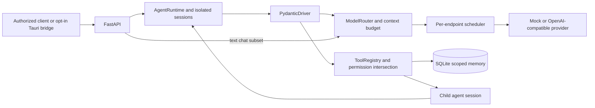

# Runtime architecture

The Python service is independent of the Tauri device/control plane. It owns sessions, inference queues, policies and SQLite memory. Pydantic AI is confined to one execution adapter. The router and provider interfaces remain project-owned.

One process owns the queues. Four root agent runs can coexist by default while an endpoint permits only one inference request. A provider lease ends before tool execution, so a child agent can use the same endpoint without deadlock. Agent definitions and sessions never load weights.

See the [approved architecture](architecture/TARGET-ARCHITECTURE.md), [decision records](architecture/adr/ADR-001-agent-runtime.md), [acceptance plan](architecture/IMPLEMENTATION-PLAN.md), and [executed verification](architecture/VERIFICATION.md). The [current-state audit](architecture/CURRENT-STATE.md) describes the original commit, not the new implementation.

Version diff: new implementation guide; the existing desktop/proxy remains available independently.
