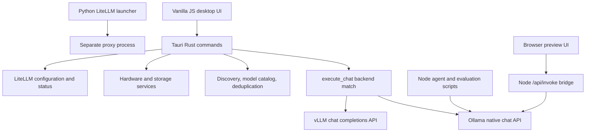

# Local LLM Hub: current-state audit

This is an evidence snapshot for the requested agent-harness migration. It is not an implementation or release acceptance report. Read it with the [target architecture](TARGET-ARCHITECTURE.md), [implementation plan](IMPLEMENTATION-PLAN.md), and [UAT evidence RCA](../../.brain/rca/RCA-001-UAT-EVIDENCE.md).

## Repository identity and inspection boundary

- Confirmed source: `D:\local-llm-hub`, remote `https://github.com/Freshair129/local-llm-hub.git`, branch `main`, baseline commit above. The checkout was clean at inspection. No fetch, pull, merge, reset, or remote change was performed; remote freshness is unverified.
- Documentation worktree: `O:\local-llm-hub-worktrees\harness-design`, branch `docs/local-llm-harness-design`, created from that baseline.
- Initial workspace `O:\local-llm-hub` contains only `tauri-app.exe` and `uninstall.exe`; the application executable reports product version `0.1.2`. It is not a Git repository.
- Source versions differ: `package.json` is `0.1.3`; Cargo and Tauri configuration are `2.0.0`. These are observations, not a requested version bump.
- Inspected tracked source, tests, configuration manifests, parent architecture, peer domains, and existing evaluation scripts. No credentials were needed. The contents of `sidecar/api_keys.json` were not inspected or copied into this proposal.

## Current runtime flow

The native chat command calls the backend directly. A proxy configuration/status surface exists alongside it; source evidence does not establish that all inference passes through LiteLLM.

## Inventory and reusable components

| Area | Observed implementation and evidence | Reuse or migration decision |
|---|---|---|
| Desktop | Tauri v2/Rust, vanilla JS, static frontend assets; [Cargo manifest](../../src-tauri/Cargo.toml), [Tauri configuration](../../src-tauri/tauri.conf.json), [IPC handlers](../../src-tauri/src/lib.rs) | Preserve desktop shell, hardware, storage, model discovery, and existing IPC signatures. |
| Catalog | `UnifiedModel` stores identity, backend, size, tags, active state and duplicate metadata; [types](../../src-tauri/src/models/types.rs), [aggregation](../../src-tauri/src/commands/models.rs) | Reuse inventory as display/discovery data. It is not yet a capability-authorized inference registry. Tags are not proof of tool calling. |
| Providers | `execute_chat` branches on Ollama and vLLM; both paths set a 120-second timeout; Ollama sends `stream: false`; [chat](../../src-tauri/src/commands/chat.rs) | Preserve legacy behavior; introduce a separate typed provider boundary for harness requests. Other compatible engines are not currently validated. |
| Backend health | HTTP probes have bounded attempts and timeout; local cache/file probes also exist; [backends](../../src-tauri/src/commands/backends.rs) | Reuse discovery concepts. Add request health, queue counts, failure counters, and endpoint-level admission control. |
| Proxy | Rust generates YAML; Python launches LiteLLM; alias generation strips model tags; configuration sets `drop_params`; [proxy](../../src-tauri/src/commands/proxy.rs), [launcher](../../sidecar/litellm_proxy.py) | Keep legacy proxy optional. New aliases must be collision-checked and unsupported request fields rejected explicitly. |
| Remote workers | Worker registration plus direct Ollama `/api/generate`; status is initialized as online; inference timeout is 5 seconds; [swarm](../../src-tauri/src/commands/swarm.rs) | Existing registration is not a generic router, active queue, or measured availability guarantee. |
| Agent workflow | Fixed role/model configuration and Ollama request logic; [pipeline](../../scripts/run_multi_agent_pipeline.mjs), [dispatch](../../scripts/dispatch_local_model.mjs), [DAG executor](../../scripts/parallel_dag_executor.mjs) | Retain as legacy clients until opt-in migration. No generic agent/session/tool/permission service was found in inspected runtime source. |
| Context | A module-global conversation array is sent with each UI message; token preflight estimates prompt size; [chat UI](../../src/js/chat.js), [token estimator](../../src-tauri/src/commands/chat.rs) | Preflight is useful UI feedback, not enforcement over history, schemas, tools and output reserve. Introduce server-side budgets. |
| Memory | App state and browser preferences exist, but no session/project/agent memory repository was found | Add a scoped persistence interface; do not reinterpret model analytics or browser preferences as agent memory. |
| Permissions | LAN path resolution and PIN helpers, Tauri command capabilities, API-key records; [sharing](../../src-tauri/src/commands/share.rs), [capabilities](../../src-tauri/capabilities/default.json) | None establishes a deny-first agent tool authorization boundary. Keep administrative desktop commands outside model-callable tools. |
| Browser bridge | `src/js/api.js` falls back to `/api/invoke`; [preview server](../../scripts/serve_ui.mjs) separately implements commands | Audit parity when introducing a new agent client. Do not label browser preview a production native API. |
| Configuration | Rust backend defaults, browser state, script constants and Python environment variables; [state](../../src-tauri/src/state.rs), [Python requirements](../../sidecar/requirements.txt) | New runtime configuration must be validated centrally. Existing settings remain in their current ownership boundary. |
| Tests/evaluation | Rust unit/integration sources and Node evaluation framework; [eval tests](../../eval/tests/eval_harness.test.mjs), [eval overview](../../eval/README.md) | Reuse deterministic validators and result concepts after checking their contracts. Do not reuse historical PASS labels as execution evidence. |
| Packaging | npm exposes Tauri and evaluation scripts; no tracked Docker/Compose or agent Python package was found | Add a separate runtime package and optional CPU-only container after approval. No GPU server belongs in its image. |

## Parent and peer document review

| Existing authority | Alignment or conflict that the proposal must resolve |
|---|---|
| [PRD-SDD v1.0](../PRD-SDD-v1.0.md), goals and non-goals | Desktop control plane is reusable. Cloud providers and distributed backends are explicitly excluded from the old scope. The new user request expands that scope; target approval must record the change rather than silently claiming old approval. |
| [Existing architecture](../adr/ARCHITECTURE.md), ADR-001/002/003/006 and ARCH-001 | Preserve Tauri, vanilla JS, UI-to-IPC boundary, and optional LiteLLM. A Python service and SQLite agent memory are new decisions; they do not rewrite desktop settings persistence. |
| [Inference gateway](../domains/inference-gateway/README.md) and [backend integration](../domains/backend-integration/README.md) | Keep discovery, proxy lifecycle and device control separate from execution policy. Specify which path owns request routing. |
| [Multi-agent workflow](../ai-system/MULTI_AGENT_WORKFLOW_SPEC.md) | Existing development automation is distinct from an application-facing runtime. Preserve its users while introducing a service contract. |
| [STD-001](../standards/STD-001-documentation-architecture.md), [STD-003](../standards/STD-003-implementation-unit-and-packet.md) | Link the new design into the document graph. Before code, register feature/requirements and issue bounded packets with explicit interfaces, acceptance tests and evidence. |

## Confirmed debt and migration risks

1. **Evaluation evidence is unsound:** the UAT generator requests a passing verdict and hardcodes success, including connection failures. An in-memory reproduction with four failed requests still produced `100% PASSED`. See the [RCA](../../.brain/rca/RCA-001-UAT-EVIDENCE.md). This finding does not prove the application features themselves fail.
2. **Behavior claims exceed inspected behavior:** the README calls chat streaming, while the inspected native completion path buffers responses. vLLM/GGUF start/stop branches return messages without lifecycle control calls. Describe these boundaries honestly during migration.
3. **No shared execution policy:** direct Rust chat, Python proxy and Node scripts form separate paths. Introducing a router without making harness requests go through it would leave concurrency and permission bypasses.
4. **Security-sensitive defaults need separation:** the legacy proxy has a built-in development credential, and a key-record file is tracked. The new runtime must never import this credential or expose key records. Secret rotation/history cleanup requires a separate concrete assessment; no credential validity was tested.
5. **Formatting baseline already fails:** the Rust formatting check produced differences across existing source. A repository-wide reformat is outside this migration proposal.

## Verification executed on 2026-10-03

| Check | Result | Evidence and limitation |
|---|---|---|
| Source identity / initial working tree | PASS | `git status --short --branch`, `git branch --show-current`, `git log --oneline -10`, remote and worktree inspection. |
| Draft documentation integrity | PASS | Nine new documents have draft lifecycle/version metadata; 64 relative links resolve; nine graph nodes and 12 edges added without changing existing entries or introducing duplicate IDs/dangling edges; tracked diff whitespace check passes. |
| Existing Node evaluation unit suite | PASS | `node eval/tests/eval_harness.test.mjs`: 5/5 tests, exit 0. Scope is the five evaluator tests only. |
| JavaScript syntax | PASS | `node --check` across 64 first-party `.js`/`.mjs` files in `src`, `scripts`, and `eval`, excluding `src/vendor`: 64 passed, 0 failed. This is not semantic linting or type checking. |
| Rust formatting | FAIL (baseline) | `cargo fmt --manifest-path src-tauri/Cargo.toml --check`: exit 1, 2,160 diagnostic lines; first difference `commands/backends.rs:46`. No formatting was applied. |
| UAT failure-path experiment | FAIL (acceptance reliability) | Four simulated provider failures still yield four passing rows and an overall 100% PASS label. No network request or file write occurred in the experiment. |
| Local endpoint discovery | Unreachable within probe deadline | Read-only requests to configured loopback defaults: Ollama version/models, vLLM models, LiteLLM health, each with a 2-second deadline, all timed out. This does not prove service absence or invalidity of another configured endpoint. |
| Lint | NOT RUN | No npm lint script is configured; Rust formatting failure above is reported separately. |
| Type checking / Rust compilation | NOT RUN | Documentation checkpoint only; no new runtime package is installed. |
| Native build / Rust test suite / desktop smoke | NOT RUN | No rebuilt or launched desktop application in this audit. |
| Real model inference / integration | NOT RUN | Endpoint discovery did not identify a reachable local default. No model was loaded, unloaded or queried for inference. |

Node is `v24.16.0` and Cargo is `1.97.1`. `python` is not on this shell's PATH; this does not establish that Python is absent from the machine. Runtime installation must select an explicit interpreter.

## Version diff

| Before | Draft 0.1.0 |
|---|---|
| No source-backed harness migration audit | Baseline identity, current flow, reusable components, parent/peer conflicts, measured checks, and explicit verification gaps. |

All new harness functionality remains **planned**. Existing desktop behavior is **implemented in source but only partially verified here**. The migration is not complete.

This document is retained as a baseline snapshot of 12e84fc. Subsequent implementation evidence is in [VERIFICATION](VERIFICATION.md).

Version diff 0.1.0 -> 0.2.0: baseline observations retained; snapshot activated and linked to subsequent implementation evidence.
