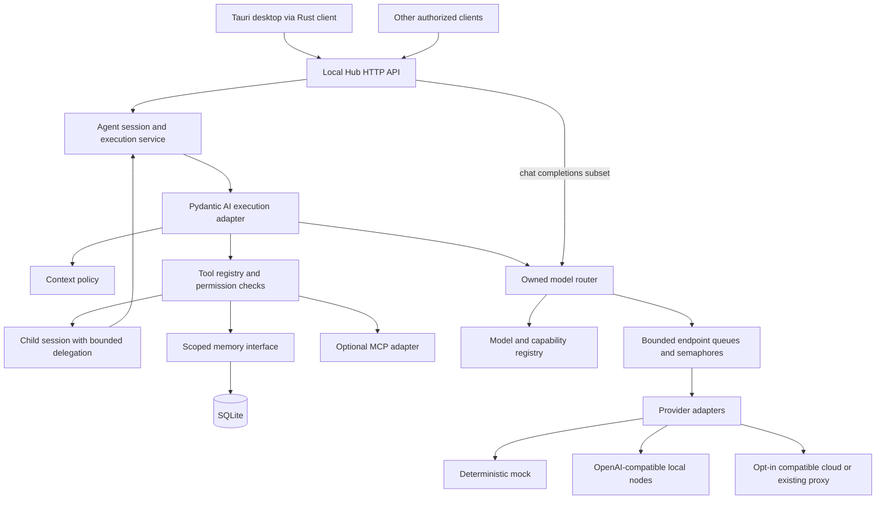

# Local LLM Hub: approved agent runtime architecture

This architecture adds a model-agnostic agent service alongside the existing desktop control plane. The user approved this design on 2026-10-03 under AGENTS.md R5. Implementation status and executed evidence are recorded in [VERIFICATION](VERIFICATION.md). The evidence baseline is [CURRENT-STATE](CURRENT-STATE.md); delivery and verification are in [IMPLEMENTATION-PLAN](IMPLEMENTATION-PLAN.md).

## Context and problem

The existing Rust chat, LiteLLM sidecar and Node agent scripts do not share a session, permission or inference-scheduling boundary. The new request needs native agent APIs, declarative roles, model capabilities, tool execution, persistent memory, delegation and reproducible evaluation without coupling each agent to a separately loaded model.

Keep the Tauri desktop, model inventory, deduplication, storage and hardware services. Add a Python service because Python is already used for the optional proxy and Pydantic AI can provide the typed agent loop. Do not put Python inside the Rust domain modules or replace the frontend stack.

## [ASSUMPTIONS]

1. Initial deployment is one trusted local operator and one runtime process. It is not a public multi-tenant hosting service.
2. Native sessions and runs are synchronous request/response in the first checkpoint. Restart invalidates in-memory sessions; project/agent memory persists.
3. Cloud routing is opt-in per configured model and request policy. Default configuration uses an explicit mock model and cannot send prompts to a cloud provider.
4. The desktop remains usable while the new service is disabled. GPU model servers remain independently operated processes or nodes.

These are proposed design choices included in approval, not silent assumptions about the user's machine.

## Parent and peer impact

| Authority / peer | Proposed treatment |
|---|---|
| [PRD v1.0](../PRD-SDD-v1.0.md) | Extend its old cloud/remote non-goals specifically for configured harness inference. Multi-user SaaS, training and fine-tuning stay outside scope. |
| [Tauri and frontend ADRs](../adr/ARCHITECTURE.md) | Preserve the desktop and UI-to-IPC boundary. A Rust client adapter may call the service; the frontend does not get host filesystem access or provider credentials. |
| LiteLLM ADR-003 | Preserve existing optional proxy clients. The harness router is authoritative for harness traffic. LiteLLM can itself be a configured upstream, not a second mandatory router. |
| Desktop settings ADR-006 | Existing settings ownership is unchanged. SQLite stores new agent memory only; no implicit migration of browser state, model statistics or key files. |
| Backend integration / model management | Catalog discovery can inform configuration, but never automatically grants capabilities, credentials or tool permissions. |
| Inference gateway / network distribution | Add an opt-in service/IPC bridge. Preserve legacy APIs and LAN sharing; do not expose their administrative operations as model tools. |
| [STD-001](../standards/STD-001-documentation-architecture.md) / [STD-003](../standards/STD-003-implementation-unit-and-packet.md) | Register new requirement/feature relationships and issue interface-locked packets before implementation. Historical ADR IDs remain intact; proposed ADRs use `HUB-ADR-*` identities. |

## Proposed decision records

| Scoped ID | Decision |
|---|---|
| HUB-ADR-001 | [Separate Python agent runtime](adr/ADR-001-agent-runtime.md) |
| HUB-ADR-002 | [Provider abstraction](adr/ADR-002-model-provider-abstraction.md) |
| HUB-ADR-003 | [Router and endpoint scheduling](adr/ADR-003-model-router.md) |
| HUB-ADR-004 | [Tool permission model](adr/ADR-004-tool-permission-model.md) |
| HUB-ADR-005 | [Memory abstraction](adr/ADR-005-memory-abstraction.md) |

## Scope

The first runnable checkpoint includes every core subsystem requested: validated configuration, providers, model/capability registry, routing/fallback, endpoint queues, health, agent definitions/sessions, bounded context, native tools, permissions, SQLite memory, bounded delegation, native HTTP API, a documented chat-completions subset, deterministic mock end-to-end tests, and a small evaluation runner.

MCP gets a disabled-by-default adapter contract and fake-adapter tests. Capability probing gets an explicit opt-in interface; `/models` discovery alone cannot prove tool/vision support. Summarization gets an interface; deterministic truncation works without another model call.

Full OpenAI parity, streaming, automatic model loading/unloading, distributed queue coordination, cost/VRAM optimization, vector databases, durable agent resumption, arbitrary native cloud SDK adapters, public hosting, Kubernetes and Kafka are deferred. They are not necessary for this checkpoint.

## Runtime and deployment flow

The service defaults to loopback, uses a configurable port, and requires an environment-supplied bearer credential for execution and detailed catalog/health APIs. Only minimal liveness is unauthenticated. Default CORS is disabled. Non-loopback deployment needs explicit bind/auth configuration and a documented trusted deployment boundary. No firewall change is part of implementation.

Use one service worker initially: in-process queues cannot enforce endpoint limits across several worker processes or several independent hubs. Multiple agents share providers and pools; creating an agent or session never loads model weights. Deployment docs must state this limitation.

## Internal boundaries

Proposed package: `runtime/local_llm_hub/`, with `api`, `agents`, `runtime`, `models`, `router`, `providers`, `tools`, `memory`, `context`, `permissions`, `mcp`, `scheduler`, `health`, and `config` modules. Small modules may share files; do not create empty frameworks merely to match names.

| Contract | Responsibility and proposed operation |
|---|---|
| ConfigLoader | `load(config_dir, environment) -> RuntimeConfig`; strict parsing and cross-reference validation. |
| ModelRegistry | `register(ModelDefinition)`, `resolve(id_or_alias)`, `list()`; duplicate and alias collision rejection. |
| Provider | `complete(InferenceRequest, ModelDefinition) -> InferenceResponse`; `health(ModelDefinition) -> ProbeResult`. |
| ModelRouter | `complete(RouteRequest) -> RoutedResponse`; owns eligibility, bounded attempts and scheduling. |
| RoutingPolicy | `rank(eligible_candidates, load_snapshot) -> ordered_candidates`; first policy is deterministic least loaded. |
| EndpointScheduler | `acquire(endpoint_id, deadline) -> lease`; counts active/queued work and releases on completion/cancellation. |
| AgentRegistry | Loads immutable definitions; resolves role/model/tool/permission references. |
| SessionStore | Creates opaque IDs; checks agent/project ownership; serializes turns per session. |
| ExecutionDriver | `run(definition, session, input, dependencies) -> RunResult`; Pydantic AI lives behind this interface. |
| ContextManager | `prepare(context_segments, model_budget) -> PreparedContext`; bounded input, safe truncation and optional summary hook. |
| ToolRegistry | Resolves schemas/handlers; never authorizes execution itself. |
| PermissionPolicy | `authorize(execution_identity, tool, validated_input) -> decision`; default deny. |
| MemoryStore | `store`, `retrieve`, `search`, `update`, `delete`, always with an authorized namespace. |
| MCPAdapter | `list_tools`, `call_tool`, `close`; imports remote tools through the same local policy boundary. |

Public DTOs are project-owned typed models. Pydantic AI message objects are translated at the execution/provider adapters; they are not the persisted memory format or the native API contract. Expected failures use typed domain errors. Raw provider bodies and configuration values do not become user-visible exception strings.

## Pydantic AI and Harness evaluation

Use Pydantic AI for the typed agent loop, tool schema handling and validated outputs. Its `UsageLimits` offers request/tool/token budgets, but provider-reported token limits may be checked after a call; local preflight remains necessary. See the [official agent documentation](https://pydantic.dev/docs/ai/core-concepts/agent/).

The official [Harness documentation](https://pydantic.dev/docs/ai/harness/) provides composable capabilities and explicitly says that `LocalWorkspace` is not a sandbox. Do not install the complete Coder capability as an authorization shortcut. Expose only tools that passed this hub's policy, and keep delegation under its shared budget.

| Primitive | Proposed use |
|---|---|
| Typed Agent and function toolsets | Execute agent/tool turns through an adapter, with request-scoped dependencies. |
| [AgentSpec](https://pydantic.dev/docs/ai/core-concepts/agent-spec/) | Evaluate as an internal translation target for validated hub YAML. Never allow arbitrary capability imports from user input. |
| [SelectModel](https://pydantic.dev/docs/ai/capabilities/select-model/) / model adapter | Route each model step through the owned router. Selection alone does not provide queue leasing. |
| [ToolOutputLimits](https://pydantic.dev/docs/ai/harness/tool-output-limits/) | Prefer bounded truncation mode after schema validation. Spill/summary modes require authorized storage/model access and are deferred. |
| [TestModel / FunctionModel](https://pydantic.dev/docs/ai/guides/testing/) | Test tool-call sequences without a GPU; disable unintended real model requests. |

Pin and lock the tested dependency versions during implementation. Harness APIs may change during 0.x, so optional capabilities must remain behind adapters. The [OpenAI provider documentation](https://pydantic.dev/docs/ai/models/openai/) describes SDK retries independent of agent budgets; disable transport retries when the hub owns retry policy.

## Configuration and model capabilities

Use `config/models.yaml`, `agents.yaml`, `permissions.yaml`, `runtime.yaml`, plus `.env.example`. Resolve named environment references only; no evaluation of expressions or Python imports. Secrets use environment variable names and redacted secret types. Private endpoints belong to ignored operator overrides. Config-relative paths resolve from the config directory, not the shell's working directory.

Validation must reject unknown fields, missing environment references, duplicate YAML keys, alias/model ID collisions, unknown fallback IDs, fallback cycles, unknown tools/agents/roles/policies, non-positive limits, inconsistent endpoint-pool limits and nonexistent workspace roots. Startup reports a sanitized field path and exits with `CONFIG_INVALID`; it never silently replaces invalid configuration with defaults.

| Definition | Required contents |
|---|---|
| Model | Logical ID, provider kind, endpoint ID, upstream model name, aliases, roles, capabilities, enabled flag, priority, fallback IDs, timeout/retry budget, concurrency limit. |
| Endpoint | Normalized base URL, credential reference, trust/egress classification, shared concurrency/queue limits, probe policy. Aliases and models sharing a capacity pool reference the same endpoint ID. |
| Capabilities | `tool_calling`, `structured_output`, `vision`, `coding`, `reasoning` as known-supported/unsupported/unknown; explicit positive `context_length` for routable models. Unknown never satisfies a required capability. |
| Agent | ID, role, model selector, required capabilities, instructions, allowed tools, permission policy, project reference, context and run budgets. |
| Runtime | Bind address/port, auth reference, state path, root-run concurrency, request/queue/run deadlines, depth limit (default 3), maximum sessions and expiry. |

Capability metadata records provenance (`configured` or `probe`), provider/model identity and observation time when probed. A probe may test a controlled schema or tool response; it cannot execute an arbitrary model-requested tool or automatically enable permissions. Native vision execution may remain unavailable in v1 even when the registry stores vision metadata; reject unsupported input types explicitly.

## Routing, fallback and inference scheduling

1. Resolve explicit ID/alias or role. Filter disabled models, requested capabilities, context constraints, endpoint health, and local/cloud data policy.
2. If no configured model satisfies capabilities, return `MODEL_CAPABILITY_MISMATCH`. If matching models exist but are unavailable, return `MODEL_UNAVAILABLE`; do not silently downgrade.
3. Rank eligible role candidates by `(active + queued) / max_concurrency`, then priority and stable model ID. Explicit selection stays on the selected model unless its configured fallback is needed. A saturated healthy endpoint queues work; saturation alone does not activate a cloud fallback.
4. Atomically reserve bounded queue capacity and obtain an inference lease. Queue wait has a deadline independent of the provider timeout, both inside the overall run deadline. A full queue returns `MODEL_BUSY`.
5. Prepare/recheck context against the actual candidate's budget; a fallback with a smaller window must not receive the larger model's unchanged request.
6. Invoke one provider attempt and record latency/status. Release the lease before tools, memory access or delegated child runs. Cancellation and failure also release it and remove queue counters.
7. Retry only configured transient connection/timeouts, 429 and eligible 5xx errors with bounded backoff. Do not retry auth/validation/capability errors, external tool side effects, or a whole agent run. Inference retries can incur duplicate provider work after an ambiguous timeout; document that limit.
8. Consider configured fallback models only within the same remaining deadline, capability constraints and egress permission. Revalidate every fallback. Report attempted logical IDs and the normalized final failure, without credentials or raw provider output.

Per-run agent admission is separate from inference permits. Waiting parents do not reserve model permits. Nested delegation uses the root run's shared limits rather than acquiring a second root-run slot, preventing a single-slot parent/child deadlock. Children are sequential initially; bounded parallel delegation can be added later.

## Agent sessions, context and delegation

An immutable agent definition contains no mutable history. Each session owns its history, task state, project and agent identity. Provider HTTP clients and inference pools may be shared; mutable context and tool authorization cannot. An existing session cannot be used with another agent/project. Concurrent turns on the same session are rejected with `SESSION_BUSY`; distinct sessions may proceed concurrently.

Root delegation depth is 0. Depths 1-3 are allowed by default; creating depth 4 returns `DELEGATION_DEPTH_EXCEEDED`. Also enforce a shared total delegation count, tool-call count, model-turn count and wall-clock deadline. A child gets a new session and only the explicit task plus selected bounded context. Effective grants are the intersection of the parent grants, target-agent policy and run restrictions. Child outputs return as untrusted tool data, not system instructions.

Context consists of system instructions, agent instructions, current task, conversation turns, tool exchanges, retrieved memory and optional summaries. Budget all serialized messages and tool schemas, reserving output tokens and a configured safety margin. An estimator reports its method; a heuristic is not an exact tokenizer. Preserve pinned instructions/current task and complete tool-call/result groups, then evict oldest complete conversation groups. If pinned content cannot fit, return `CONTEXT_LIMIT` before inference.

Limit tool output bytes at capture time and text size before model input. Truncation returns metadata (`truncated`, original size, retained size); it must not silently corrupt a structured tool result. The summarizer interface is optional and disabled by default. Persistent memory is retrieved explicitly into a bounded segment and cannot overwrite instructions.

## Tools and permission threat model

Each tool declares name, description, input/output schema, required grants, timeout and handler. First tools are `filesystem.read`, `filesystem.write`, `filesystem.list`, `search.grep`, `shell`, `http`, `memory.*` and `agent.delegate`. A schema-valid tool call still requires authorization at execution time.

| Policy profile | Maximum available authority, always subject to explicit grants |
|---|---|
| read-only | Authorized reads/list/search inside configured roots; no write, shell or network default. |
| workspace | Adds explicitly granted file writes inside those roots. |
| trusted | May enable exact executable/argument policies and explicit HTTP destinations. |
| admin | Operator-managed configuration only; not a model-selectable escape from policy. |

The service protects against malicious prompts, hostile tool arguments and out-of-scope file paths. It does not claim to isolate arbitrary code running under the same OS user or a compromised host.

- Filesystem operations canonicalize roots and existing parents, compare path components using platform semantics, and reject traversal, disallowed absolute/UNC/device paths, Windows alternate data streams, and symlink/junction/reparse escapes. New-file writes validate the parent and use bounded atomic writes. Policy tests include sibling-prefix paths and link escapes.
- Local path checks are not an OS sandbox against a concurrent hostile process changing filesystem links. Restrict managed roots to trusted writers; fail closed on detected link changes. Strong isolation for untrusted code requires a separate sandbox execution backend.
- Shell is disabled by default. Use direct process spawning with validated executable plus argument vector, no shell string interpolation, no user-controlled environment inheritance, a validated working directory, bounded stdout/stderr and exit status. Capture and kill the owned process tree on timeout/cancellation. Working directory alone is not filesystem isolation; interpreter commands, scripts and build hooks require an explicit trusted execution policy or sandbox.
- HTTP tools permit only configured destinations/methods, validate resolved addresses, disable redirects by default, cap response size and timeout, and do not forward provider credentials. Local/private destinations require explicit grants; arbitrary metadata or internal network access is denied.
- API authentication establishes operator authority; request bodies cannot grant tools, select arbitrary workspace roots or elevate a session. Browser CORS is not authentication.
- Provider output, repository files, retrieved memory and MCP descriptions are untrusted data. Prompt text cannot alter tool grants.

## Memory and MCP

Use a small SQLite store with parameterized queries and an explicit schema version. The key includes scope, project, agent/session owner and record ID. Project sharing requires configured access; agent memory stays within its project/agent namespace; session memory cannot be enumerated from another session. Support literal substring search with bounded limits first, transactions for updates/deletes and concurrent access tests. Expire session records; persist project/agent records. No embedding service or vector index is needed.

Do not store raw provider credentials or full prompts by default. The API, memory implementation and execution driver remain separable. Store future schema changes as explicit migrations; do not import historical files or destroy old data automatically.

MCP configuration is operator-owned and disabled by default. Discovered tools are namespaced and schema-checked before registration, then follow the same permission, timeout and output policies as native tools. A fake adapter must demonstrate this path; a live server is a separately reported integration check. No external tool discovery can authorize itself.

## API and compatibility

| Route | Initial contract |
|---|---|
| `GET /health` | Minimal process liveness only. |
| `GET /v1/health` | Authenticated readiness, dependency summaries and degraded state. |
| `GET /v1/models`, `GET /models` | Native registered-model catalog: aliases, roles, capabilities and safe health metadata. No claim of full OpenAI model-list parity. |
| `GET /models/{id}/health` | Endpoint/model status, last successful request time, latency, active/queued counts and failure count. |
| `GET /v1/agents` | Configured agent metadata; omit instructions, secret values and private paths. |
| `POST /v1/agents/{agent_id}/sessions` | Validate configured project access and create a session; return opaque ID and expiry. |
| `POST /v1/agents/{agent_id}/run` | Accept input plus optional owned session ID; return request/session/agent IDs, final model ID, output, actual usage when available and bounded tool metadata. |
| `POST /v1/chat/completions` | Stateless text completion through the router. Accept `model`, text `messages`, `temperature`, `max_tokens`, and `stream: false` or omitted. No implicit server tool execution. |

The chat-completions subset returns the conventional completion ID/object/created/model/choices structure and provider-backed usage when available. Reject streaming, multiple choices, image/audio input, `tools`, `tool_choice`, `response_format` and other unsupported fields with `UNSUPPORTED_PARAMETER`; never silently drop them or fabricate token counts. Native agents may internally use tools and structured outputs even though the compatibility endpoint initially exposes only text completion.

Health probes do not generate tokens or load models. Availability and capability evidence are separate. Probe intervals/timeouts are configurable and requests update health independently. Expose metrics through a small sink interface; do not require Prometheus or OpenTelemetry infrastructure in v1.

## Errors, logs and evaluation

Native errors include `{error: {code, message, request_id, details}}`; compatibility errors additionally use the documented OpenAI-style envelope where applicable. Details are sanitized and bounded.

| Error | HTTP behavior |
|---|---|
| `MODEL_UNAVAILABLE` | 503 |
| `MODEL_CAPABILITY_MISMATCH` | 422 |
| `MODEL_TIMEOUT`, `TOOL_TIMEOUT` | 504 |
| `MODEL_BUSY` | 429 |
| `TOOL_PERMISSION_DENIED` | 403 |
| `AGENT_NOT_FOUND`, unknown model/session | 404 |
| `CONTEXT_LIMIT` | 413 |
| `DELEGATION_DEPTH_EXCEEDED`, `SESSION_BUSY` | 409 |
| `CONFIG_INVALID` | Startup failure, sanitized field path; service does not start. |

Tool errors encountered inside an agent run retain their normalized codes; do not disguise failed tools as a successful run unless a documented recovery actually succeeds. Unexpected programming errors remain observable and are not converted to generic provider fallback.

Emit JSON logs with event, timestamp, request/session/agent/model IDs, tool name when applicable, duration and error code. Never log credentials, Authorization headers, complete prompts, raw provider error bodies or full tool outputs by default. Test both success and error log paths for disclosure.

Evaluation fixtures cover instruction following, tool calls, structured output, coding and reasoning with deterministic assertions appropriate to each task. Record JSON/JSONL with model/task/revision, status and reason, latency, reported tokens, and error. TTFT and decode tokens/sec are null unless measured by a supporting transport; end-to-end tokens/sec must be named as such. Derive error rate from executed trials and report skipped trials separately. Address the [confirmed UAT defect](../../.brain/rca/RCA-001-UAT-EVIDENCE.md) before using that entry point for acceptance.

## Risks, rollback and approval

| Risk | Mitigation / proof required |
|---|---|
| Python process/dependency complexity | Separate package, pinned environment, CPU-only mock quick start, independent service shutdown. |
| Pydantic/Harness coupling | Owned DTOs/policies, one adapter, pinned versions and adapter contract tests. |
| Permission escape | Deny-first policy, Windows path/link tests, shell opt-in, explicit OS-isolation limitation. |
| Queue/delegation deadlock or leaked permits | Release inference leases before tools; shared root budgets; cancellation and single-slot delegation tests. |
| Accidental cloud disclosure | Local-only default and explicit per-request/config egress constraints on every fallback. |
| Desktop regression | Opt-in bridge, legacy default retained until verified, focused Rust/desktop smoke tests. |
| False acceptance | Real assertions and receipts; no generated or static PASS labels. |

Rollback disables the new bridge and stops the separate runtime; existing desktop inference remains available. Preserve the SQLite file and logs for diagnosis. Never delete memory, reset the main checkout, or rewrite historical reports as a rollback action. Any later migration of old settings requires a separate documented plan.

The user approved this architecture, the five scoped ADRs and the [phased acceptance plan](IMPLEMENTATION-PLAN.md) on 2026-10-03. Approval authorizes implementation in the isolated worktree; it does not authorize production deployment, public exposure or credential rotation.

## Version diff

| Baseline | Draft 0.1.0 proposal |
|---|---|
| Desktop and script-specific inference | Separate Python agent service with an opt-in desktop bridge. |
| Model inventory and tags | Capability-aware registry plus one endpoint scheduler for harness traffic. |
| Global UI history and script contexts | Isolated sessions, bounded delegation and context budgets. |
| Desktop operations and key records | Explicit agent tool grants and scoped SQLite memory. |
| Static UAT success labels | Executed assertions and truthful PASS/FAIL/NOT_RUN evidence. |

Approval delta 0.1.0 → 0.2.0: user approved the design on 2026-10-03; implementation is authorized within these boundaries.

Implementation delta 0.2.0 -> 0.3.0: owned runtime/API, opt-in bridge, tools/memory/delegation and truthful evaluation implemented; see the verification receipt for PASS/FAIL/NOT_RUN boundaries.

## Zuri P1 approved extension — 2026-10-06

0.3.0 -> 0.4.0: [CR-HUB-001](../plans/CR-HUB-001-zuri-agent-backend.md) and [SPEC-HUB-ZURI-001](../plans/SPEC-HUB-ZURI-001-agent-backend.md) extend the native client contract only. P1 permits typed inference controls, strict output boundary, opt-in request-bound evidence and capability discovery with offline tests. Existing signatures/permissions/chat subset remain; P2 live integration and P3 sidecar are deferred. The extension passed its [P1 offline checkpoint](../plans/HUB-ZURI-P1-VERIFICATION.md); live Zuri integration and sidecar packaging remain NOT_RUN.
