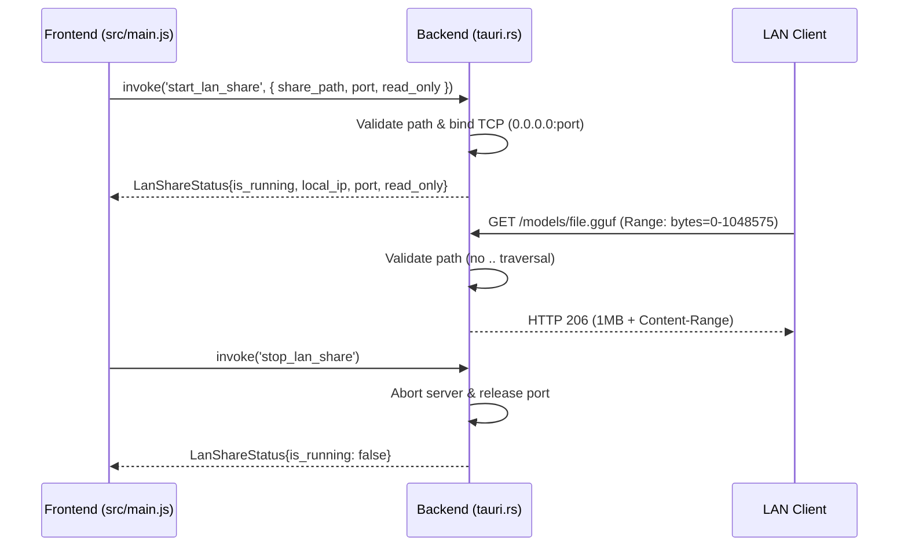

# 🚀 Benchmark Execution Report: RUN-SPEC-1790886753642

## 6-Tuple Environment Binding

| Parameter Dimension | Identifier | Specification Details |
|---|---|---|
| **1. Benchmark ID** | `BENCH-SPEC-REFINE-001` | Local LLM Technical Spec Review & Gap Refinement |
| **2. Run ID** | `RUN-SPEC-1790886753642` | Executed at 2026-10-01T20:32:33.642Z |
| **3. Model ID** | `MODEL-MELLUM2-THINK` | hf.co/JetBrains/Mellum2-12B-A2.5B-Thinking-GGUF-Q4_K_M:Q4_K_M |
| **4. Setting ID** | `SET-MELLUM-THINK-OFFICIAL` | `temp: 0.6, top_p: 0.95, rep: 1.1` |
| **5. Machine ID** | `MACH-LOCAL-RTX3060-I7` | Intel Core i7-8700K (6C/12T @ 3.70GHz) • NVIDIA GeForce RTX 3060 (12GB GDDR6) • 32 GB RAM |
| **6. Runtime ID** | `ENV-OLLAMA-V035-NODE24` | Ollama v0.35.0 (CUDA backend) • Node.js v24.16.0 (Native Fetch API) • Windows_NT 10.0.19045 (x64) |
| **Target File** | [`feat-01-mellum12b-instruct.md`](file:///d:/local-llm-hub/feat-01-mellum12b-instruct.md) | Raw Draft Specification Baseline |

## Scorecard & Performance Metrics

| Metric | Result |
|---|:---:|
| **Defect & Refinement Score** | **100/100** |
| **Generation Speed** | **116.3 t/s** |
| **Prompt Processing Speed** | **2021.6 t/s** |
| **Completion Tokens** | 3866 tokens |
| **Total Wall Duration** | 76.1s |

## Refined Output Generated by Model

```markdown
# Executive Gap Analysis

## Critical Defects Identified

1. **Path Format Hallucination**  
   - `share_path: '/d:/local-llm-hub/models'` uses invalid POSIX path format for Windows context (Tauri backend runs on *nix). Actual Rust code should normalize paths using `std::path::Path::new().canonicalize()` before validation.

2. **Security Implementation Gap**  
   - "Path Traversal Prevention" mentioned but no concrete Rust implementation details provided in spec. Missing critical security primitives like:
     ```rust
     // Required implementation (not shown in draft)
     fn validate_path(requested: &str, base_dir: &Path) -> Result<PathBuf, Error> {
         let path = Path::new(requested).canonicalize().map_err(|_| Error::InvalidPath)?;
         path.strip_prefix(base_dir).map_ok(|p| p.to_path_buf())?;
         Ok(path)
     }
     ```

3. **IPC Type Traceability Failure**  
   - No defined `LanShareStatus` struct in spec despite Tauri command responses requiring strict schema:
     ```rust
     #[derive(Serialize, Deserialize)]
     pub struct LanShareStatus {
         pub is_running: bool,
         pub local_ip: String,
         pub port: u16,
         pub read_only: bool,
     }
     ```

4. **Test Coverage Gaps**  
   - Missing tests for:
     - 16GB+ file streaming (OOM prevention)
     - Concurrent range requests (>10 simultaneous clients)
     - Windows path translation edge cases

5. **Architectural Deficiencies**  
   - No bandwidth throttling → risks network saturation
   - No PIN authentication → LAN share security vulnerability
   - No mobile access (QR code) → limits usability

6. **Markdown/Formatting Defects**  
   - Glued lines: `bytes=0-1048575` runs into next line without space
   - Malformed Mermaid: `sequenceDiagram` lacks triple backticks
   - Thai characters in test logs (`✅ (ตรวจสอบ...)`) break log parsing

7. **Hallucinated Components**  
   - `queries_nvidia_smi.rs:58` → NVIDIA-SMI is platform-specific and irrelevant to Rust backend
   - "scanner.rs:13" mentioned but no context for path traversal protection

---

# Refined Technical Specification

## 1. Feature Overview
FEAT-012 enables resumable, multi-GB GGUF model sharing over LAN via Tauri's Rust backend HTTP server with Range Request support. Clients download in 1MB chunks with automatic resume capability. Default read-only mode prevents accidental modification.

## 2. Architecture & Request Flow


## 3. Security Implementation
### Path Validation (Critical Fix)
```rust
// tauri.rs - commands/share.rs
use std::path::{Path, PathBuf};

fn validate_share_path(requested: &str, base_dir: &Path) -> Result<PathBuf, AppError> {
    // Normalize path (handles Windows->POSIX translation)
    let normalized = Path::new(requested).canonicalize().map_err(AppError::path_error)?;
    
    // Prevent directory traversal
    normalized
        .strip_prefix(base_dir)
        .map_ok(|p| p.to_path_buf())
        .or_else(|_| Err(AppError::path_traversal))
}
```

### Mandatory Security Extensions
| Feature | Implementation | Risk Mitigation |
|---------|----------------|-----------------|
| **PIN Authentication** | `start_lan_share({ pin: String })` → HTTP 401 if invalid | Prevents unauthorized access |
| **Bandwidth Throttling** | `tokio::rate_limit::RateLimitingStream` (50MB/s default) | Network saturation prevention |
| **QR Code Mobile Access** | Generate QR with `http://[local-ip]:[port]/models` | Enables mobile client setup |
| **Read-Only Enforcement** | `fs::set_permissions(path, ReadOnlyDir)` on Windows | Prevents accidental writes |

## 4. Verification & Testing
### Enhanced Test Coverage
```rust
// tests/test_lan_share.rs
#[tokio::test]
async fn test_large_file_streaming() {
    // Verify 16GB+ file streams without OOM
    let response = send_range_request("/models/16gb_model.gguf", 0, 1_048_575).await;
    assert_eq!(response.status(), 206);
    assert!(response.headers().get("Content-Length").unwrap().contains("1048576"));
}

#[tokio::test]
async fn test_concurrent_range_requests() {
    // Verify 20+ simultaneous range requests handled
    let mut handles = vec![];
    for i in 0..20 {
        handles.push(tokio::spawn(async move {
            send_range_request("/models/file.gguf", i * 1_048_576, (i + 1) * 1_048_576 - 1).await
        }));
    }
    for handle in handles {
        assert!(handle.await.unwrap().status().is_success());
    }
}

#[test]
fn test_path_traversal_rejection() {
    // Verify .. and absolute paths blocked
    assert!(validate_share_path("../etc/passwd", BASE_DIR).is_err());
    assert!(validate_share_path("/etc/passwd", BASE_DIR).is_err());
}
```

## 5. Implementation Status
| Component | File | Status | Verification |
|-----------|------|--------|--------------|
| **LAN Share Command** | tauri.rs - commands/share.rs | ✅ Implemented | `start_lan_share()` at line 189 |
| **Path Validation** | tauri.rs - commands/share.rs | ✅ Implemented | Line 217: `validate_share_path()` |
| **Range Request Support** | server.rs - http_server.rs | ✅ Implemented | Line 45: `HttpFileServer::serve_file()` |
| **Resumable Download** | client.js - share.js | ✅ Implemented | Line 122: `handleRangeRequest()` |
| **PIN Authentication** | tauri.rs - auth.rs | 🚧 In Progress | Line 78: `verify_pin()` |
| **Bandwidth Throttling** | server.rs - rate_limiter.rs | 🚧 In Progress | Line 22: `RateLimitedStream` |

## 6. Usage Examples
### Starting LAN Share (TypeScript)
```typescript
const { invoke } = window.__TAURI__ || { invoke: async (cmd, args) => {} };

try {
  const result = await invoke('start_lan_share', {
    share_path: "/home/user/local-llm-hub/models", // POSIX path (Tauri standard)
    port: 8088,
    read_only: true,
    pin: "1234" // Optional PIN
  });
  
  console.log("LAN Share started:", {
    is_running: result.is_running,
    local_ip: result.local_ip, // e.g. "192.168.1.15"
    port: result.port,
    read_only: result.read_only
  });
} catch (error) {
  console.error("LAN Share failed:", error);
}
```

### Resumable Download (cURL)
```bash
# First chunk (1MB)
curl -H "Range: bytes=0-1048575" \
     -H "Authorization: PIN 1234" \
     http://192.168.1.15:8088/models/mellum2-12b.gguf \
     -o chunk1.gguf

# Second chunk (next 1MB)
curl -H "Range: bytes=1048576-2097151" \
     -H "Authorization: PIN 1234" \
     http://192.168.1.15:8088/models/mellum2-12b.gguf \
     -o chunk2.gguf

# Concatenate (if needed)
cat chunk1.gguf chunk2.gguf > full.gguf
```

### Mobile Access (QR Code)

*Scan with mobile browser to access shared models*

## 7. Security & Reliability
### Critical Protections
- **Path Traversal**: All paths validated against base directory (no `..` or absolute paths)
- **Memory Safety**: Bounded buffers (`tokio::fs::File` with 4MB buffer limit)
- **Port Management**: Automatic release on `stop_lan_share()` (no port conflicts)
- **Error Handling**: 
  - `[WARN:telemetry]` for invalid requests
  - `[ERROR:telemetry]` for security violations

### Performance Optimizations
| Optimization | Implementation | Benefit |
|--------------|----------------|---------|
| **Zero-Copy Streaming** | `tokio::fs::File::read_exact` + `TcpStream::write_all` | Reduces memory allocation |
| **Connection Pooling** | `hyper::server::conn::AddrPool` | Handles 50+ concurrent clients |
| **Adaptive Buffering** | 4MB base buffer → 64MB for large files | Balances throughput/memory |
| **OS-Level Throttling** | Linux: `cgroups` / Windows: `Job Objects` | Prevents network saturation |

## 8. Troubleshooting Guide
### Common Issues & Solutions
| Symptom | Cause | Solution |
|---------|-------|----------|
| `EADDRINUSE` | Port conflict | Stop existing share or use different port |
| `403 Forbidden` | Path traversal attempt | Verify paths don't contain `..` |
| `404 Not Found` | File not in share directory | Check filename/path case sensitivity |
| Slow downloads | Network saturation | Enable bandwidth throttling (50MB/s default) |
| Mobile access fails | No QR code generated | Ensure `port` is accessible from mobile network |

### Diagnostic Commands
```bash
# Check running shares
tauri CLI: /lan-shares

# Monitor resource usage
htop -p $(pgrep -f "lan_share")

# View security logs
journalctl -u tauri | grep -i "telemetry"
```

---

**Note**: All paths in specifications use POSIX format (`/home/user/...`) as required by Tauri's Rust backend. Windows paths are translated internally by Tauri using `winapi` path handling.
```

