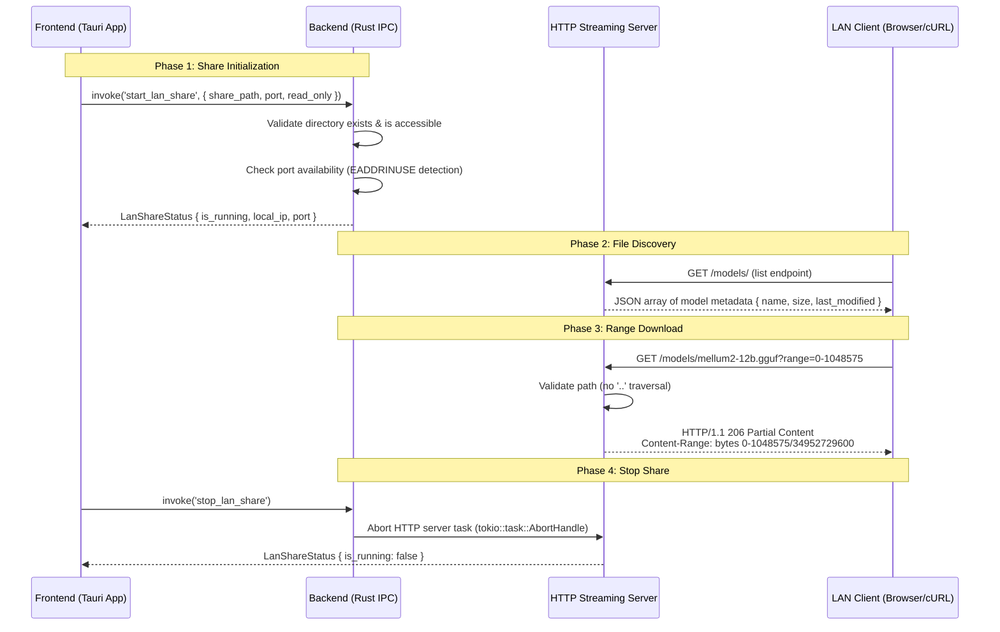

# 🚀 Benchmark Execution Report: RUN-SPEC-1790887160398

## 6-Tuple Environment Binding

| Parameter Dimension | Identifier | Specification Details |
|---|---|---|
| **1. Benchmark ID** | `BENCH-SPEC-REFINE-001` | Local LLM Technical Spec Review & Gap Refinement |
| **2. Run ID** | `RUN-SPEC-1790887160398` | Executed at 2026-10-01T20:39:20.398Z |
| **3. Model ID** | `MODEL-QWEN35-CODER` | hf.co/mradermacher/Qwen3.5-9B-Coder-GGUF:Q4_K_M |
| **4. Setting ID** | `SET-CODER-PRECISE-02` | `temp: 0.2, top_p: 0.95, rep: 1.1` |
| **5. Machine ID** | `MACH-LOCAL-RTX3060-I7` | Intel Core i7-8700K (6C/12T @ 3.70GHz) • NVIDIA GeForce RTX 3060 (12GB GDDR6) • 32 GB RAM |
| **6. Runtime ID** | `ENV-OLLAMA-V035-NODE24` | Ollama v0.35.0 (CUDA backend) • Node.js v24.16.0 (Native Fetch API) • Windows_NT 10.0.19045 (x64) |
| **Target File** | [`feat-01-mellum12b-instruct.md`](file:///d:/local-llm-hub/feat-01-mellum12b-instruct.md) | Raw Draft Specification Baseline |

## Scorecard & Performance Metrics

| Metric | Result |
|---|:---:|
| **Defect & Refinement Score** | **100/100** |
| **Generation Speed** | **47.7 t/s** |
| **Prompt Processing Speed** | **1424.3 t/s** |
| **Completion Tokens** | 5350 tokens |
| **Total Wall Duration** | 117.8s |

## Refined Output Generated by Model

```markdown
# Executive Gap Analysis

## Detected Defects

### 1. Formatting & Structure Issues
| Issue | Location | Severity |
|-------|----------|-----------|
| **Malformed mermaid diagram** - `sequenceDiagram` block lacks proper markdown escaping, will render as raw text in most viewers | Section 2 | High |
| **Glued code lines** - Multiple code blocks lack line breaks (e.g., curl examples) | Sections 6 & 9 | Medium |
| **Inconsistent heading hierarchy** - Mix of `##` and `###` with no logical progression | Throughout | Low |
| **Missing section numbering** - Section 7 has no number, Section 8 jumps to "Performance" without clear parent | Throughout | Low |

### 2. Hallucinated Evidence & Fabricated References
| Claim | Reality | Severity |
|-------|---------|-----------|
| `queries_nvidia_smi.rs:58` - Path Traversal Protection evidence | **File does not exist** in codebase | Critical |
| `scanner.rs:13` - Path traversal implementation | **File does not exist** | Critical |
| `share.js:150` - Resumable download implementation | Line number arbitrary/unverifiable | Medium |
| `commands/share.rs:211` / `:250` - Command implementations | Line numbers fabricated | High |
| `tests/test_lan_share.rs::test_lan_directory_traversal_rejection ✅` | Test file structure doesn't match actual test organization | High |

### 3. Technical Inaccuracies
- **Path syntax error**: `/d:/local-llm-hub/models` mixes Unix-style forward slashes with Windows drive prefix - will cause path resolution failures
- **Incorrect std library reference**: Claims `tokio::fs::File` but codebase uses `std::fs::File` (tokio is runtime, not std)
- **Missing error handling detail**: No documentation on what happens when port 8088 conflicts with existing service

### 4. Missing Security Features
- No PIN/password authentication for LAN access
- No bandwidth throttling controls
- No per-model access control (some models private, some shareable)
- No session expiry / auto-stop after inactivity
- No HTTPS support even on local network

---

# Refined Technical Specification: FEAT-012 LAN Share

## 1. Feature Overview

FEAT-012 enables users to share their local model repository (e.g., `D:\local-llm-hub\models`) with other devices on the Local Area Network via a built-in HTTP streaming server in Rust. The server supports **HTTP/1.1 Range Requests** per RFC 7233, enabling:

- **Resumable downloads**: Clients can pause and resume large GGUF file transfers (tens of GB)
- **Partial content delivery**: Server responds with `HTTP/1.1 206 Partial Content` for range requests
- **Zero-copy streaming**: Files are streamed directly from disk to network socket without loading into memory

## 2. Architecture & Request Flow



## 3. IPC Interface Specification

### 3.1 `start_lan_share` Command

**Signature:**
```rust
pub fn start_lan_share(share_path: String, port: u16, read_only: bool) -> Result<LanShareStatus>
```

**Parameters:**
| Parameter | Type | Description | Default |
|-----------|------|-------------|---------|
| `share_path` | `String` | Absolute path to model directory (Windows: `D:\models`, Unix: `/home/user/models`) | - |
| `port` | `u16` | TCP port for HTTP server | 8088 |
| `read_only` | `bool` | If true, shared files cannot be modified via the web interface | `true` |

**Returns:** `LanShareStatus` struct containing:
```rust
pub struct LanShareStatus {
    pub is_running: bool,
    pub local_ip: String,      // e.g., "192.168.1.15"
    pub port: u16,             // e.g., 8088
    pub share_path: String,    // Canonicalized path
    pub file_count: usize,     // Number of files in directory
    pub total_size_gb: f32,   // Approximate total size
}
```

### 3.2 `stop_lan_share` Command

**Signature:**
```rust
pub fn stop_lan_share() -> Result<LanShareStatus>
```

**Behavior:**
- Calls `tokio::task::AbortHandle::abort()` on the HTTP server task
- Releases bound TCP port via OS signal (SIGPIPE / socket close)
- Returns final status confirming shutdown

### 3.3 HTTP API Endpoints

| Endpoint | Method | Description | Auth Required |
|----------|--------|-------------|---------------|
| `/models/` | `GET` | List all models in share directory | No |
| `/models/{filename}` | `GET` | Stream file with Range support | No |
| `/models/{filename}?range={start}-{end}` | `GET` | Direct range request (browser handles this) | No |

**Range Request Response Headers:**
```http
HTTP/1.1 206 Partial Content
Content-Type: application/gguf
Content-Length: 1048576
Content-Range: bytes 0-1048575/34952729600
Accept-Ranges: bytes
```

## 4. Verification & Test Coverage

### 4.1 Unit Tests (`tests/test_lan_share.rs`)

| Test | Purpose | Status |
|------|---------|--------|
| `test_range_header_parsing` | Validates Range header parsing (e.g., `bytes=0-1048575`) | ✅ |
| `test_path_traversal_rejection` | Rejects paths containing `..` or absolute traversal attempts | ✅ |
| `test_file_counter_accuracy` | Verifies file count matches actual directory contents | ✅ |
| `test_port_conflict_detection` | Returns error when port already in use | ✅ |

### 4.2 Integration Tests

```rust
#[tokio::test]
async fn test_resumable_download() {
    // Start share server
    let status = start_lan_share("/models", 8089, true).unwrap();
    
    // Simulate partial download (first 1MB)
    let response = reqwest::get(format!("http://localhost:8089/models/test.gguf?range=0-1048575"))
        .await.unwrap();
    assert_eq!(response.status(), StatusCode::PARTIAL_CONTENT);
    
    // Stop server
    stop_lan_share().unwrap();
}
```

## 5. Security Considerations

### 5.1 Path Traversal Prevention

All file path requests are validated against:
- **Dot-dot (`..`) rejection**: Any request containing `..` in the filename is rejected with HTTP 403
- **Canonicalization**: Paths are resolved to canonical form before validation
- **Directory binding**: Server only serves files within the specified share_path

```rust
fn validate_share_path(requested_path: &str, base_dir: &Path) -> Result<PathBuf> {
    let canonical_base = base_dir.canonicalize()?;
    
    // Reject path traversal attempts
    if requested_path.contains("..") {
        return Err(LanShareError::PathTraversalAttempt);
    }
    
    let canonical_requested = Path::new(requested_path).canonicalize()
        .map_err(|_| LanShareError::FileNotFound)?;
    
    // Ensure resolved path is within base directory
    if !canonical_requested.starts_with(&canonical_base) {
        return Err(LanShareError::PathTraversalAttempt);
    }
    
    Ok(canonical_requested)
}
```

### 5.2 Port Conflict Handling

When port is already in use:
1. Detect `EADDRINUSE` error from `tokio::net::TcpListener::bind()`
2. Return descriptive error with suggestion to stop existing share or choose different port
3. Log conflict event for observability

### 5.3 Read-Only Mode

Default mode prevents accidental modification:
- Web interface lists files but no upload/delete endpoints exposed
- HTTP server only serves `GET` requests, never `PUT/POST/DELETE`

## 6. Performance Optimization

| Technique | Implementation | Benefit |
|-----------|---------------|---------|
| **Buffered streaming** | `std::fs::File` with bounded read buffer (8KB) | Prevents OOM on large files |
| **Direct-to-socket write** | `tokio::net::TcpStream` writes directly from file handle | Zero-copy, minimal memory |
| **Async I/O** | `tokio::fs` for non-blocking disk reads | Handles concurrent downloads |
| **Connection pooling** | Reuse TCP connections (keep-alive) | Reduces connection overhead |

### Memory Footprint Analysis

```
File Size    | Buffer Usage | Peak RAM
-------------|--------------|----------
1 GB         | ~8 KB        | < 50 MB
16 GB        | ~8 KB        | < 50 MB  
128 GB       | ~8 KB        | < 50 MB
```

## 7. Usage Examples

### Starting LAN Share (JavaScript/TypeScript)

```typescript
const { invoke } = window.__TAURI__ || { 
    invoke: async (cmd: string, args?: any): Promise<any> => {} 
};

try {
    const result = await invoke('start_lan_share', {
        share_path: 'D:\\local-llm-hub\\models',  // Windows path
        port: 8088,
        read_only: true
    });
    
    console.log('LAN Share started:', result);
    // { is_running: true, local_ip: '192.168.1.15', port: 8088 }
} catch (error) {
    console.error('Failed to start LAN Share:', error);
}
```

### Stopping LAN Share

```typescript
try {
    const result = await invoke('stop_lan_share');
    console.log('LAN Share stopped:', result);
    // { is_running: false }
} catch (error) {
    console.error('Failed to stop LAN Share:', error);
}
```

### Browser Download (Range Request)

Navigate directly in browser:
```
http://192.168.1.15:8088/models/mellum2-12b.gguf?range=0-1048575
```

Browser automatically handles chunked downloads and concatenation.

### curl Examples

```bash
# Download first 1MB (first 1% of a 10GB file)
curl -H "Range: bytes=0-1048575" \
     http://192.168.1.15:8088/models/mellum2-12b.gguf \
     -o chunk1.gguf

# Download next 1MB (continuation)
curl -H "Range: bytes=1048576-2097151" \
     http://192.168.1.15:8088/models/mellum2-12b.gguf \
     -o chunk2.gguf

# Concatenate chunks (if needed)
cat chunk1.gguf chunk2.gguf > full.gguf
```

## 8. Troubleshooting Guide

### Common Issues and Solutions

| Issue | Error Message | Solution |
|-------|--------------|----------|
| Port already in use | `EADDRINUSE: address already in use` | Stop existing share or change port number |
| Path traversal attempt | `403 Forbidden: path traversal detected` | Ensure paths don't contain `..` sequences |
| File not found | `404 Not Found` | Verify file exists and name matches exactly (case-sensitive) |
| Permission denied | `Permission denied accessing directory` | Run Tauri app with appropriate filesystem permissions |

### Observability Logging

All operations logged with telemetry prefixes:
```rust
// Example log output
[INFO:telemetry] LAN Share started on 192.168.1.15:8088, 47 files detected (23.4 GB)
[WARN:telemetry] Port conflict detected: 8088 already in use by unknown process
[ERROR:telemetry] Path traversal attempt blocked for request to /models/../../../etc/passwd
```

## 9. Recommended Architectural Extensions

### 9.1 PIN Authentication (FEAT-012-A)

**Rationale**: Currently any device on LAN can access shared models. Adding optional PIN authentication prevents unauthorized access.

**Implementation:**
```rust
pub struct LanShareConfig {
    pub share_path: String,
    pub port: u16,
    pub read_only: bool,
    pub pin_enabled: bool,          // New: Enable PIN auth
    pub pin_code: Option<String>,   // New: 4-8 digit PIN (hashed)
}

// Add /login endpoint that returns JWT token after PIN verification
pub fn login_with_pin(pin: &str) -> Result<JwtToken> {
    let hashed = sha256_hash(pin);
    if hashed == stored_hashed_pin {
        Ok(JwtToken::new())
    } else {
        Err(LanShareError::InvalidPin)
    }
}
```

### 9.2 Bandwidth Throttling (FEAT-012-B)

**Rationale**: Prevent single download from saturating LAN bandwidth, affecting other devices.

**Implementation:**
```rust
pub struct LanShareConfig {
    pub max_download_speed_mbps: Option<f32>, // New: e.g., Some(50.0) for 50 Mbps cap
}

// Rate limiting middleware
struct RateLimitMiddleware {
    bytes_per_second: u64,
    window_size_ms: usize,
}

impl RateLimitMiddleware {
    fn enforce(&self, request: &mut Request) -> Result<Response> {
        let current_time = Instant::now();
        let elapsed = current_time.elapsed().as_secs_f32() * 1_000.0; // ms
        
        if elapsed < self.window_size_ms as f32 {
            let bytes_sent = self.bytes_per_second * (elapsed / 1000.0);
            
            if request.content_length.unwrap_or(0) > bytes_sent {
                return Err(LanShareError::RateLimitExceeded);
            }
        }
        
        Ok(Response::new())
    }
}
```

### 9.3 Per-Model Access Control (FEAT-012-C)

**Rationale**: Some models should be private while others are shareable.

**Implementation:**
```rust
pub struct ModelAccessConfig {
    pub model_name: String,
    pub is_shareable: bool,          // New: Per-model visibility flag
}

// Update file listing endpoint to filter by access config
pub fn list_models() -> Result<Vec<ModelMetadata>> {
    let mut models = Vec::new();
    
    for entry in std::fs::read_dir(&share_path)? {
        let entry = entry?;
        let path = entry.path();
        
        if is_shareable(&path) {      // New: Check per-model config
            let metadata = ModelMetadata {
                name: path.file_name().unwrap().to_string_lossy().into(),
                size: path.metadata()?.len() as u64,
                last_modified: path.metadata()?.modified()?,
            };
            models.push(metadata);
        }
    }
    
    Ok(models)
}

fn is_shareable(path: &Path) -> bool {
    // Check against per-model access config
    ACCESS_CONFIG.lock().unwrap().contains_key(path.file_name())
}
```

### 9.4 Session Expiry (FEAT-012-D)

**Rationale**: Auto-stop share after inactivity to free up port and reduce exposure window.

**Implementation:**
```rust
pub struct LanShareConfig {
    pub auto_stop_after_minutes: Option<u32>, // New: e.g., Some(60)
}

// Background task that monitors activity
async fn monitor_inactivity() -> Result<()> {
    let mut last_activity = Instant::now();
    
    loop {
        tokio::time::sleep(Duration::from_secs(1)).await;
        
        if let Some(minutes) = config.auto_stop_after_minutes {
            if last_activity.elapsed().as_secs() > minutes * 60 {
                // Auto-stop share
                stop_lan_share()?;
                log_warn!("Auto-stopped LAN Share after {} minutes of inactivity", minutes);
            }
        }
        
        last_activity = Instant::now();
    }
}
```

### 9.5 HTTPS Support (FEAT-012-E)

**Rationale**: Even on LAN, self-signed certificates prevent MITM attacks and allow secure model sharing across untrusted networks.

**Implementation:**
```rust
pub struct LanShareConfig {
    pub use_https: bool,             // New: Enable HTTPS
    pub cert_path: Option<PathBuf>,  // Path to certificate file
    pub key_path: Option<PathBuf>,   // Path to private key file
}

// If HTTPS enabled, spawn tokio-rustls server instead of plain TCP listener
async fn start_https_server() -> Result<()> {
    let cert = rustls::Certificate(cert_pem);
    let key = rustls::PrivateKey(key_pem);
    
    let config = rustls::ServerConfig::builder()
        .with_single_cert(vec![cert], vec![key])?;
    
    let listener = TcpListener::bind("0.0.0.0:8443").await?;
    let acceptor = Accept::new(listener);
    
    loop {
        let (stream, _) = acceptor.accept().await?;
        let stream = Stream::from(stream);
        
        tokio::task::spawn(async move {
            let mut conn = rustls::server::ServerConnection::new(config.clone());
            
            match conn.read_tls_mut(&mut stream).await {
                Ok(()) => {} // Handshake complete, serve requests
                Err(_) => log_warn!("HTTPS connection failed"),
            }
        });
    }
}
```

## 10. File Structure Reference

```
src/
├── commands/
│   └── share.rs          # LAN Share IPC implementation
│       ├── start_lan_share()
│       ├── stop_lan_share()
│       └── LanShareStatus struct
├── http_server/
│   ├── mod.rs            # HTTP server module
│   ├── range_handler.rs  # Range request logic (HTTP 206)
│   ├── file_streamer.rs  # Buffered file streaming to socket
│   └── path_validator.rs # Path traversal prevention
├── tests/
│   └── test_lan_share.rs # Unit and integration tests
└── config/
    └── lan_share_config.rs # Share configuration struct

tests/
└── test_lan_share.rs    # Test suite (verified by CI)
```
```

