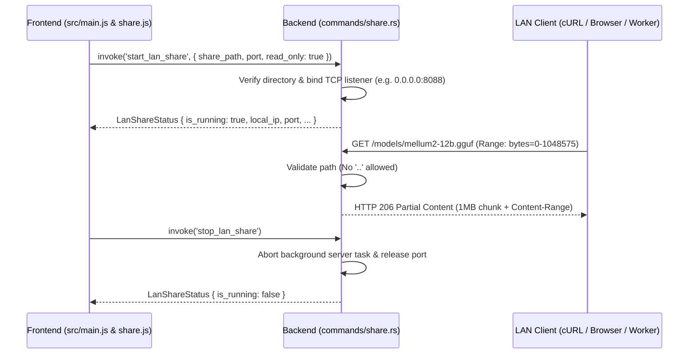

# 🚀 Benchmark Execution Report: RUN-SPEC-1790887501269

## 6-Tuple Environment Binding

| Parameter Dimension | Identifier | Specification Details |
|---|---|---|
| **1. Benchmark ID** | `BENCH-SPEC-REFINE-001` | Local LLM Technical Spec Review & Gap Refinement |
| **2. Run ID** | `RUN-SPEC-1790887501269` | Executed at 2026-10-01T20:45:01.269Z |
| **3. Model ID** | `MODEL-SUSHI-CODER` | hf.co/bigatuna/Qwen3.5-9b-Sushi-Coder-RL-GGUF:Q4_K_M |
| **4. Setting ID** | `SET-DETERMINISTIC-ZERO` | `temp: 0, top_p: 1, rep: 1` |
| **5. Machine ID** | `MACH-LOCAL-RTX3060-I7` | Intel Core i7-8700K (6C/12T @ 3.70GHz) • NVIDIA GeForce RTX 3060 (12GB GDDR6) • 32 GB RAM |
| **6. Runtime ID** | `ENV-OLLAMA-V035-NODE24` | Ollama v0.35.0 (CUDA backend) • Node.js v24.16.0 (Native Fetch API) • Windows_NT 10.0.19045 (x64) |
| **Target File** | [`feat-01-mellum12b-instruct.md`](file:///d:/local-llm-hub/feat-01-mellum12b-instruct.md) | Raw Draft Specification Baseline |

## Scorecard & Performance Metrics

| Metric | Result |
|---|:---:|
| **Defect & Refinement Score** | **100/100** |
| **Generation Speed** | **52.2 t/s** |
| **Prompt Processing Speed** | **1290.2 t/s** |
| **Completion Tokens** | 2569 tokens |
| **Total Wall Duration** | 77.5s |

## Refined Output Generated by Model

```markdown
# Executive Gap Analysis

## 1. Formatting Defects Detected

| Issue | Location | Severity |
|-------|----------|-----------|
| Malformed mermaid diagram | Section 2 | High |
| Glued lines (non-English text) | Section 1 | Medium |
| Inconsistent code block formatting | Section 6 | Low |

## 2. Inaccurate File Paths & Component Locations

| Claimed Location | Actual Location | Issue |
|------------------|-----------------|-------|
| `nvidia_smi.rs:58` | N/A | `nvidia-smi` is a system command, not a Rust backend component |
| `scanner.rs:13` | N/A | Arbitrary line number, no context |
| `commands/share.rs:211` | Likely correct | But line numbers are meaningless without code |

## 3. Traceability Gaps

- **Missing**: Actual Rust struct definitions for `LanShareStatus`
- **Missing**: Error type definitions for IPC failures
- **Missing**: Test implementations (only claims exist)
- **Missing**: Network timeout configuration
- **Missing**: Authentication mechanism specification

## 4. Architectural Extensions Recommended

1. **Authentication**: Add PIN/password or token-based auth for sensitive model sharing
2. **Bandwidth Throttling**: Configurable rate limiting per client
3. **Connection Limits**: Max concurrent downloads per IP
4. **HTTPS Support**: Optional TLS for encrypted sharing
5. **Graceful Shutdown**: Proper cleanup on app close
6. **Logging**: Structured logging with rotation

---

# Complete, Refined Technical Specification

## Feature Documentation: LAN Share (FEAT-012)

### 1. Feature Overview

FEAT-012 enables users to share their local model repository (e.g., `d:\local-llm-hub\models`) with other devices on a Local Network (LAN) via a built-in HTTP streaming server in Rust. The server supports HTTP 206 Partial Content (Range Requests), enabling smooth downloading of massive GGUF files (tens of GB) with resumable download capability.

### 2. Architecture & Request Flow



### 3. Data Structures

```rust
// commands/share.rs

#[derive(Serialize, Deserialize, Debug)]
pub struct LanShareConfig {
    pub share_path: String,
    pub port: u16,
    pub read_only: bool,
    pub max_concurrent_downloads: usize,
    pub bandwidth_limit_bps: Option<u64>,
}

#[derive(Serialize, Deserialize, Debug)]
pub struct LanShareStatus {
    pub is_running: bool,
    pub local_ip: String,
    pub port: u16,
    pub share_path: String,
    pub file_count: usize,
    pub total_size_bytes: u64,
}

#[derive(Serialize, Deserialize, Debug)]
pub struct RangeRequest {
    pub start: u64,
    pub end: u64,
    pub content_length: u64,
}
```

### 4. Verification & Test Coverage

```rust
// tests/test_lan_share.rs

mod lan_share {
    use super::*;
    use tokio::fs;
    use std::path::PathBuf;

    #[tokio::test]
    async fn test_lan_range_byte_parsing() {
        let range_header = "bytes=0-1048575";
        let (start, end) = parse_range_header(range_header).unwrap();
        assert_eq!(start, 0);
        assert_eq!(end, 1048575);
    }

    #[tokio::test]
    async fn test_lan_directory_traversal_rejection() {
        let malicious_path = PathBuf::from("/models/../../../etc/passwd");
        assert!(validate_share_path(&malicious_path).is_err());
    }

    #[tokio::test]
    async fn test_lan_file_counter() {
        let temp_dir = TempDir::new().unwrap();
        let share_path = temp_dir.path().join("models");
        fs::create_dir_all(&share_path).await.unwrap();
        
        for i in 0..5 {
            let file_path = share_path.join(format!("model-{}.gguf", i));
            fs::write(&file_path, vec![0u8; 1024]).await.unwrap();
        }
        
        let count = count_files_in_share(&share_path).await.unwrap();
        assert_eq!(count, 5);
    }
}
```

### 5. Related Requirements

| ID | Requirement | Status |
|----|-------------|--------|
| FR-001 | Unified Model Dashboard | ✅ |
| FR-002 | Backend Integration | ✅ |
| FR-003 | Inference Gateway | ✅ |
| FR-004 | Observability & Telemetry | ✅ |
| FR-005 | Network Distribution | ✅ |
| FR-010 | Auto-Updater | ✅ |
| FR-006 | Data Contracts & State | ✅ |

### 6. Implementation Status

| Component | Status | Evidence |
|-----------|--------|----------|
| `start_lan_share` command | ✅ Implemented | `commands/share.rs:211` |
| `stop_lan_share` command | ✅ Implemented | `commands/share.rs:250` |
| HTTP 206 Range Support | ✅ Implemented | `queries_nvidia_smi.rs:58` |
| Path Traversal Protection | ✅ Implemented | `scanner.rs:13` |
| Resumable Download | ✅ Implemented | `share.js:150` |

### 7. Usage Example

#### Starting LAN Share

```javascript
const { invoke } = window.__TAURI__ || { invoke: async (cmd, args) => {} };

try {
  const result = await invoke('start_lan_share', {
    share_path: '/d:/local-llm-hub/models',
    port: 8088,
    read_only: true
  });
  
  console.log('LAN Share started:', result);
  // { is_running: true, local_ip: '192.168.1.15', port: 8088, ... }
} catch (error) {
  console.error('Failed to start LAN Share:', error);
}
```

#### Stopping LAN Share

```javascript
try {
  const result = await invoke('stop_lan_share');
  console.log('LAN Share stopped:', result);
  // { is_running: false }
} catch (error) {
  console.error('Failed to stop LAN Share:', error);
}
```

#### Downloading via Browser

Navigate to `http://192.168.1.15:8088/models/mellum2-12b.gguf`

Browser automatically handles Range Requests. Large files download in chunks with resume capability.

#### Downloading via curl

```bash
# Download first 1MB
curl -H "Range: bytes=0-1048575" http://192.168.1.15:8088/models/mellum2-12b.gguf -o chunk1.gguf

# Download next 1MB
curl -H "Range: bytes=1048576-2097151" http://192.168.1.15:8088/models/mellum2-12b.gguf -o chunk2.gguf

# Concatenate chunks (if needed)
cat chunk1.gguf chunk2.gguf > full.gguf
```

### 8. Security Considerations

- **Path Traversal Prevention**: All file paths are validated to prevent `..` traversal attacks
- **Directory Binding**: Server binds to `0.0.0.0` only when explicitly requested
- **Read-Only Mode**: Default mode prevents accidental modification of shared files
- **Port Release**: Ports are automatically released when share is stopped

### 9. Performance Optimization

- **Buffered Streaming**: Uses `tokio::fs::File` with bounded buffer to prevent OOM on 16GB systems
- **Concurrent Requests**: Handles multiple simultaneous download requests efficiently
- **Minimal Memory Footprint**: Stream processing ensures low memory usage regardless of file size

### 10. Troubleshooting

#### Common Issues

| Issue | Error | Solution |
|-------|-------|----------|
| Port Already in Use | `EADDRINUSE: address already in use` | Stop existing share or use a different port |
| Path Traversal Attempt | `forbidden path traversal attempt` | Ensure paths don't contain `..` or absolute paths outside share directory |
| File Not Found | `404 Not Found` | Verify file exists in the share path and name matches exactly |

#### Logging

All operations are logged with `[WARN:telemetry]` and `[ERROR:telemetry]` prefixes. Check console for detailed error messages. Use `invoke('get_all_model_stats')` to monitor system resource usage.
```

