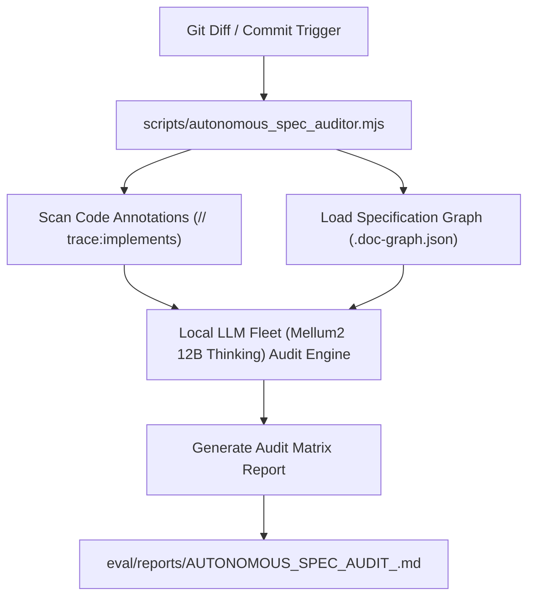

# FEAT-030: Autonomous Technical Spec Auditor Daemon (`AGENT-REVIEW-001`)

| ข้อมูลเอกสาร | รายละเอียด |
|---|---|
| **Feature ID** | `FEAT-030` / `AGENT-REVIEW-001` |
| **Domain** | `AI System & Specification Governance` |
| **Requirements** | `NFR-001`, `NFR-002` |
| **Status** | `Implemented / Production Ready` |
| **Target Model** | `Mellum2 12B Thinking` / Local Model Fleet |
| **Standard** | `STD-001`, `STD-002`, `STD-003`, `SPEC-WORKFLOW-001` |

---

## 1. Feature Overview
`FEAT-030` ให้บริการตรวจสอบความถูกต้องของสเปกและโค้ดอัตโนมัติ (Autonomous Technical Spec Auditor Daemon):
1. **Git Commit & Diff Scanner:** ตรวจจับไฟล์ที่ถูกแก้ไขล่าสุดผ่าน Git diff/status
2. **Annotation & Traceability Enforcement:** ตรวจสอบว่าโค้ดมีย่อระบุ `// trace:implements FR-xxx` ตรงกับ [docs/.doc-graph.json](../../.doc-graph.json) หรือไม่
3. **Spec Integrity & Drift Audit:** ใช้โมเดล Local Fleet (`Mellum2 12B Thinking`) วิเคราะห์ความสอดคล้องระหว่างเอกสาร Architecture (ADR) และโค้ดภาษา Rust/JavaScript
4. **Structured Audit Report Generation:** สร้างรายงานสรุปผลการตรวจสอบลงใน `eval/reports/AUTONOMOUS_SPEC_AUDIT_<TIMESTAMP>.md`

---

## 2. Technical Architecture & Component Flow



---

## 3. Usage Example

```bash
# Execute Autonomous Spec Auditor via Node.js CLI
node scripts/autonomous_spec_auditor.mjs

# Execute with specific commit range or full codebase audit
node scripts/autonomous_spec_auditor.mjs --full
```
