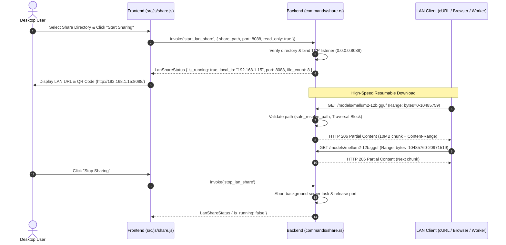

# FEAT-012 — LAN Model Streamer & Directory Sharing

| Field | Value |
|---|---|
| **ID** | FEAT-012 |
| **Domain** | network-distribution |
| **Status** | Active / Implemented |
| **Owner** | Boss |
| **Created** | 2026-09-29 |
| **Updated** | 2026-10-02 |
| **Requirements** | [FR-010](../../../requirements/FR-010-lan-sharing.md) |
| **Traceability** | [`commands/share.rs`](file:///d:/local-llm-hub/src-tauri/src/commands/share.rs), [`src/js/share.js`](file:///d:/local-llm-hub/src/js/share.js), [`tests/test_lan_share.rs`](file:///d:/local-llm-hub/src-tauri/tests/test_lan_share.rs) |

---

## 1. Feature Overview

**FEAT-012** เปิดโอกาสให้ผู้ใช้สามารถแชร์คลังโมเดลในเครื่อง (เช่น `d:\local-llm-hub\models` หรือโฟลเดอร์โมเดล GGUF/HF) ให้กับอุปกรณ์เครื่องอื่นใน Local Area Network (LAN) ได้ โดยผ่าน Built-in Asynchronous HTTP Streaming Server ใน Rust ที่รองรับ **HTTP 206 Partial Content (Range Requests)** ทำให้ไคลเอนต์สามารถดาวน์โหลดไฟล์ GGUF ขนาดมหึมา (หลายสิบ GB) ได้อย่างราบรื่นและสามารถหยุดชั่วคราวแล้วดาวน์โหลดต่อได้ (Resumable Download)

---

## 2. Architecture & Request Flow



---

## 3. Data Contracts & Interfaces

### 3.1 Rust IPC & Domain Models (`src-tauri/src/models/types.rs`)

```rust
#[derive(Debug, Clone, Serialize, Deserialize)]
#[serde(rename_all = "camelCase")]
pub struct LanShareConfig {
    pub share_path: String,
    pub port: u16,
    pub read_only: bool,
    pub auth_pin: Option<String>,
    pub max_connections: Option<usize>,
}

#[derive(Debug, Clone, Serialize, Deserialize)]
#[serde(rename_all = "camelCase")]
pub struct LanShareStatus {
    pub is_running: bool,
    pub local_ip: Option<String>,
    pub port: u16,
    pub share_path: Option<String>,
    pub active_connections: usize,
    pub total_bytes_transferred: u64,
    pub shared_model_count: usize,
}
```

---

## 4. Implementation Details

| Component / Subsystem | Location | Description |
|---|---|---|
| **LAN Share Commands** | [`src-tauri/src/commands/share.rs`](file:///d:/local-llm-hub/src-tauri/src/commands/share.rs) | ฟังก์ชัน `start_lan_share`, `stop_lan_share`, และ `get_lan_share_status` |
| **Path Traversal Protection** | [`commands/share.rs::safe_resolve_path`](file:///d:/local-llm-hub/src-tauri/src/commands/share.rs) | สแกนและตรวจจับ `..`, symlink loop, และพาธที่ไม่ได้รับอนุญาตเพื่อป้องกัน Directory Traversal |
| **HTTP 206 Range Parser** | [`commands/share.rs::parse_range_header`](file:///d:/local-llm-hub/src-tauri/src/commands/share.rs) | ถอดรหัส `Range: bytes=start-end` เพื่อส่งเฉพาะไบต์ที่ไคลเอนต์ร้องขอ |
| **Frontend Share Controller** | [`src/js/share.js`](file:///d:/local-llm-hub/src/js/share.js) | จัดการ UI Switcher, Port selector, และสถิติ Real-time Transfer Rate |

---

## 5. Verification & Test Coverage

* [`tests/test_lan_share.rs::test_lan_range_byte_parsing`](file:///d:/local-llm-hub/src-tauri/tests/test_lan_share.rs) ✅ ตรวจสอบ Range Header Parser (Byte ranges, unbounded end, invalid headers)
* [`tests/test_lan_share.rs::test_lan_directory_traversal_rejection`](file:///d:/local-llm-hub/src-tauri/tests/test_lan_share.rs) ✅ ตรวจจับและปฏิเสธการร้องขอไฟล์นอกเหนือโฟลเดอร์แชร์ (Security test)
* [`tests/test_lan_share.rs::test_lan_file_counter`](file:///d:/local-llm-hub/src-tauri/tests/test_lan_share.rs) ✅ ตรวจสอบการนับจำนวนไฟล์โมเดล GGUF/Bin ในโฟลเดอร์ที่แชร์

---

## 6. Usage & Integration Examples

### 6.1 Starting LAN Share from Frontend
```javascript
import { invoke } from '@tauri-apps/api/core';

try {
  const status = await invoke('start_lan_share', {
    config: {
      sharePath: 'D:\\local-llm-hub\\models',
      port: 8088,
      readOnly: true,
      authPin: null,
      maxConnections: 8
    }
  });
  console.log(`LAN Server running on http://${status.localIp}:${status.port}`);
} catch (err) {
  console.error('Failed to start LAN share:', err);
}
```

### 6.2 Resumable Model Download via CLI / cURL
```bash
# Download first 10MB chunk
curl -H "Range: bytes=0-10485759" http://192.168.1.15:8088/models/qwen2.5-coder-7b.gguf -o model_part1.gguf

# Resume next 10MB chunk
curl -H "Range: bytes=10485760-20971519" http://192.168.1.15:8088/models/qwen2.5-coder-7b.gguf -o model_part2.gguf
```

---

## 7. Recommended Future Enhancements

1. 📱 **Web Download Portal (`GET /`)**:
   * หน้า Web Dashboard สไตล์ Glassmorphism แสดงรายชื่อโมเดล, ขนาดไฟล์, และปุ่มคลิกเดียวเพื่อดาวน์โหลดผ่านเบราว์เซอร์
2. 📷 **QR Code Fast Connect**:
   * แสดง QR Code บนเดสก์ท็อป สำหรับให้มือถือหรือแท็บเล็ตสแกนแล้วเปิดหน้าดาวน์โหลดได้ทันที
3. 🔒 **4-Digit PIN Security Mode**:
   * ป้องกันการดึงโมเดลโดยอุปกรณ์ไม่ได้รับอนุญาตในวง Wi-Fi เดียวกัน
4. ⚡ **Bandwidth & I/O Throttling**:
   * กำหนดเพดานความเร็ว (เช่น Max 50 MB/s) เพื่อไม่ให้กระทบ Disk I/O ขณะรัน Inference โมเดลหลักในเครื่อง
5. 📡 **Zero-Config mDNS Discovery**:
   * ประกาศโปรโตคอล `_localllm-share._tcp.local` ให้อุปกรณ์อื่นค้นพบเครื่อง Hub ในวงแลนอัตโนมัติ
