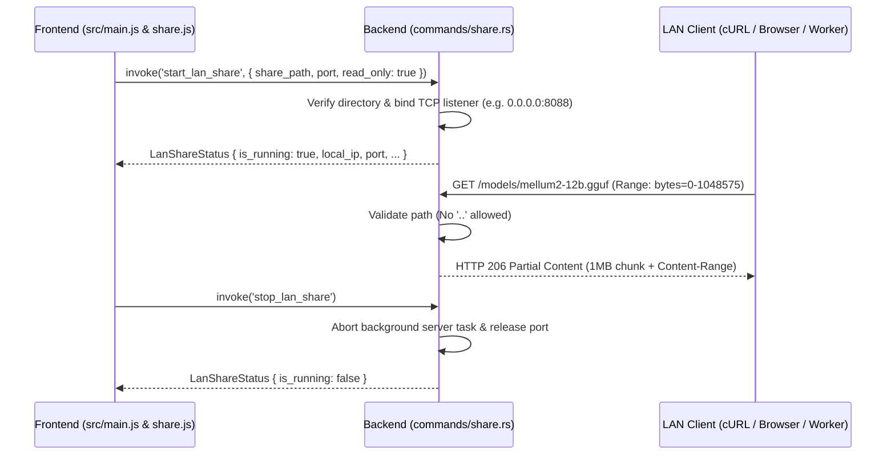

# FEAT-012 — LAN Model Streamer & Directory Sharing

| Field | Value |
|-------|-------|
| **ID** | FEAT-012 |
| **Domain** | network-distribution |
| **Status** | Active / Implemented |
| **Owner** | Boss |
| **Created** | 2026-09-29 |
| **Requirements** | [FR-010](../../../requirements/FR-010-lan-sharing.md) |
| **Traceability** | `commands/share.rs`, `src/js/share.js`, `tests/test_lan_share.rs` |

---

## 1. Feature Overview

FEAT-012 เปิดโอกาสให้ผู้ใช้สามารถแชร์คลังโมเดลในเครื่อง (เช่น `d:\local-llm-hub\models`) ให้กับอุปกรณ์เครื่องอื่นใน Local Network (LAN) ได้ โดยผ่าน Built-in HTTP Streaming Server ใน Rust ที่รองรับ HTTP 206 Partial Content (Range Requests) ทำให้ไคลเอนต์สามารถดาวน์โหลดไฟล์ GGUF ขนาดมหึมา (หลายสิบ GB) ได้อย่างราบรื่นและสามารถหยุดชั่วคราวแล้วดาวน์โหลดต่อได้ (Resumable Download)

---

## 2. Architecture & Request Flow

---

## 3. Verification & Test Coverage

- `tests/test_lan_share.rs::test_lan_range_byte_parsing` ✅ (ตรวจสอบ Range Header parser)
- `tests/test_lan_share.rs::test_lan_directory_traversal_rejection` ✅ (ป้องกัน Path Traversal `..`)
- `tests/test_lan_share.rs::test_lan_file_counter` ✅ (นับจำนวนไฟล์โมเดลในโฟลเดอร์ที่แชร์)
