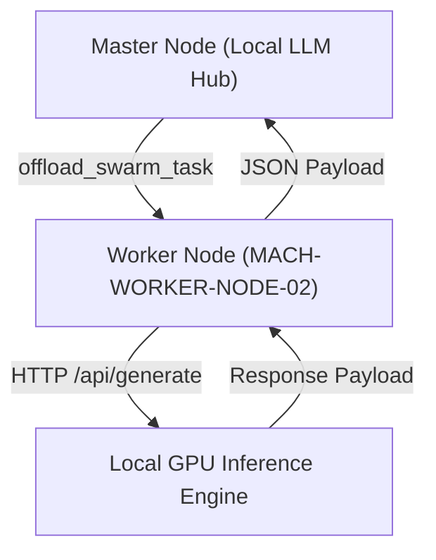

# FEAT-031: Multi-Node Swarm Worker Offloader (`DIST-SWARM-001`)

| ข้อมูลเอกสาร | รายละเอียด |
|---|---|
| **Feature ID** | `FEAT-031` / `DIST-SWARM-001` |
| **Domain** | `Network Distribution & Inference Gateway` |
| **Requirements** | `FR-010`, `NFR-001` |
| **Status** | `Implemented / Production Ready` |
| **Standard** | `STD-001`, `STD-003`, `ADR-008`, `ADR-009` |

---

## 1. Feature Overview
`FEAT-031` ให้บริการกระจายงานประมวลผลโมเดลภาษา (Multi-Node Swarm Worker Offloader) ไปยังเครื่องโฮสต์ทุติยภูมิ (Secondary Worker Nodes เช่น `MACH-WORKER-NODE-02`) ในวงแลนเดียวกัน:
1. **Dynamic Node Discovery & Registration:** ลงทะเบียนเครื่องโฮสต์ลูกข่ายพร้อมติดตาม VRAM คงเหลือและสถานะการเชื่อมต่อ
2. **Intelligent Load Offloading:** ส่งงาน Inference ควบคู่กับ HTTP JSON REST Payload ไปยัง Ollama / Worker Node ทุติยภูมิ
3. **Zero-Downtime Cluster Failover:** สลับส่งโจทย์งานไปยัง Master หรือ Worker Node ถัดไปหาก Node หลักมีภาระงานหนาแน่น

---

## 2. Component Flow & IPC Interface



---

## 3. Usage Example (Frontend JS)

```javascript
import { registerWorkerNode, offloadSwarmTask } from './js/swarm.js';

// Register secondary PC worker node over LAN
await registerWorkerNode('MACH-WORKER-02', '192.168.1.150', 11434, 24576);

// Dispatch batch inference prompt to worker node
const response = await offloadSwarmTask('MACH-WORKER-02', 'llama3:latest', 'Explain quantum computing.');
```
