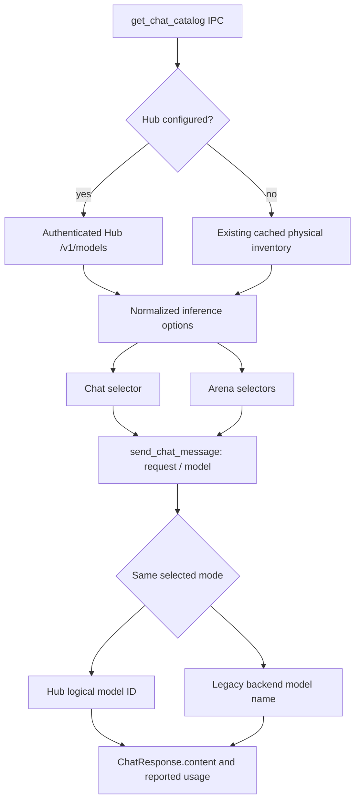

# Repair all current failures and close the remaining acceptance gaps

## Scope and parent/peer alignment

The user requested "fix it all" on 2026-10-04. This proposal covers the reported formatting failure, desktop Chat/Arena contract defects, Docker execution and backend cancellation evidence. It also records the remaining symlink/model-catalog limitations rather than silently dropping them.

Parent: [approved architecture](../architecture/TARGET-ARCHITECTURE.md), [H01-H30](../architecture/IMPLEMENTATION-PLAN.md), [ADR-100](../adr/ARCHITECTURE.md). Peers: [FR-007 Chat](../requirements/FR-007-chat-interface.md), [FR-011 Arena](../requirements/FR-011-model-arena.md), [FR-023 Hub](../requirements/FR-023-hub-api-evaluation.md), [API packet](../packets/PKT-FR-023-HUB-ROUTE.md). Confirmed causes: [RCA-002](../../.brain/rca/RCA-002-DESKTOP-ACCEPTANCE-GAPS.md).

The approved Hub transport is buffered. Older peer requirements describe streaming/TTFT; this repair will document the supported buffered mode and show unavailable metrics honestly, not claim those old streaming criteria passed. New streaming, provider types, live MCP transports, distributed coordination and durable conversation storage remain separate feature work. Installer signing and release publication are not part of desktop functional smoke.

## Architecture and contract delta

Add `get_chat_catalog(state) -> Result<ChatCatalog, String>` as an additive IPC command. Its serialized result is `{mode: "hub" | "legacy", models: [{id, name, model, backend}]}`. All option fields are strings: id is the UI selection key, name is display text, model is the exact value sent in ChatRequest.model, and backend is the selected legacy backend or hub. For Hub entries, id/model are the registered logical ID; do not expose private endpoint URLs or tokens. Only enabled Hub models appear. For legacy entries, keep the current inventory ID, display name and actual backend model name. Return an explicit error on an enabled but unavailable Hub; do not fall back to the legacy list.

Both Chat and Arena consume this catalog through shared frontend state. Physical model-management views continue using list_all_models. Reinitialization preserves a still-valid selection, resets a stale selection explicitly and does not retain a previous-mode model. An empty/error catalog disables inference with a visible explanation. Request payload remains `{request:{model,messages,backend,temperature,max_tokens}}`; response remains the existing ChatResponse. This is a contract addition and changes cross-module behavior, approved by the user on 2026-10-05.

Arena renders content, uses reported completion_tokens when available, and removes Math.random, response-length token guesses and fabricated GPU labels. Show TTFT as not measured. Any output-token rate derived from total duration is labeled an end-to-end rate, not decode throughput. The legacy zero-for-unknown usage convention must not turn absent measurements into performance evidence. Winner indication is withheld when comparable measured values are unavailable.

## Bounded implementation units and acceptance

| Unit | Change map | Risk | Exit criterion |
|---|---|---|---|
| R1: Formatting | Exactly the 23 Rust files listed by the current formatter receipt | LOW | cargo fmt --check exits 0; inspect mechanical-only diff; existing Rust tests still pass |
| R2: Catalog/Chat | src-tauri/src/commands/hub.rs, src-tauri/src/lib.rs, narrowly scoped catalog DTOs; src/main.js, src/js/chat.js, src/js/state.js and a small shared catalog module if needed | MEDIUM | Hub-only model appears and sends its logical ID; legacy-disabled path still works; empty/failed Hub catalog cannot silently use legacy models; no credential reaches frontend |
| R3: Arena/metrics | src/js/arena.js and the directly affected Chat telemetry | MEDIUM | Both selected backends use correct request fields; canonical response renders; errors remove busy state; no random TTFT or guessed tokens/GPU state; unavailable metrics cannot determine a winner |
| R4: Native GUI acceptance | Narrow WebDriver runner/tests and task-local test configuration | MEDIUM | Real Tauri window selects a Hub model and renders an actual Hub response; Arena succeeds; service outage is visible; capture results and stop owned app/driver/services |
| R5: Container acceptance | Runtime Dockerfile/Compose only if an executed failure requires a fix; a bounded container smoke runner | HIGH for environment setup | Build locked runtime image; healthy unprivileged container; unauthorized request rejected; authenticated mock request succeeds; project memory survives container restart; owned containers stop while evidence volumes are preserved |
| R6: Cancellation evidence | Existing opt-in live test plus bounded server-log receipt handling | MEDIUM | Correlate the cancelled server task with stop/release and subsequent successful request; keep GPU kernel-level timing unverified unless actually instrumented |
| R7: Documentation | FR-007/FR-011/FR-023, matching packet, deployment/verification/RCA, graph and append-only lineage | LOW | Contracts and measured outcomes agree; preserve prior receipts and record current source/commands/counts/skips |

Implement R1 separately from behavior changes for a reviewable diff. Add focused failing contract tests for R2/R3 before fixes. Native GUI checks must use actual IPC and Hub HTTP, not a mocked browser presented as desktop proof. Existing library/API tests remain the fast regression gate.

## Environment actions included in the proposed approval

- Docker: use the already registered Ubuntu 26.04 WSL2 distribution. Read-only discovery found no Docker/Podman/socket. Its VHD is on C:, so package/image storage will grow there; do not relocate a distro or place Docker overlay storage on the NTFS workspace. After checking host free space and package conflicts, install Docker Engine and Compose from the official Ubuntu package repository. Record installed versions. Do not remove conflicting packages, change Windows firewall rules or enable persistent startup automatically. If prerequisites conflict, stop that environment step and report the exact blocker. Use an isolated Compose project and test-only token/volumes/loopback port; no GPU container support is needed. Stop task-started services afterwards; retain packages and evidence volumes for reproducible reruns.
- GUI: install only task-local tauri-driver and a matching Microsoft Edge WebDriver when absent, record versions/checksums, and use a distinct test app identifier/profile. Do not replace O:\local-llm-hub\tauri-app.exe or reuse the user's app data. No privileged embedded automation plugin is added to the production build. The driver may open the test window because interaction with that window is the requested verification.
- Model: reuse the already approved qwen3.5:4b files and temporary 127.0.0.1:11435 server profile when live repetition is needed. No new weights, inference engine, global binding, cloud access or unrelated process termination.

Reference procedures: [Tauri WebDriver](https://v2.tauri.app/develop/tests/webdriver/) and [Docker Engine on Ubuntu](https://docs.docker.com/engine/install/ubuntu/). Validate tool versions and host prerequisites during execution; these links are not evidence that installation or acceptance has run.

## Other reported limitations, accounted for explicitly

| Item | Current evidence | Disposition |
|---|---|---|
| Backend cancellation | Existing Ollama log lines 832-834 record HTTP completion after disconnect, cancellation of task 674 and slot release; task 704 subsequently completes. | Promote only server-task stop/release evidence after correlation review. Existing untimestamped slot lines cannot establish GPU kernel stop latency. |
| True Windows symlink test | Existing fixture skips when the host cannot create a symlink; junction escape already passes. | Execute the symlink test in Linux container acceptance as additional platform coverage. Keep Windows-specific privilege-dependent result distinct; do not change Windows developer mode or privilege policy automatically. |
| Broken unrelated model entry | The MaralGPT-Mythos-9B Q4_K_M manifest references a missing 407-byte config blob `008c3c9e5d7ccd86e9e8445d7df131715860e848a9ffeb0abb02f3d9a661c57c`; its 5,629,109,248-byte model layer is present. | Diagnose/recover only an exact SHA-256-matching existing local metadata copy if available. Do not redownload weights, fabricate metadata, overwrite the manifest or remove the model under this approval. If no exact copy exists, report the separate recovery prerequisite. |
| Template warnings on other models | Discovery warnings alone do not prove those embedding/reranking models fail their intended task. | Preserve inventory and report warnings; no speculative template rewrite. |
| Global Ollama binding | Process/user setting remains 0.0.0.0:11434; no pre-existing inference listener was found before the temporary test. | Temporary task stays loopback-only. Managed service/network-policy migration is not inferred from a GUI repair. |
| Live MCP, other providers, streaming | Explicit deferred extension/features in the approved architecture. | Keep deferred; they are not claimed fixed by this acceptance repair. |

## Verification and rollback

Success requires R1-R3 tests and formatting to pass and R4-R6 to have actual execution evidence or exact prerequisite blockers. An unresolved environment gate means the overall "all fixed" claim is not permitted. Run Python lint/typecheck/regressions, Node contract tests, Rust library tests and the native build where affected. Check documentation metadata/links/graph and append source-linked receipts. Do not repeatedly run GPU tests for documentation-only edits.

Rollback disables the opt-in bridge and restores only this change's explicit files through a reviewed revert, preserving original checkout WIP and databases. Stop only task-owned processes/containers; no broad prune, volume deletion, git reset/clean/stash, merge, push or release.

## Version diff

New draft 0.1.0: replaces an ambiguous "fix all" with confirmed causes, an additive catalog contract, seven bounded units, explicit environment setup and verifiable exit criteria. No application code, dependencies, container installation or model files were modified while preparing this proposal.

Approval delta 0.1.0 -> 0.2.0: user approved all specified repair units and environment actions on 2026-10-05. Execution is authorized within the stated boundaries.

R4 execution refinement: native tests reproduced hidden peer panels and IPC starvation from synchronous, overlapping sensor reads (RCA-002). The minimal HTML close-tag correction and async worker/one-in-flight telemetry refresh are required to make the approved Chat/Arena acceptance executable. `src/index.html` and `src/js/observability.js` are consequently included alongside the already scoped Rust command file. Sensor contracts, sampling cadence, settings and hardware data are preserved; this remains MEDIUM cross-module repair risk.
