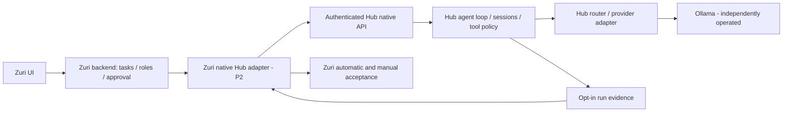

# สเปก Hub native agent backend สำหรับ Zuri

## 1. บริบท เป้าหมาย และข้อกำหนดต้นทาง

CR: [CR-HUB-001](CR-HUB-001-zuri-agent-backend.md). RCA: [RCA-003](../../.brain/rca/RCA-003-ZURI-BACKEND-CONTRACT-GAPS.md). Tech lead/ผู้จัดทำ: ATHER; owner/ผู้อนุมัติ: Boss. ไม่มีการกำหนดทีมเพิ่มเติมหรือวันส่งมอบที่ยังไม่ได้ตกลง

เป้าหมาย P1: Hub รองรับ external client ที่ต้องรู้สัญญาที่รองรับ กำหนด inference settings ผ่าน operator config และรับหลักฐานของ structured run ได้ โดยคง API/permissions ของ client เดิม ใช้ [target architecture](../architecture/TARGET-ARCHITECTURE.md) และ [separate-runtime ADR](../architecture/adr/ADR-001-agent-runtime.md) เป็น parent; FR-018/019/020/021/023 เป็น peer ตาม CR

[ASSUMPTIONS]

1. เสนอให้เริ่มแบบ local service แยก, trusted operator หนึ่งคน, Hub worker เดียว ยังไม่ใช่ public multi-tenant service
2. Zuri เป็นเจ้าของ business roles/skills/task approvals; operator ของ Hub map สิ่งเหล่านี้เป็น immutable agent definitions และ scoped tool permissions ไม่แปล role name จาก request เป็นสิทธิ์โดยอัตโนมัติ
3. P1 ทำเฉพาะ Hub และ offline verification; P2 จึงเชื่อม Zuri และใช้ live fixture; sidecar lifecycle เป็น P3

ข้อสมมตินี้เป็นส่วนของเอกสารที่ต้องอนุมัติก่อน implementation ไม่ใช่การตัดสินใจที่นำไปลงโค้ดแล้ว

## 2. ขอบเขตและ ownership

Hub เป็นเจ้าของ agent loop ของงานที่ส่งให้ Hub เท่านั้น ไม่รัน OpenCode loop ซ้อนภายใน Hub Zuri ยังคุมคำสั่งธุรกิจและ review queue; Hub บังคับสิทธิ์ tools ที่แคบกว่าหรือเท่ากับ operator grants Hub ไม่ได้ทำ role provisioning จากชื่อบทบาทหรือ execute marketing skills ทุกไฟล์เอง

P1 รวม discovery, settings propagation, duplicate-key rejection, structured-output enforcement และ evidence แบบ opt-in ใช้ native buffered run เดิม

ไม่รวม streaming/async job API, run resumption, remote hosting, model download/start/stop, database migration, dependency upgrade, UI, OpenCode-compatible proxy, live inference หรือ sidecar launcher การเปิด Zuri เพียงแอปเดียวแล้วใช้งานได้เป็นเป้าหมาย P3 ไม่ใช่ผลส่งมอบ P1

## 3. สัญญา API ที่เสนอ

### 3.1 Client discovery

เพิ่ม authenticated `GET /v1/capabilities` ตอบ object:

| Field | ชนิด/ค่า |
|---|---|
| `contract_version` | literal `0.2.0` เป็น native client contract version ไม่ใช่ package version |
| `native_agents` | literal true |
| `transport` | literal `buffered` |
| `structured_output` | literal `tool_schema` |
| `run_evidence_version` | literal `0.1.0` |
| `inference_settings` | array ของชื่อที่ implementation รองรับ: temperature, top_p, presence_penalty, reasoning_effort |

Discovery แสดงความสามารถของ Hub implementation เท่านั้น ไม่ยืนยันว่าโมเดล/endpoint ทุกตัวรองรับ settings หรือ structured output Model capability registry และ endpoint allowlist ยังเป็น gate ต่างหาก ไม่ส่ง endpoint URL, token, roots, agent instructions หรือ config contents

Client ที่ต้องการ contract 0.2.0 ต้องหยุดก่อน inference เมื่อพบ 404/401/version mismatch หรือ capabilities ไม่ครบ ห้าม fallback ไป chat route/โมเดลอื่นโดยเงียบ Contract ในร่างนี้ยังไม่ปรากฏใน service ปัจจุบัน

### 3.2 Native run

คง `POST /v1/agents/{agent_id}/run` และ input `{input: string, session_id?: string}` เดิม ไม่มี request-level schema/tools/permissions/settings override และไม่มี dynamic agent creation

คง result fields `request_id`, `session_id`, `agent_id`, `model_id`, `output`, optional `usage` เพิ่ม optional `evidence` เฉพาะ agent ที่ operator เปิด `emit_run_evidence: true` Default false และ omit field เมื่อตั้ง false เพื่อคงรูปแบบ client เดิม

HTTP success ของ Hub หมายถึง runtime/schema success ไม่ใช่ marketing acceptance; response ไม่มี field `marketing_pass` หรือการอนุมัติ publish

### 3.3 ความเข้ากันได้และ errors

`/v1/chat/completions` คง text-only, non-streaming เดิม ยังคง reject tools/response_format/stream true RunInput ยัง reject unknown fields Errors ใช้ envelope เดิมและ request_id:

| กรณี | ผล |
|---|---|
| Config settings ชนิด/ช่วงผิด หรือ endpoint ไม่รองรับค่าที่ตั้ง | `CONFIG_INVALID` ก่อนรับงาน |
| Candidate หลัง routing/fallback ไม่รองรับ settings ที่จำเป็น | `MODEL_CAPABILITY_MISMATCH` ก่อน provider dispatch |
| Plain text แทน required output tool / malformed args / duplicate keys / schema mismatch / truncated final output | `MODEL_RESPONSE_INVALID` 502 |
| Auth/session/permission/budget/timeouts | คง error codes และ cleanup semantics เดิม |

ไม่มี fence stripping, type coercion, fabricated output หรือ retry-to-pass เพื่อเปลี่ยน failure เป็น success

## 4. Inference settings ที่ operator กำหนด

เพิ่ม `AgentDefinition.inference_settings` เป็น strict typed object ค่าเริ่มต้นเป็น settings เดิม:

| Field | ชนิด/ช่วง | Default / wire |
|---|---|---|
| temperature | finite number 0..2 | 0.2; ส่ง `temperature` |
| top_p | finite number มากกว่า 0 ถึง 1 หรือ null | null; ไม่ส่งเมื่อ unset |
| presence_penalty | finite number -2..2 หรือ null | null; ไม่ส่งเมื่อ unset |
| reasoning_effort | literal `none` หรือ null | null; ไม่ส่งเมื่อ unset; P1 รองรับ explicit none เท่านั้น |

คง `max_tokens` และ `context_budget` เดิม เพิ่ม fields ที่จำเป็นใน `InferenceRequest` และส่งต่อผ่าน RoutedModel -> ModelRouter -> Provider โดยไม่เปลี่ยนค่าหรือทิ้งค่า ไม่อ่าน settings จาก prompt

เพิ่ม endpoint config `supported_inference_settings` เป็น tuple ของชื่อ optional settings (`top_p`, `presence_penalty`, `reasoning_effort`), default ว่าง เพื่อไม่อ้าง support ของ endpoint เดิมเอง Operator ต้องระบุ support โดยมีหลักฐานก่อนเปิด profile; configuration declaration ไม่ใช่ proof ว่า upstream ใช้ค่าจริง Fallback candidate ทุกตัวต้องผ่าน check เช่นเดียวกัน ถ้าไม่ผ่านให้ fail closed

ไม่เพิ่ม arbitrary extra_body, options map หรือ guessing provider dialect P1 ไม่ส่ง `top_k`/`num_ctx` ผ่าน OpenAI-compatible payload: QA fixture ต้องตรวจค่าฝั่ง Ollama แยก หากพิสูจน์ไม่ได้ให้ block การเปรียบเทียบ ไม่อนุมานจาก context_budget ของ Hub

ค่าที่ต้องรักษาใน P2 ของ Zuri คือ qwen3.5:9b รุ่น digest เดิม, temperature 1, top_p 0.95, presence_penalty 1.5, reasoning_effort none; top_k 20 และ context 32768 ต้องมีหลักฐานจาก model/server configuration การเปลี่ยน OpenCode เป็น Hub เป็นการเปลี่ยน execution stack จึงห้ามสรุปเชิงสาเหตุว่า schema อย่างเดียวทำให้ผลดีขึ้น

## 5. Structured output และขอบเขต parsing

ใช้ `AgentDefinition.output_schema` และ SDK output tool ที่มีอยู่ต่อไป ไม่เพิ่ม schema engine ใหม่ Schema เป็น operator config; P1 ไม่มี runtime schema upload ต้องตรวจ draft/schema type ตาม existing config validation

Provider ต้อง reject duplicate object keys ทุกระดับทั้ง response JSON และ JSON string ของ tool arguments รวม keys ที่เขียนด้วย Unicode escapes แต่ decode เป็นชื่อเดียวกัน Reject non-finite JSON numbers และ malformed/trailing JSON ก่อนแปลงเป็น domain dict เนื่องจาก schema validator ที่รับ dict แล้วจะมองไม่เห็นข้อมูลที่ parser ยุบไป

Structured run ต้องจบด้วย output tool ที่ถูกต้องเพียงหนึ่งรายการ; reject plain text final, หลาย final outputs, final ที่ปน actionable tool call ใน response เดียวกัน หรือ finish_reason length โดยไม่ execute side effects จาก response กำกวมนั้นก่อน reject คง retries=0 ของ SDK; transport retry ใช้นโยบาย router เดิมและนับทุก attempt

Output ที่ผ่าน schema ยังอาจไม่มีการแก้ข้อความหรืออ้าง source ผิด Hub ไม่รับผิดชอบตรวจ editorial quality ใน P1 Zuri จะตรวจ canonical 0.3.0 field values, actual edits, exact CTA, source quotes และ manual semantics ต่อใน P2; raw tool-argument JSON ต้องเก็บเป็นหลักฐานใน QA ไม่เอา program serialization ไปอ้างว่าเป็น raw model bytes

## 6. Evidence แบบ opt-in

`RunEvidence` เป็น strict object ที่ runtime สร้าง ไม่รับค่าจาก model output และผูกกับ IDs ใน RunResult:

| Field | สัญญา |
|---|---|
| `version` | literal `0.1.0` |
| `request_id`, `session_id`, `agent_id` | ต้องตรง RunResult |
| `input_sha256` | SHA-256 ของ UTF-8 input string ที่รับจริง |
| `output_schema_sha256` | hash ของ schema ที่โหลด หรือ null; serialization ใช้ UTF-8 JSON, sorted keys, compact separators, ไม่ escape non-ASCII, reject NaN/Infinity |
| `output_kind` | `text` หรือ `tool_schema`; structured schema PASS ไม่ใช่ business PASS |
| `provider_attempts` | array ตามลำดับจริง: logical model_id, ordinal เริ่ม 1, sent_settings และ outcome `success`/`error`; รวม transport retries/fallbacks ไม่เฉพาะ final model |
| `reads` | array: root index, relative path, tool_call_id, SHA-256 ของ UTF-8 read text ที่ส่งให้โมเดลจริง, returned_bytes, truncated; เฉพาะ successful filesystem.read ใน run นี้ |
| `final_arguments_sha256` | hash ของ UTF-8 raw argument string ของ final output tool หรือ null สำหรับ text; ไม่ hash dict ที่ serialize ใหม่แล้วอ้างเป็น raw |

`sent_settings` ใช้ typed fields ในข้อ 4 และ max_tokens; เป็นค่าที่ส่งบน wire ไม่อ้างว่าเป็น effective model/server settings Paths เป็น normalized relative path ภายใน root ที่อนุญาต ไม่ส่ง host absolute root ไม่มี token, headers, prompts, file contents, reasoning text หรือ raw provider body ใน response/log

เก็บ trace เฉพาะ run ใน memory โดยมีเพดานตาม request/tool budgets; ไม่สร้างฐานข้อมูล audit ใหม่ Delegated events ต้องไม่ปะปนกับ parent session: evidence ของ parent ไม่รวม child reads เป็น parent reads สำหรับ pilot ปิด delegation ทั้งหมด

Hash read คำนวณจากข้อมูลหลัง bounding ที่คืนจริง ไม่อ่านไฟล์ซ้ำภายหลังแล้วเรียกว่า read evidence เมื่อ truncated true client ต้องปฏิเสธ fixture ที่ต้องใช้ full content ผู้เรียกไม่สามารถส่ง expected hash มาแทน observed hash ได้

เก็บ raw response ใน opt-in synthetic QA recorder แยกจาก production logs สำหรับ failures ใช้ error/request_id เดิมและ QA recorder; ไม่ขยาย public error envelope ให้คืน raw contents ข้อมูล usage ที่ upstream ไม่ให้ยังเป็น null/absent ไม่สร้างค่าประมาณแล้วอ้างว่า measured

## 7. Security และ lifecycle

คง loopback, bearer auth, CORS disabled และ body bounds เดิม Credentials อยู่ฝั่ง backend/operator ไม่ถึง UI bearer credential ปัจจุบันให้ authority ของ trusted operator ไม่ใช่ per-user authorization และห้ามเปิด service นี้เป็น multi-tenant ด้วย CR นี้

Policy grants, project roots, session ownership และ workspace path checks เดิมยังบังคับก่อน tool execution Skill content เป็นข้อมูลที่ไม่น่าเชื่อถือ ไม่สามารถเพิ่ม grants ได้ P1 ไม่เปิด shell/write/http ให้ marketing fixture; pilot ใช้ filesystem.read เท่าที่จำเป็น

P1 operator รัน Hub แยก Zuri client ปิดแล้วต้องไม่ฆ่า shared Hub หรือ Ollama Service unavailable แสดง failure; ไม่ fallback ไป legacy loop โดยอัตโนมัติ Keep cancellation/queue release tests เดิม การ cancel HTTP ไม่อ้างหยุด GPU kernel หากไม่มีหลักฐาน

ข้อจำกัด P3 ที่ต้องออกสเปกแยก: package Python runtime/version pin, owned-process identity ที่ไม่ใช้ PID อย่างเดียว, readiness timeout, Windows process-tree cleanup, graceful shutdown, shared-service detection และห้ามฆ่า Ollama ที่ผู้ใช้เปิดเอง ไม่มีการเปิด server ผ่านเครื่องมือในรอบเอกสาร/P1 offline นี้

## 8. แผน implementation และ component boundary หลังอนุมัติ

| ลำดับ | หน่วย / FR | Component ที่อาจต้องแก้ | Gate |
|---|---|---|---|
| D0 | ล็อกเอกสาร/packets | Active parent/peer version deltas, matching FR × layer packets และ graph | ทบทวน architecture/API/config/evidence ให้ตรงร่าง; ถ้าต้องเปลี่ยนสัญญาให้กลับมาอนุมัติ |
| P1a | Config/schema / FR-018 | config.py, models.py | Invalid/unsupported settings fail ก่อน dispatch; defaults ไม่เปลี่ยน |
| P1b | Provider / FR-019 | providers.py, router.py | Wire values ตรง; duplicate/truncated/unsupported output fail; record retries ตามจริง |
| P1c | Agent/read evidence / FR-020/021 | pydantic_driver.py, agent_driver.py, agents.py, tools.py | Schema boundary และ evidence ถูกผูกกับ run; no permission widening |
| P1d | API / FR-023 | api.py | Authenticated discovery, optional evidence, old API regression |
| P1e | Verification/docs | runtime/tests/test_configuration_registry.py, test_routing_providers.py, test_agent_runtime.py, test_tool_permissions.py, test_api.py, test_documentation.py; guides และ verification | AC matrix, regressions, lint/typecheck, docs/trace/graph |

ชื่อ .py ในตารางอยู่ใต้ `runtime/local_llm_hub/` ทุกไฟล์ต้องมี changed-line justification ไม่แก้ Rust, Electron, launcher, dependency lock หรือ Zuri ใน P1 ไม่สร้าง skeleton code ในรอบเสนอเอกสาร

Public signatures ที่คงเดิม: `create_app(config, runtime=None)`, `AgentRuntime.run(agent_id, text, session_id=None, request_id=None)`, `Provider.complete(request, model)`; เปลี่ยนเฉพาะ DTO/config fields ที่ระบุและเพิ่ม route ตามข้อ 3 Internal evidence plumbing ให้ล็อก symbol/typed signature ใน D0 packets ก่อน code ตาม STD-003 ไม่ใช้ generic tracing framework

## 9. Acceptance criteria และ test mapping

ทุก AC ต้องมี dedicated test อย่างน้อยหนึ่งรายการตาม STD-003 ชื่อด้านล่างเป็น **planned tests, NOT_RUN** ไม่ใช่ชื่อที่มีอยู่แล้ว

| AC | Planned test / ชั้น | ผลที่ต้องพิสูจน์ |
|---|---|---|
| AC-HZ-01 | test_native_capability_discovery / API | 401 เมื่อไม่มี auth; DTO/version ตรง; ไม่มีข้อมูลลับ |
| AC-HZ-02 | test_settings_defaults_and_validation / config | Old configs คงค่าเดิม; invalid type/range/unknown/unsupported reject |
| AC-HZ-03 | test_inference_settings_reach_wire / provider | Exact none/temp/top_p/penalty/max_tokens; unset optional ไม่ส่ง; mock HTTP capture |
| AC-HZ-04 | test_settings_checked_for_fallback / routing | Candidate ไม่รองรับห้าม dispatch; no silent dropping |
| AC-HZ-05 | test_strict_provider_and_tool_json / parser | Nested/escaped duplicate keys, non-finite/malformed/trailing JSON reject |
| AC-HZ-06 | test_structured_final_boundary / SDK loop | Valid output tool succeeds; plain text/multiple final/schema error/length reject; mixed final+action ไม่ execute action |
| AC-HZ-07 | test_run_evidence_binding_and_opt_out / runtime | IDs/input/schema/raw argument hashes ตรง; disabled evidence ไม่เปลี่ยน result เดิม |
| AC-HZ-08 | test_current_run_read_evidence / tools | Actual returned text hash; truncated marked; denied read ไม่เป็น successful read; previous/child session ไม่เป็น parent read |
| AC-HZ-09 | test_attempt_accounting_and_privacy / runtime | Attempts/retries ตรง; ไม่มี secrets/contents/absolute roots; bounded trace |
| AC-HZ-10 | test_legacy_api_and_isolation_regression / integration | Chat subset, sessions, auth, cancellation, permission/path boundaries เดิมผ่าน |
| AC-HZ-11 | test_native_client_mock_workflow / integration | Discovery -> new session -> scoped reads -> structured result -> evidence verification โดย client mock; ไม่มี GPU |
| AC-HZ-12 | test_schema_pass_is_not_business_acceptance / boundary | Schema-valid แต่ unchanged edit/wrong source เป็น runtime success ได้ แต่ evidence/response ไม่มี business PASS; P2 verifier ต้อง reject |

P1 exit: AC ทั้งหมดผ่าน, affected runtime suite/lint/typecheck ผ่าน, docs metadata/links/graph และ architecture review ผ่าน, ไม่มี known regression ในขอบเขต Skip ต้องรายงานแยก ไม่แทน PASS

P2 gate แยก: user-approved fixture/attempt budget, pinned model and server controls, accepted A/context/skill hashes, actual current-run reads, exact original/output evidence, strict mechanical checks และ independent semantic review Snapshot 5.0.10 คง FAIL; P1 mock green ไม่เปลี่ยนสถานะนั้น หาก P2 live output ไม่ผ่านให้เก็บ FAIL และหยุดตามงบ ห้ามปรับ prompt/วนซ้ำโดยปริยาย

## 10. ความเสี่ยง การสังเกตการณ์ และ rollback

| ความเสี่ยง | การป้องกัน/การตรวจ |
|---|---|
| Upstream ละเลย settings แม้ส่งแล้ว | แยก sent กับ effective; wire mock ตรวจการส่ง; live proof แยก และ block comparison ถ้าหลักฐานไม่พอ |
| Evidence เปิดเผยข้อมูลหรือไม่ตรงสิ่งที่โมเดลเห็น | Opt-in, hash actual bounded result, no raw logs, privacy/negative tests |
| Schema ผ่านแต่ข้อความผิด | ไม่มี business acceptance ใน Hub; Zuri ตรวจ semantics ต่อ |
| Retry/session ทำให้ผลข้าม run | request/session binding, attempt counts, no auto semantic retry, concurrency/cancel tests |
| Sidecar กระทบ shared service | เลื่อน lifecycle implementation ไป P3; P1 ไม่มี process supervisor |

Metrics ใช้ request_id, logical model, attempts, elapsed time และ upstream-reported usage เท่าที่วัดได้ TTFT unavailable เพราะ buffered ไม่มี invented metrics ไม่กำหนด latency SLA จาก mock timing

Rollback: ปิด use ของ new client contract และ emit_run_evidence; revert เฉพาะ patch นี้อย่าง reviewable หากจำเป็น โดยรักษา configs/DB/evidence เดิม ไม่มี data migration และไม่มี git reset/stash/clean Zuri pilot เมื่อมีใน P2 ต้องเลือก runtime ที่รับงานก่อน dispatch; ห้าม retry งานที่อาจมี side effects ไป runtime อื่นเพราะ Hub response หาย

## 11. การตรวจเอกสารและสถานะการส่งมอบ

ตรวจ source และ parent/peer docs ตาม CR แล้ว วันที่ 2026-10-06 ผลตรวจเอกสารหลังเพิ่มร่าง:

- Existing documentation suite: **3 PASS** (baseline ก่อนเพิ่มร่าง 3 PASS เช่นกัน) ครอบคลุม existing contracts และ graph integrity; suite เดิมไม่ได้ discover ร่างใหม่ทั้งสามโดยอัตโนมัติ
- ตรวจร่างทั้งสามแยก: **PASS** สำหรับ YAML frontmatter, status/version, relative links, balanced fences, draft graph registration, AC-HZ-01 ถึง 12 ไม่ซ้ำ, RCA ครบห้าหัวข้อ และมี architecture Mermaid source ยังไม่ได้อ้าง rendered-diagram verification
- `git diff --check`: **PASS**; working tree มีเพียงเอกสารใหม่สามไฟล์และ doc graph เพิ่มสาม nodes/แปด edges ไม่มี code/config/dependency edits
- Architecture review โดยผู้จัดทำ: ขอบเขตแยก service, single agent loop, operator permissions, sent/effective settings และ business acceptance ตรงกับ parent/peer ที่อ้างใน CR; การอนุมัติจากผู้ใช้ยัง **PENDING**

Implementation tests ใน AC matrix: NOT_RUN. Live inference: NOT_RUN. Zuri adapter: NOT_RUN. Sidecar packaging: NOT_RUN. ไม่ใช้ผล live 4b fixture เก่ามารับรองงาน 9b marketing นี้

## 12. Version diff และจุดอนุมัติ

ไม่มี -> **SPEC 0.1.0 draft**. เสนอ native client contract **0.2.0** และ evidence contract **0.1.0**; ทั้งคู่ยังไม่ implemented. Existing architecture 0.3.0, Hub package และ Zuri app 0.5.1 คงเดิม Status ของร่างจะเป็น active หลังมีการอนุมัติที่ชัดเจน และ interface lock จะถูกบันทึกใน D0 ก่อนแก้ code

Please review and approve this documentation. I will generate the code once approved.

## Approval delta 0.1.0 -> 0.2.0

User approved with "approve" on 2026-10-06. P1 Hub implementation and offline tests are authorized; P2 live/Zuri adapter and P3 sidecar remain deferred. Earlier proposal-status and NOT_RUN text records the pre-approval checkpoint. Internal interface lock is in the Zuri packets; no public signature or scope expansion is authorized.

## P1 local implementation outcome — 2026-10-06

P1 implementation and offline acceptance PASS: 107 passed, 1 existing Windows symlink privilege skip, 5 live tests deselected; Ruff/mypy/docs checks pass. See [source-bound verification](HUB-ZURI-P1-VERIFICATION.md). This supersedes P1 NOT_RUN/pending statements at earlier proposal/approval checkpoints only. P2 Zuri/live and P3 sidecar remain NOT_RUN. Native client 0.2.0 and evidence 0.1.0 are locally implemented, package versions unchanged. Source remains uncommitted; no deployment or packet merge/closure is claimed.
